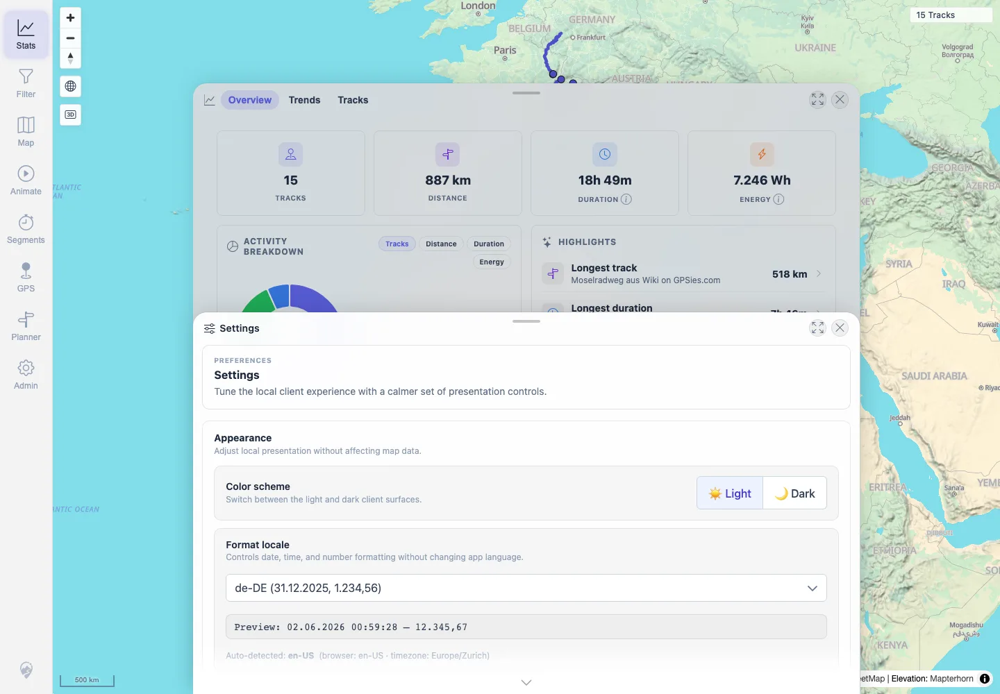

# Packet: LOC_04

## Scope

- Coverage source: `documentation/testing/frontend-regression-test-plan.md`
- Coverage ID or run packet: LOC_04
- In scope: Boundary-value rendering for flat/zero-gain, null-elevation, extreme/negative-elevation synthetic tracks.
- Out of scope: Non-locale import workflow coverage; covered by IMP, FMT, and SYN packets.

## Prerequisites

- Required previous coverage IDs or run packets: LOC_03.
- Required app/data state: Authenticated 12-track map before adding LOC synthetic files.
- Required browser context: Desktop Chromium context.

## Allowed Mutations

- Allowed: Add fully synthetic `loc04_*.gpx` files to the watched import folder, wait for ingest, then delete them.
- Not allowed: Leave LOC synthetic files or imported LOC tracks behind.

## Actions And Results

| Coverage ID | Action | Expected result | Actual result | Status | Evidence |
|---|---|---|---|---|---|
| LOC_04 | Imported synthetic flat/zero-gain, no-elevation, and extreme/negative-elevation GPX files, opened Stats and the tracks view, then deleted all `loc04_*.gpx` files. | Boundary values render sensibly, not as `NaN` or blank, and cleanup restores the baseline. | Three unique LOC tracks rendered in Stats with sane values, including `LOC 04 Extreme Values`, `LOC 04 Null Elevation Distinct`, and `LOC 04 Boundary Flat`. The same-route no-elevation file imported successfully but was duplicate-filtered. UI text contained no `NaN`, `undefined`, or `Infinity`. Cleanup deleted four LOC tracks and restored 12 visible tracks with no LOC API markers. | PASS | [assets/LOC_04-boundary-values.txt](../assets/LOC_04-boundary-values.txt); [assets/LOC_04-boundary-stats.webp](../assets/LOC_04-boundary-stats.webp); [assets/LOC_04-boundary-tracks.webp](../assets/LOC_04-boundary-tracks.webp); [assets/LOC_cleanup-state.txt](../assets/LOC_cleanup-state.txt) |

## Issues

| ID | Severity | Summary | Reproduction | Expected | Actual | Evidence | Release impact |
|---|---|---|---|---|---|---|---|

## Evidence Files

| File | Purpose |
|---|---|
| [assets/LOC_04-boundary-values.txt](../assets/LOC_04-boundary-values.txt) | Boundary-value UI/API summary, duplicate note, and no-NaN check. |
| [assets/LOC_04-boundary-stats.webp](../assets/LOC_04-boundary-stats.webp) | Stats panel showing boundary tracks under `de-DE` formatting. |
| [assets/LOC_04-boundary-tracks.webp](../assets/LOC_04-boundary-tracks.webp) | Tracks view/Stats state after boundary imports. |
| [assets/LOC_cleanup-state.txt](../assets/LOC_cleanup-state.txt) | Verified removal of LOC synthetic files and return to 12 tracks. |

## Screenshot Evidence

**Stats panel showing boundary tracks under de-DE formatting.**

**Tracks view/Stats state after boundary imports.**

## Timings

| Step | Timing |
|---|---:|
| Boundary imports, verification, and cleanup | ~12 min |

## Handoff Notes

- Completed: LOC_04 terminal as `PASS`.
- Remaining unfinished coverage: Continue with MOB_01.
- Blocked or not applicable: None.
- State left for the next packet: Fresh browser context showed 12 tracks; remote `loc04_*.gpx` files absent; API no longer contained LOC markers.
