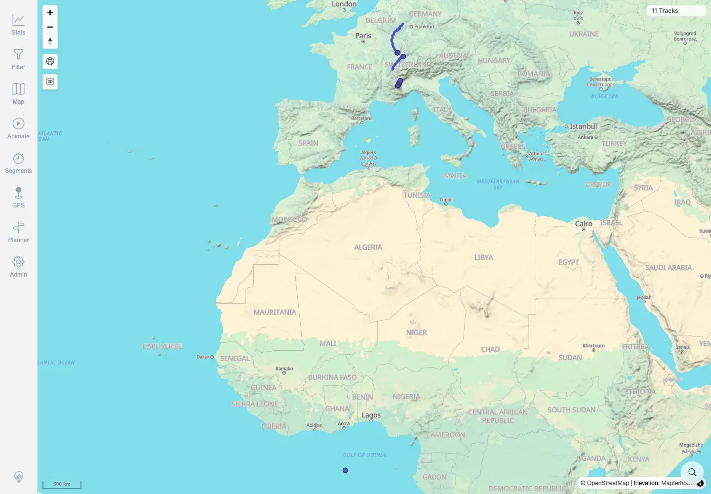

# Packet: MAP_03

## Scope

- Coverage source: `documentation/testing/frontend-regression-test-plan.md`
- Coverage ID or run packet: MAP_03
- In scope: Verify newly imported tracks appear without a full browser restart after accepting freshness/reload prompt.
- Out of scope: Initial import pipeline correctness; covered by IMP_* and FMT_*.

## Prerequisites

- Required previous coverage IDs or run packets: MAP_02.
- Required app/data state: Browser open with eleven tracks visible.
- Required browser context: Authenticated desktop browser context kept open during import.

## Allowed Mutations

- Allowed: Add one fully synthetic GPX (`map03_freshness.gpx`) to the watched import folder.
- Not allowed: Restart the browser, delete tracks, or use private track data.

## Actions And Results

| Coverage ID | Action | Expected result | Actual result | Status | Evidence |
|---|---|---|---|---|---|
| MAP_03 | With the map open at `11 Tracks`, created synthetic `map03_freshness.gpx` in the watched folder, waited for the freshness prompt, clicked **Reload**, and observed the map. | Newly imported track appears without full browser restart after accepting freshness/reload prompt. | Prompt `New data available` appeared with `Reload`; after clicking it, the same browser showed `12 Tracks`. | PASS | [assets/MAP_03-live-freshness-reload.txt](../assets/MAP_03-live-freshness-reload.txt), [assets/MAP_03-before-live-import.webp](../assets/MAP_03-before-live-import.webp), [assets/MAP_03-after-live-import.webp](../assets/MAP_03-after-live-import.webp) |

## Issues

| ID | Severity | Summary | Reproduction | Expected | Actual | Evidence | Release impact |
|---|---|---|---|---|---|---|---|

## Evidence Files

| File | Purpose |
|---|---|
| [assets/MAP_03-live-freshness-reload.txt](../assets/MAP_03-live-freshness-reload.txt) | Import output, prompt text, reload action, and before/after count assertions. |
| [assets/MAP_03-before-live-import.webp](../assets/MAP_03-before-live-import.webp) | Browser state before live import. |
| [assets/MAP_03-after-live-import.webp](../assets/MAP_03-after-live-import.webp) | Browser state after freshness reload to twelve tracks. |

## Screenshot Evidence

**Browser state before live import.**

**Browser state after freshness reload to twelve tracks.**

## Timings

| Step | Timing |
|---|---:|
| Watched-folder import to freshness prompt/reload | ~30 seconds |

## Handoff Notes

- Completed: MAP_03 terminal as `PASS`.
- Remaining unfinished coverage: Continue with MAP_04.
- Blocked or not applicable: None.
- State left for the next packet: Twelve tracks are now visible; `map03_freshness.gpx` remains in the watched folder.
