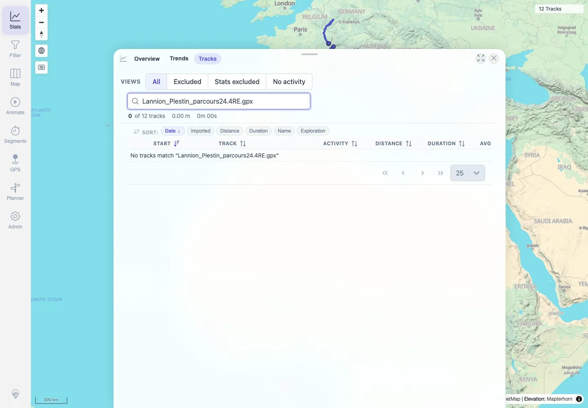

# Packet: MAP_04

## Scope

- Coverage source: `documentation/testing/frontend-regression-test-plan.md`
- Coverage ID or run packet: MAP_04
- In scope: Verify tracks deleted during DEL_* remain absent from map sources, selection/list surfaces, and related deletion evidence.
- Out of scope: Deletion processing itself; covered by DEL_01-DEL_05.

## Prerequisites

- Required previous coverage IDs or run packets: DEL_03, MAP_03.
- Required app/data state: Twelve visible tracks after MAP_03; deleted tracks were `Vitry-le-Francois_Langres.gpx` and `Lannion_Plestin_parcours24.4RE.gpx`.
- Required browser context: Authenticated desktop browser context.

## Allowed Mutations

- Allowed: Query current track API and search user-visible Stats Tracks.
- Not allowed: Delete or reimport source files.

## Actions And Results

| Coverage ID | Action | Expected result | Actual result | Status | Evidence |
|---|---|---|---|---|---|
| MAP_04 | Checked current map/API state and searched Stats Tracks for the two deleted source filenames. Linked existing DEL_03 deletion-surface evidence. | Deleted tracks do not appear in map sources, selection lists, popups, or related user-visible surfaces. | Current API returned 12 tracks with deleted ids/names absent. Searches for both deleted filenames returned `0 of 12 tracks` and no selectable rows. DEL_03 already verified deleted tracks absent from map/list/filter/heatmap/stats/related surfaces. | PASS | [assets/MAP_04-deleted-track-absence.txt](../assets/MAP_04-deleted-track-absence.txt), [assets/MAP_04-map-after-deletions.webp](../assets/MAP_04-map-after-deletions.webp), [assets/MAP_04-deleted-search-empty.webp](../assets/MAP_04-deleted-search-empty.webp), [assets/DEL_03-user-visible-removal.txt](../assets/DEL_03-user-visible-removal.txt) |

## Issues

| ID | Severity | Summary | Reproduction | Expected | Actual | Evidence | Release impact |
|---|---|---|---|---|---|---|---|

## Evidence Files

| File | Purpose |
|---|---|
| [assets/MAP_04-deleted-track-absence.txt](../assets/MAP_04-deleted-track-absence.txt) | Current API/search absence assertions and linked deletion evidence list. |
| [assets/MAP_04-map-after-deletions.webp](../assets/MAP_04-map-after-deletions.webp) | Current map with twelve visible non-deleted tracks. |
| [assets/MAP_04-deleted-search-empty.webp](../assets/MAP_04-deleted-search-empty.webp) | Stats search showing no deleted-track result. |
| [assets/DEL_03-user-visible-removal.txt](../assets/DEL_03-user-visible-removal.txt) | Earlier deletion flow surface checks for map/list/filter/heatmap/stats/related. |

## Screenshot Evidence

**Current map with twelve visible non-deleted tracks.**

**Stats search showing no deleted-track result.**

## Timings

| Step | Timing |
|---|---:|
| Current deleted-track absence check | ~5 seconds |

## Handoff Notes

- Completed: MAP_04 terminal as `PASS`.
- Remaining unfinished coverage: Continue with MAP_05.
- Blocked or not applicable: None.
- State left for the next packet: Twelve visible tracks remain.
