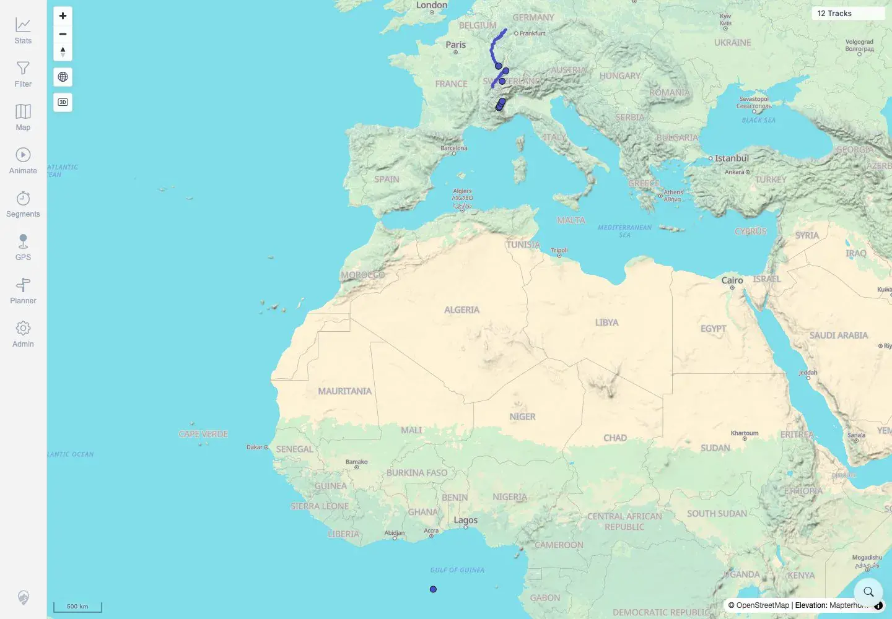
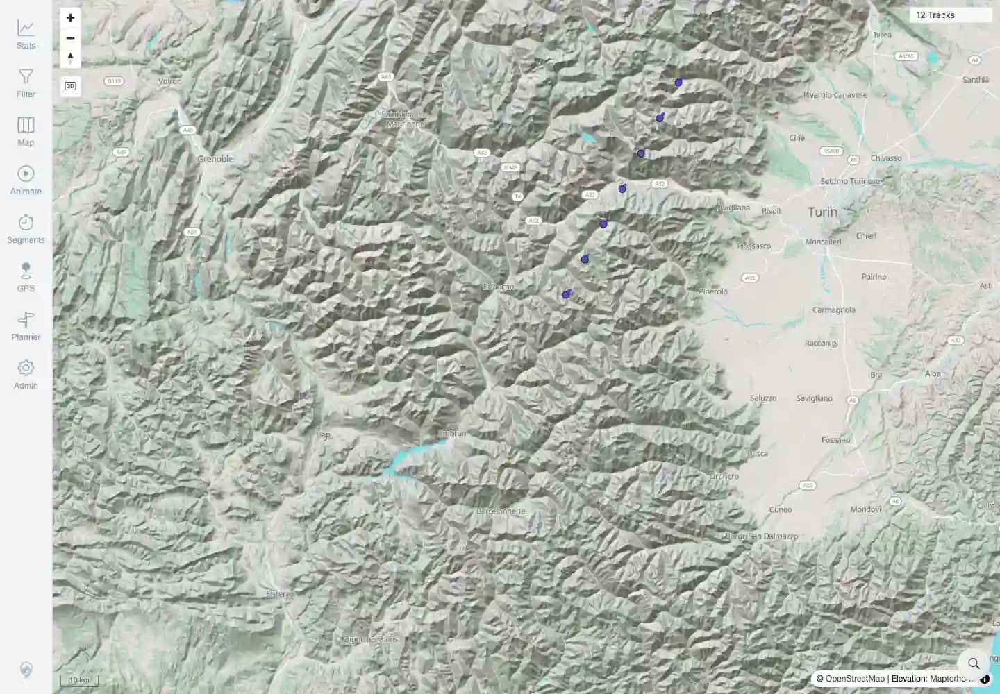

# Packet: MAP_05

## Scope

- Coverage source: `documentation/testing/frontend-regression-test-plan.md`
- Coverage ID or run packet: MAP_05
- In scope: Zoom into a visible track area and verify detail/precision improves without duplicate or broken lines.
- Out of scope: Direction arrows/point marker popup behavior; covered by MAP_07 and MAP_11.

## Prerequisites

- Required previous coverage IDs or run packets: MAP_04.
- Required app/data state: Twelve visible tracks.
- Required browser context: Authenticated desktop browser context.

## Allowed Mutations

- Allowed: Pan/zoom map view.
- Not allowed: Change app data or map source.

## Actions And Results

| Coverage ID | Action | Expected result | Actual result | Status | Evidence |
|---|---|---|---|---|---|
| MAP_05 | Captured the initial map, then used seven mouse-wheel zoom-in steps centered on the visible European GPX/synthetic track cluster. | Detail/precision improves; no duplicate or broken lines. | Scale changed from `500 km` to `10 km`; visible track geometry/points were closer and continuous, with no duplicate/broken line artifacts or loading spinner. | PASS | [assets/MAP_05-zoom-precision.txt](../assets/MAP_05-zoom-precision.txt), [assets/MAP_05-before-zoom.webp](../assets/MAP_05-before-zoom.webp), [assets/MAP_05-after-zoom.webp](../assets/MAP_05-after-zoom.webp) |

## Issues

| ID | Severity | Summary | Reproduction | Expected | Actual | Evidence | Release impact |
|---|---|---|---|---|---|---|---|

## Evidence Files

| File | Purpose |
|---|---|
| [assets/MAP_05-zoom-precision.txt](../assets/MAP_05-zoom-precision.txt) | Before/after scale and zoom assertions. |
| [assets/MAP_05-before-zoom.webp](../assets/MAP_05-before-zoom.webp) | Pre-zoom map screenshot. |
| [assets/MAP_05-after-zoom.webp](../assets/MAP_05-after-zoom.webp) | Post-zoom map screenshot showing closer geometry. |

## Screenshot Evidence

**Pre-zoom map screenshot.**

**Post-zoom map screenshot showing closer geometry.**

## Timings

| Step | Timing |
|---|---:|
| Zoom-in sequence and settle | ~5 seconds |

## Handoff Notes

- Completed: MAP_05 terminal as `PASS`.
- Remaining unfinished coverage: Continue with MAP_06.
- Blocked or not applicable: None.
- State left for the next packet: App state unchanged.
