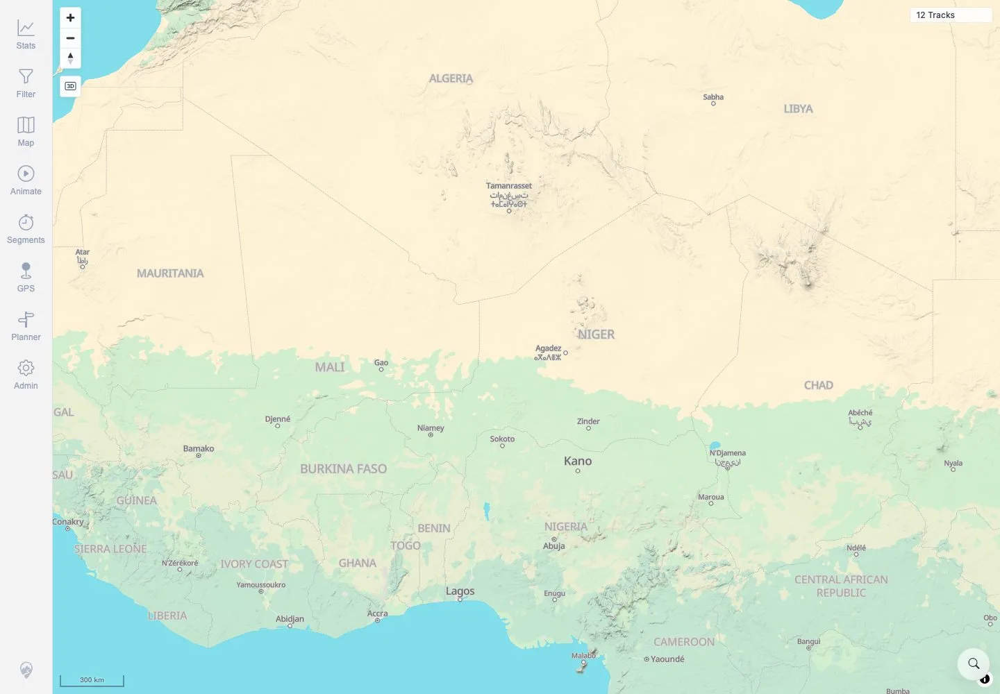

# Packet: MAP_06

## Scope

- Coverage source: `documentation/testing/frontend-regression-test-plan.md`
- Coverage ID or run packet: MAP_06
- In scope: Fast pan/zoom stress check for stale lines, missing tiles, and runaway loading indicators.
- Out of scope: Direction arrows and point popups; covered by MAP_07 and MAP_11.

## Prerequisites

- Required previous coverage IDs or run packets: MAP_05.
- Required app/data state: Twelve visible tracks.
- Required browser context: Authenticated desktop browser context.

## Allowed Mutations

- Allowed: Pan and zoom the map rapidly.
- Not allowed: Change map source or app data.

## Actions And Results

| Coverage ID | Action | Expected result | Actual result | Status | Evidence |
|---|---|---|---|---|---|
| MAP_06 | Performed rapid wheel zooms and drag pans, then waited for the map to settle. | Fast pan/zoom leaves no stale lines, missing tiles, or runaway loading spinners. | Settled view still showed `12 Tracks`, controls remained visible, no loading text/spinner remained, and screenshot showed base map without stale overlay. Tile aborts were limited to expected in-flight cancellations during rapid pan/zoom. | PASS | [assets/MAP_06-fast-pan-zoom.txt](../assets/MAP_06-fast-pan-zoom.txt), [assets/MAP_06-fast-pan-zoom-settled.webp](../assets/MAP_06-fast-pan-zoom-settled.webp) |

## Issues

| ID | Severity | Summary | Reproduction | Expected | Actual | Evidence | Release impact |
|---|---|---|---|---|---|---|---|

## Evidence Files

| File | Purpose |
|---|---|
| [assets/MAP_06-fast-pan-zoom.txt](../assets/MAP_06-fast-pan-zoom.txt) | Fast pan/zoom assertions and note about non-blocking tile request aborts. |
| [assets/MAP_06-fast-pan-zoom-settled.webp](../assets/MAP_06-fast-pan-zoom-settled.webp) | Settled map screenshot after rapid interactions. |

## Screenshot Evidence

**Settled map screenshot after rapid interactions.**

## Timings

| Step | Timing |
|---|---:|
| Fast pan/zoom and settle | ~7 seconds |

## Handoff Notes

- Completed: MAP_06 terminal as `PASS`.
- Remaining unfinished coverage: Continue with MAP_07.
- Blocked or not applicable: None.
- State left for the next packet: App state unchanged.
