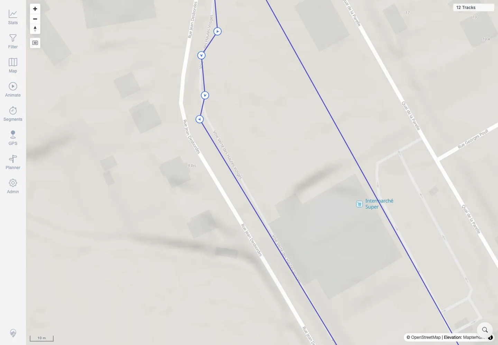

# Packet: MAP_07

## Scope

- Coverage source: `documentation/testing/frontend-regression-test-plan.md`
- Coverage ID or run packet: MAP_07
- In scope: Verify high-zoom Track Points & Direction markers on a dense rendered track.
- Out of scope: Track-point popup metrics; covered by MAP_11.

## Prerequisites

- Required previous coverage IDs or run packets: MAP_06.
- Required app/data state: Twelve visible tracks, including public GPX-backed track 100000.
- Required browser context: Authenticated desktop browser context.

## Allowed Mutations

- Allowed: Open map settings, use location search, pan/zoom map view.
- Not allowed: Change app data or map source.

## Actions And Results

| Coverage ID | Action | Expected result | Actual result | Status | Evidence |
|---|---|---|---|---|---|
| MAP_07 | Confirmed the Track Points & Direction layer was enabled at 100% opacity, searched for Rupt-sur-Moselle, then zoomed to 10 m on dense public GPX-backed track 100000. | Direction arrows appear on visible in-viewport track points at high zoom. | The 10 m map view showed multiple in-viewport circular GPS point markers with direction arrows on the rendered track line; evidence used public GPX track 100000 (`VoieVerteHauteVosges.gpx`, 629 simplified points), not a sparse two-point synthetic track. | PASS | [assets/MAP_07-track-points-direction.txt](../assets/MAP_07-track-points-direction.txt), [assets/MAP_07-track-points-direction.webp](../assets/MAP_07-track-points-direction.webp) |

## Issues

| ID | Severity | Summary | Reproduction | Expected | Actual | Evidence | Release impact |
|---|---|---|---|---|---|---|---|

## Evidence Files

| File | Purpose |
|---|---|
| [assets/MAP_07-track-points-direction.txt](../assets/MAP_07-track-points-direction.txt) | Layer state, map scale/count, and selected dense-track summary. |
| [assets/MAP_07-track-points-direction.webp](../assets/MAP_07-track-points-direction.webp) | High-zoom map screenshot showing point markers with direction arrows. |

## Screenshot Evidence

**High-zoom map screenshot showing point markers with direction arrows.**

## Timings

| Step | Timing |
|---|---:|
| Login, layer check, location search, zoom, screenshot | ~17 seconds |

## Handoff Notes

- Completed: MAP_07 terminal as `PASS`.
- Remaining unfinished coverage: Continue with MAP_08.
- Blocked or not applicable: None.
- State left for the next packet: App data unchanged; map view may remain zoomed near Rupt-sur-Moselle in that browser context only.
