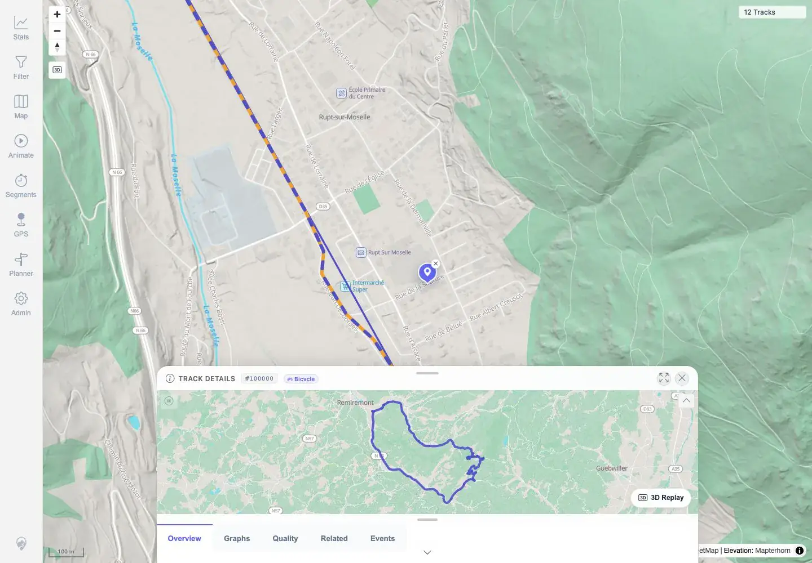

# Packet: MAP_08

## Scope

- Coverage source: `documentation/testing/frontend-regression-test-plan.md`
- Coverage ID or run packet: MAP_08
- In scope: Click a single rendered track and verify highlight plus details opening.
- Out of scope: Overlap chooser behavior; covered by MAP_09.

## Prerequisites

- Required previous coverage IDs or run packets: MAP_07.
- Required app/data state: Twelve visible tracks; public GPX track 100000 available.
- Required browser context: Authenticated desktop browser context.

## Allowed Mutations

- Allowed: Use location search, click map track, open details sheet.
- Not allowed: Change app data or map source.

## Actions And Results

| Coverage ID | Action | Expected result | Actual result | Status | Evidence |
|---|---|---|---|---|---|
| MAP_08 | Searched for Rupt-sur-Moselle and clicked an isolated visible segment of GPX track 100000 at the 100 m map scale. | The clicked single track highlights and its details open. | The clicked route changed to highlighted blue/orange styling and the Track Details sheet opened for `#100000` with Overview, Graphs, Quality, Related, and Events tabs visible. | PASS | [assets/MAP_08-single-track-click.txt](../assets/MAP_08-single-track-click.txt), [assets/MAP_08-single-track-click.webp](../assets/MAP_08-single-track-click.webp) |

## Issues

| ID | Severity | Summary | Reproduction | Expected | Actual | Evidence | Release impact |
|---|---|---|---|---|---|---|---|

## Evidence Files

| File | Purpose |
|---|---|
| [assets/MAP_08-single-track-click.txt](../assets/MAP_08-single-track-click.txt) | Click action, selected track, and UI assertions. |
| [assets/MAP_08-single-track-click.webp](../assets/MAP_08-single-track-click.webp) | Screenshot showing highlighted track and open Track Details sheet. |

## Screenshot Evidence

**Screenshot showing highlighted track and open Track Details sheet.**

## Timings

| Step | Timing |
|---|---:|
| Location search, click, and details open | ~11 seconds |

## Handoff Notes

- Completed: MAP_08 terminal as `PASS`.
- Remaining unfinished coverage: Continue with MAP_09.
- Blocked or not applicable: None.
- State left for the next packet: App data unchanged.
