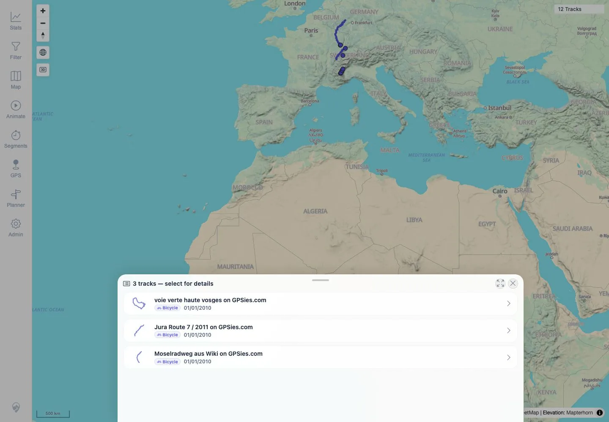
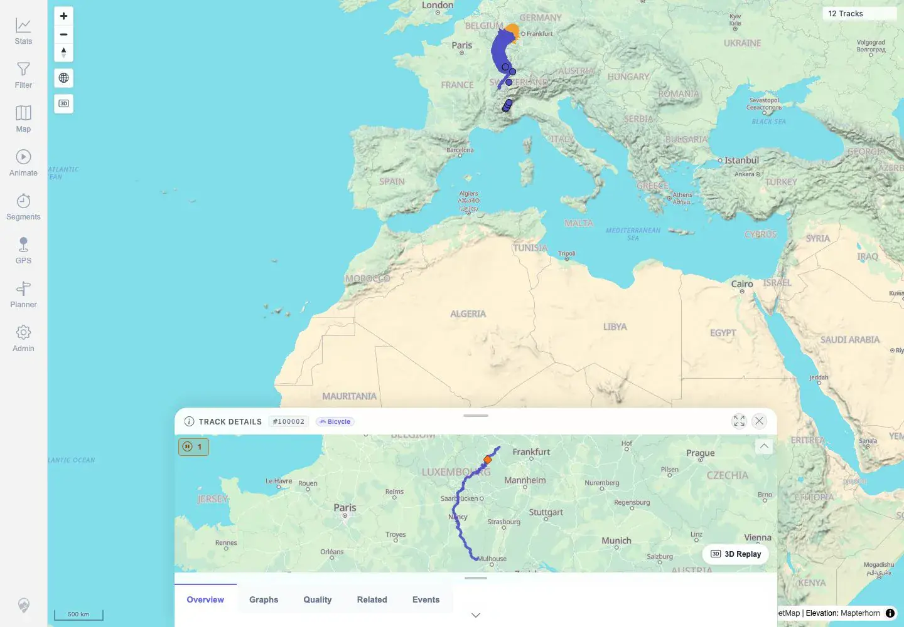

# Packet: MAP_09

## Scope

- Coverage source: `documentation/testing/frontend-regression-test-plan.md`
- Coverage ID or run packet: MAP_09
- In scope: Click an overlapping track area, verify selection list, and pick one track to open details.
- Out of scope: Deselect/close behavior; covered by MAP_10.

## Prerequisites

- Required previous coverage IDs or run packets: MAP_08.
- Required app/data state: Twelve visible tracks with overlapping GPX routes in the default overview.
- Required browser context: Authenticated desktop browser context.

## Allowed Mutations

- Allowed: Click overlapping map cluster and open one selected track details sheet.
- Not allowed: Change app data or map source.

## Actions And Results

| Coverage ID | Action | Expected result | Actual result | Status | Evidence |
|---|---|---|---|---|---|
| MAP_09 | Clicked the overlapping Vosges/Jura/Mosel cluster in the 500 km overview, then selected `Moselradweg aus Wiki on GPSies.com` from the chooser. | A selection list appears for overlapping tracks; choosing one opens its details. | A `3 tracks - select for details` chooser appeared with `voie verte haute vosges`, `Jura Route 7 / 2011`, and `Moselradweg aus Wiki`; choosing Moselradweg opened Track Details for `#100002`. | PASS | [assets/MAP_09-overlap-selection.txt](../assets/MAP_09-overlap-selection.txt), [assets/MAP_09-overlap-selection.webp](../assets/MAP_09-overlap-selection.webp), [assets/MAP_09-picked-details.webp](../assets/MAP_09-picked-details.webp) |

## Issues

| ID | Severity | Summary | Reproduction | Expected | Actual | Evidence | Release impact |
|---|---|---|---|---|---|---|---|

## Evidence Files

| File | Purpose |
|---|---|
| [assets/MAP_09-overlap-selection.txt](../assets/MAP_09-overlap-selection.txt) | Click coordinates, chooser contents, and selected-detail assertions. |
| [assets/MAP_09-overlap-selection.webp](../assets/MAP_09-overlap-selection.webp) | Screenshot of the overlap selection list. |
| [assets/MAP_09-picked-details.webp](../assets/MAP_09-picked-details.webp) | Screenshot after picking Moselradweg and opening details. |

## Screenshot Evidence

**Screenshot of the overlap selection list.**

**Screenshot after picking Moselradweg and opening details.**

## Timings

| Step | Timing |
|---|---:|
| Overlap click, chooser capture, selection, details open | ~16 seconds |

## Handoff Notes

- Completed: MAP_09 terminal as `PASS`.
- Remaining unfinished coverage: Continue with MAP_10.
- Blocked or not applicable: None.
- State left for the next packet: App data unchanged.
