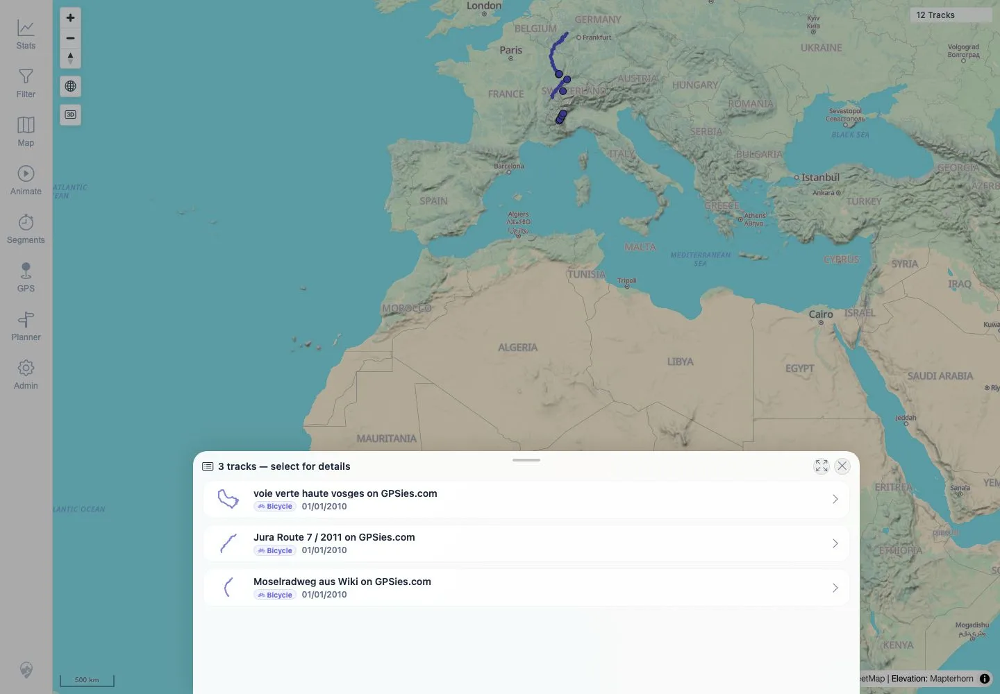
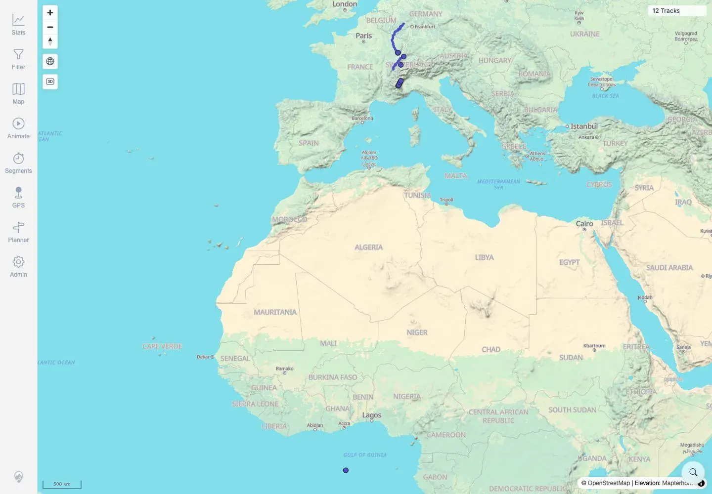

# Packet: MAP_10

## Scope

- Coverage source: `documentation/testing/frontend-regression-test-plan.md`
- Coverage ID or run packet: MAP_10
- In scope: Close/deselect an overlap selection list and verify the map returns to normal.
- Out of scope: Opening details from the selection list; covered by MAP_09.

## Prerequisites

- Required previous coverage IDs or run packets: MAP_09.
- Required app/data state: Twelve visible tracks with an overlap cluster in the default overview.
- Required browser context: Authenticated desktop browser context.

## Allowed Mutations

- Allowed: Open and close the map selection sheet.
- Not allowed: Change app data or map source.

## Actions And Results

| Coverage ID | Action | Expected result | Actual result | Status | Evidence |
|---|---|---|---|---|---|
| MAP_10 | Clicked the overlapping map cluster to open the `3 tracks - select for details` sheet, then clicked its close control without selecting a track. | Closing/deselecting the selection returns the map to normal. | The selection sheet closed cleanly; no Track Details sheet remained open; the normal map was visible with `12 Tracks` at the 500 km overview. | PASS | [assets/MAP_10-close-selection.txt](../assets/MAP_10-close-selection.txt), [assets/MAP_10-selection-before-close.webp](../assets/MAP_10-selection-before-close.webp), [assets/MAP_10-map-after-close.webp](../assets/MAP_10-map-after-close.webp) |

## Issues

| ID | Severity | Summary | Reproduction | Expected | Actual | Evidence | Release impact |
|---|---|---|---|---|---|---|---|

## Evidence Files

| File | Purpose |
|---|---|
| [assets/MAP_10-close-selection.txt](../assets/MAP_10-close-selection.txt) | Selector-before and map-after close assertions. |
| [assets/MAP_10-selection-before-close.webp](../assets/MAP_10-selection-before-close.webp) | Screenshot of the open overlap selector before closing. |
| [assets/MAP_10-map-after-close.webp](../assets/MAP_10-map-after-close.webp) | Screenshot of the normal map after closing the selector. |

## Screenshot Evidence

**Screenshot of the open overlap selector before closing.**

**Screenshot of the normal map after closing the selector.**

## Timings

| Step | Timing |
|---|---:|
| Selector open, close, and settle | ~13 seconds |

## Handoff Notes

- Completed: MAP_10 terminal as `PASS`.
- Remaining unfinished coverage: Continue with MAP_11.
- Blocked or not applicable: None.
- State left for the next packet: App data unchanged; no selection or details sheet remains open.
