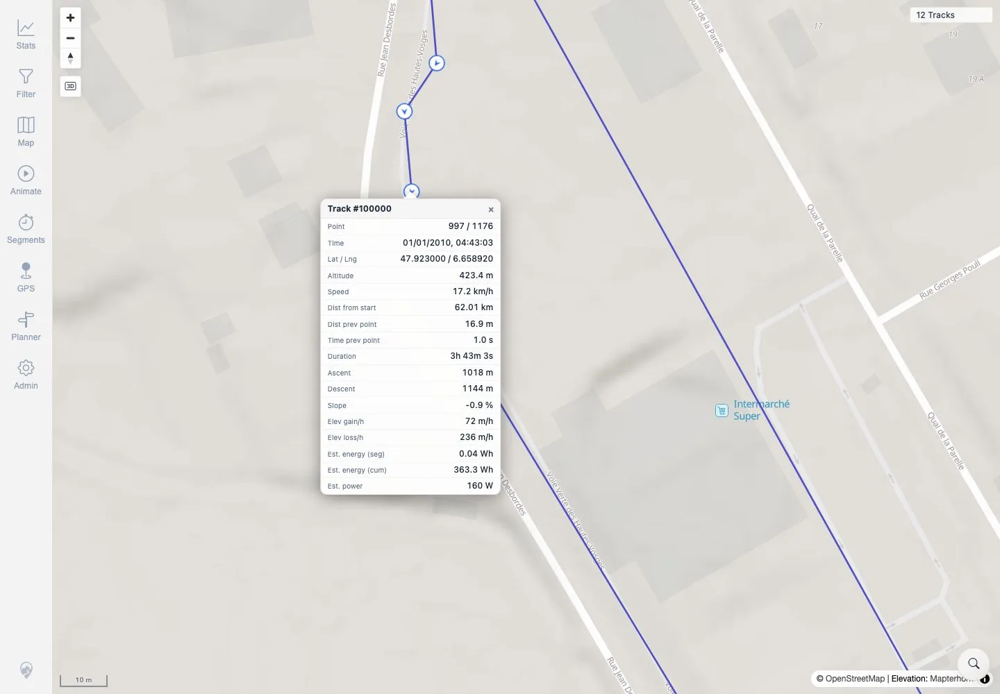

# Packet: MAP_11

## Scope

- Coverage source: `documentation/testing/frontend-regression-test-plan.md`
- Coverage ID or run packet: MAP_11
- In scope: Click an actual rendered track-point marker and verify metric popup contents.
- Out of scope: General high-zoom marker visibility; covered by MAP_07.

## Prerequisites

- Required previous coverage IDs or run packets: MAP_10.
- Required app/data state: Twelve visible tracks; Track Points & Direction layer enabled.
- Required browser context: Authenticated desktop browser context.

## Allowed Mutations

- Allowed: Use location search, zoom, and click track-point marker.
- Not allowed: Change app data or map source.

## Actions And Results

| Coverage ID | Action | Expected result | Actual result | Status | Evidence |
|---|---|---|---|---|---|
| MAP_11 | Searched for Rupt-sur-Moselle, zoomed to the 10 m Track Points & Direction view, and clicked an actual circular direction/point marker on track 100000. | Clicking a rendered track-point marker shows a popup with expected metrics such as time, speed, and elevation. | A `Track #100000` popup opened with point index, time, lat/lng, altitude, speed, distance, previous-point distance/time, duration, ascent/descent, slope, energy, and power metrics. | PASS | [assets/MAP_11-point-marker-popup.txt](../assets/MAP_11-point-marker-popup.txt), [assets/MAP_11-point-marker-popup.webp](../assets/MAP_11-point-marker-popup.webp) |

## Issues

| ID | Severity | Summary | Reproduction | Expected | Actual | Evidence | Release impact |
|---|---|---|---|---|---|---|---|

## Evidence Files

| File | Purpose |
|---|---|
| [assets/MAP_11-point-marker-popup.txt](../assets/MAP_11-point-marker-popup.txt) | Marker click location and popup metric assertions. |
| [assets/MAP_11-point-marker-popup.webp](../assets/MAP_11-point-marker-popup.webp) | Screenshot showing the point popup and metrics. |

## Screenshot Evidence

**Screenshot showing the point popup and metrics.**

## Timings

| Step | Timing |
|---|---:|
| Location search, zoom, marker click, popup capture | ~18 seconds |

## Handoff Notes

- Completed: MAP_11 terminal as `PASS`.
- Remaining unfinished coverage: Continue with MAP_12.
- Blocked or not applicable: None.
- State left for the next packet: App data unchanged.
