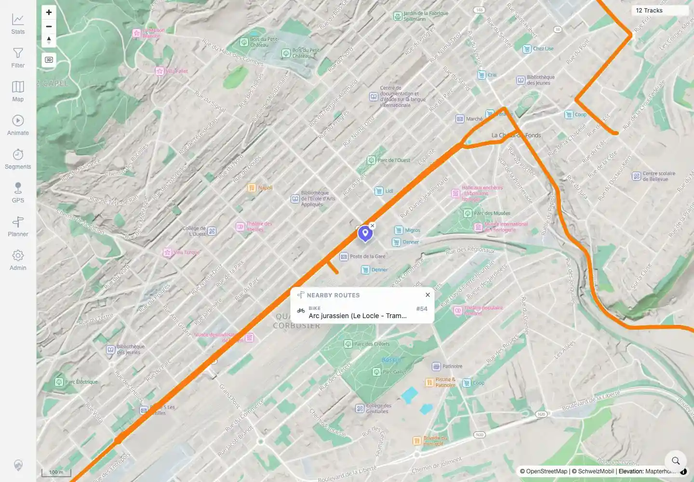
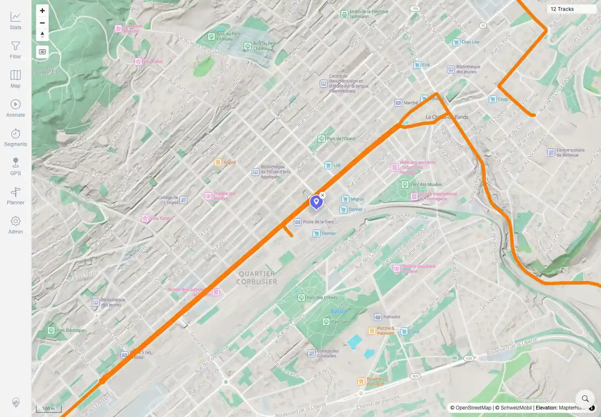

# Packet: MAP_12

## Scope

- Coverage source: `documentation/testing/frontend-regression-test-plan.md`
- Coverage ID or run packet: MAP_12
- In scope: Swiss route overlay popup and close behavior where applicable.
- Out of scope: Remote-raster provider mode checks; covered by MAP_13-MAP_15.

## Prerequisites

- Required previous coverage IDs or run packets: MAP_11.
- Required app/data state: Twelve visible tracks; local map mode with Swiss overlay support.
- Required browser context: Authenticated desktop browser context.

## Allowed Mutations

- Allowed: Enable Swiss Bike Routes overlay, use location search, click route overlay, close popup.
- Not allowed: Change app data or deployment mode.

## Actions And Results

| Coverage ID | Action | Expected result | Actual result | Status | Evidence |
|---|---|---|---|---|---|
| MAP_12 | Enabled Swiss Bike Routes, searched La Chaux-de-Fonds, clicked the visible orange Swiss route overlay, then closed the route popup. | Swiss Mobility routes popup shows nearby official routes where applicable and closes cleanly. | The map showed `© SchweizMobil`; clicking the Swiss route overlay opened a `NEARBY ROUTES` popup with `BIKE`, `Arc jurassien (Le Locle - Tramelan)`, and `#54`; closing the popup removed it while the map remained visible with `12 Tracks`. | PASS | [assets/MAP_12-swiss-route-popup.txt](../assets/MAP_12-swiss-route-popup.txt), [assets/MAP_12-swiss-route-popup.webp](../assets/MAP_12-swiss-route-popup.webp), [assets/MAP_12-swiss-route-popup-closed.webp](../assets/MAP_12-swiss-route-popup-closed.webp) |

## Issues

| ID | Severity | Summary | Reproduction | Expected | Actual | Evidence | Release impact |
|---|---|---|---|---|---|---|---|

## Evidence Files

| File | Purpose |
|---|---|
| [assets/MAP_12-swiss-route-popup.txt](../assets/MAP_12-swiss-route-popup.txt) | Overlay state, popup route details, attribution, and close assertions. |
| [assets/MAP_12-swiss-route-popup.webp](../assets/MAP_12-swiss-route-popup.webp) | Screenshot of the Swiss route popup. |
| [assets/MAP_12-swiss-route-popup-closed.webp](../assets/MAP_12-swiss-route-popup-closed.webp) | Screenshot after closing the popup. |

## Screenshot Evidence

**Screenshot of the Swiss route popup.**

**Screenshot after closing the popup.**

## Timings

| Step | Timing |
|---|---:|
| Enable overlay, search, route click, close | ~19 seconds |

## Handoff Notes

- Completed: MAP_12 terminal as `PASS`.
- Remaining unfinished coverage: Continue with MAP_13.
- Blocked or not applicable: None.
- State left for the next packet: App data unchanged; overlay was enabled only in that browser context.
