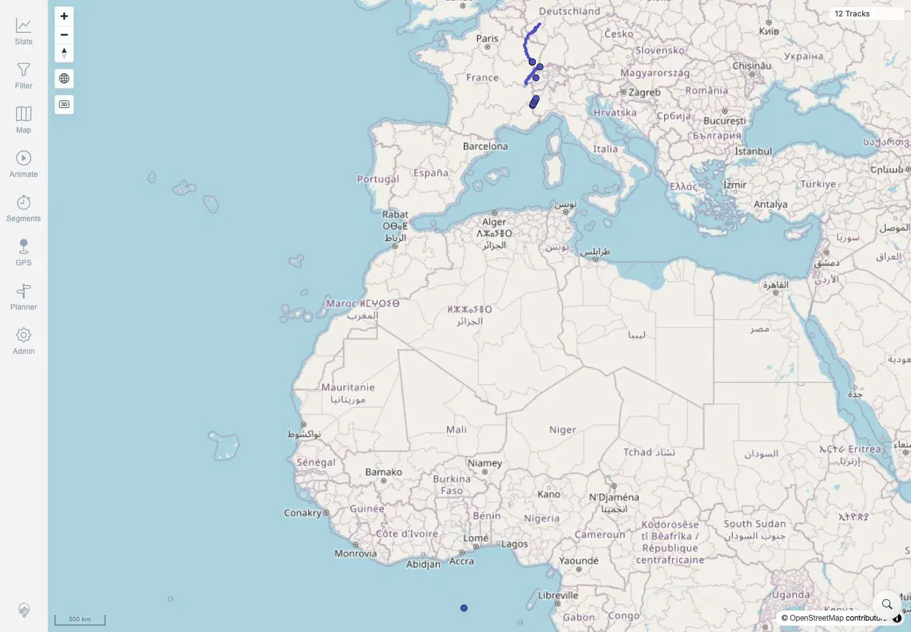
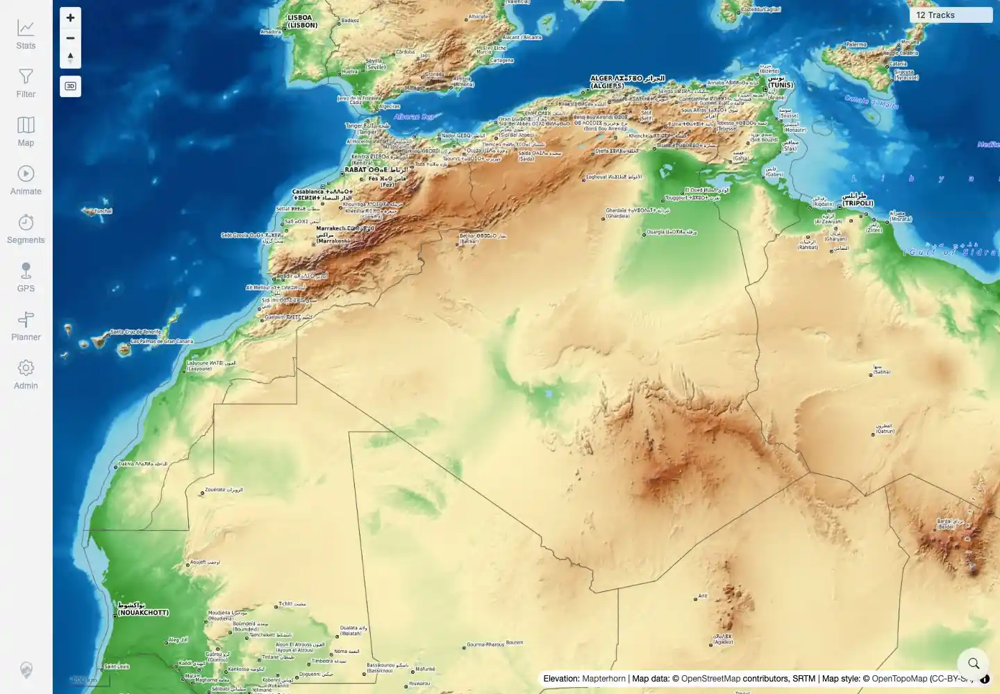
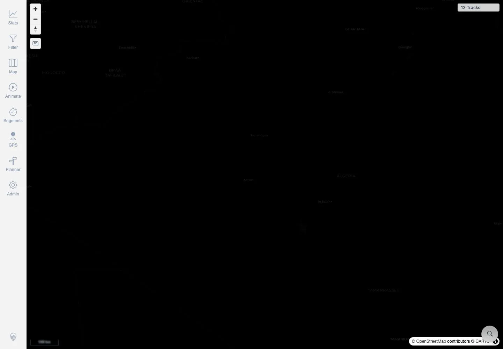

# Packet: MAP_13

## Scope

- Coverage source: `documentation/testing/frontend-regression-test-plan.md`
- Coverage ID or run packet: MAP_13
- In scope: Intentional remote-raster deployment mode, map config shape, OSM Light/Topo/Dark provider behavior, attribution, interactivity, and `/api/map-proxy` absence.
- Out of scope: Local-vector fallback and manual source override; covered by MAP_14 and MAP_15.

## Prerequisites

- Required previous coverage IDs or run packets: MAP_12.
- Required app/data state: Twelve visible tracks.
- Required browser context: Authenticated clean desktop browser context.

## Allowed Mutations

- Allowed: Create temporary compose override with `MTL_MAP_SERVER_TILE_MODE=remote` and restart only the `app` service.
- Not allowed: Change app data or restart database/location-search/BRouter services.

## Actions And Results

| Coverage ID | Action | Expected result | Actual result | Status | Evidence |
|---|---|---|---|---|---|
| MAP_13 | Added `docker-compose.override.yml` setting `MTL_MAP_SERVER_TILE_MODE=remote`, restarted only `app`, confirmed `/mtl/api/map/config`, then selected OSM Light, OSM Topo, and OSM Dark while watching network requests. | Config exposes `remoteRasterStyles` for `light`, `light-topo`, and `dark`; no legacy `remoteTileUrl`; each theme loads provider tiles with matching attribution, remains interactive, and makes no `/api/map-proxy` tile requests. | Config returned `tileMode: remote`, style keys `dark`, `light`, and `light-topo`, and `remoteTileUrl: null`. OSM Light requested `tile.openstreetmap.org`, OSM Topo requested `tile.opentopomap.org`, OSM Dark requested `basemaps.cartocdn.com`; each showed attribution, retained `12 Tracks`, changed scale after zoom, and recorded `0` `/api/map-proxy` requests. | PASS | [assets/MAP_13-remote-mode-deployment.txt](../assets/MAP_13-remote-mode-deployment.txt), [assets/MAP_13-remote-raster-browser.txt](../assets/MAP_13-remote-raster-browser.txt), [assets/MAP_13-osm-light.webp](../assets/MAP_13-osm-light.webp), [assets/MAP_13-osm-topo.webp](../assets/MAP_13-osm-topo.webp), [assets/MAP_13-osm-dark.webp](../assets/MAP_13-osm-dark.webp) |

## Issues

| ID | Severity | Summary | Reproduction | Expected | Actual | Evidence | Release impact |
|---|---|---|---|---|---|---|---|

## Evidence Files

| File | Purpose |
|---|---|
| [assets/MAP_13-remote-mode-deployment.txt](../assets/MAP_13-remote-mode-deployment.txt) | Compose override, app restart, env, readiness, and authenticated map config excerpt. |
| [assets/MAP_13-remote-raster-browser.txt](../assets/MAP_13-remote-raster-browser.txt) | Browser config, provider requests, attribution, interactivity, and map-proxy assertions. |
| [assets/MAP_13-osm-light.webp](../assets/MAP_13-osm-light.webp) | OSM Light remote raster screenshot. |
| [assets/MAP_13-osm-topo.webp](../assets/MAP_13-osm-topo.webp) | OSM Topo remote raster screenshot. |
| [assets/MAP_13-osm-dark.webp](../assets/MAP_13-osm-dark.webp) | OSM Dark remote raster screenshot. |

## Screenshot Evidence

**OSM Light remote raster screenshot.**

**OSM Topo remote raster screenshot.**

**OSM Dark remote raster screenshot.**

## Timings

| Step | Timing |
|---|---:|
| Compose override and app restart/readiness | ~13 seconds |
| Browser remote-raster provider pass | ~25 seconds |

## Handoff Notes

- Completed: MAP_13 terminal as `PASS`.
- Remaining unfinished coverage: Continue with MAP_14; restore local-vector mode before local-mode checks.
- Blocked or not applicable: None.
- State left for the next packet: Temporary remote-mode compose override remains active and must be removed before MAP_14/MAP_15 local-vector checks.
