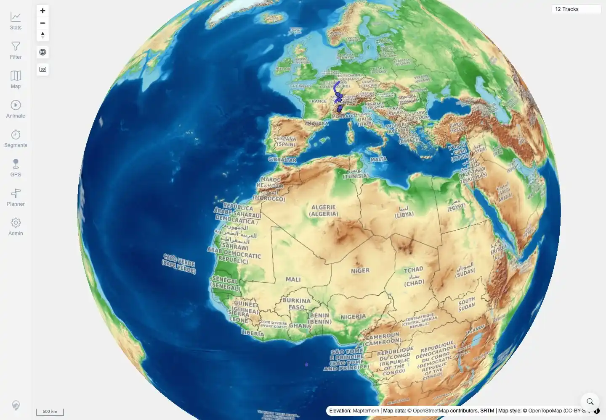
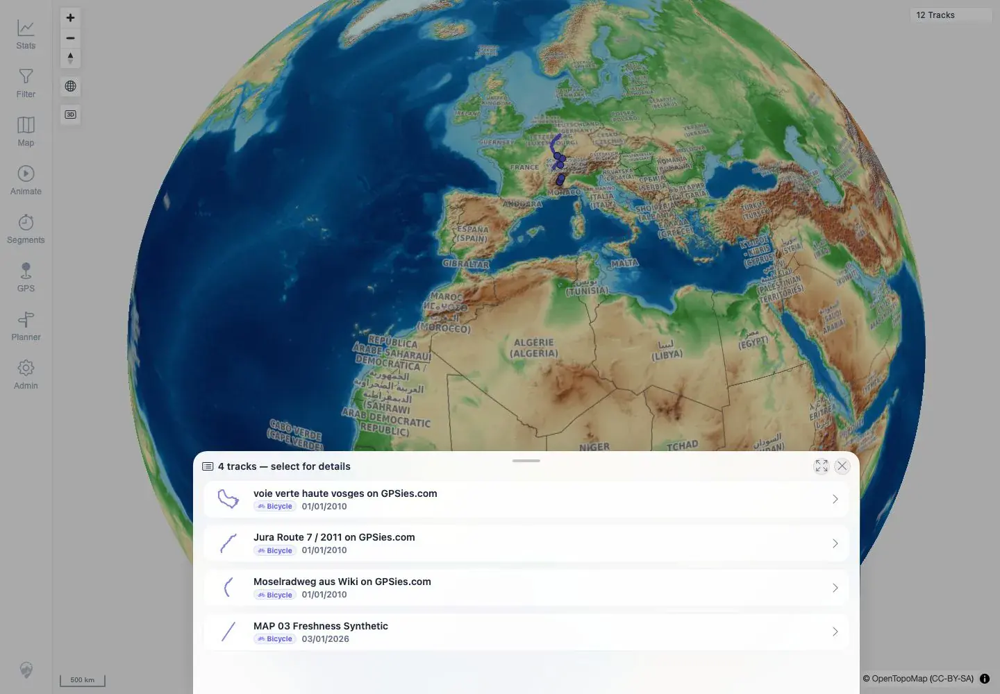

# Packet: MAP_14

## Scope

- Coverage source: `documentation/testing/frontend-regression-test-plan.md`
- Coverage ID or run packet: MAP_14
- In scope: Local-vector runtime tile failure fallback to remote raster, attribution, pan/zoom viability, track display, and track selection.
- Out of scope: Manual user-selected remote source override; covered by MAP_15.

## Prerequisites

- Required previous coverage IDs or run packets: MAP_13.
- Required app/data state: Twelve visible tracks; app restored to `tileMode: local`.
- Required browser context: Authenticated clean desktop browser context with local PMTiles requests blocked.

## Allowed Mutations

- Allowed: Remove temporary remote-mode compose override, restart only `app`, block PMTiles requests in the test browser context.
- Not allowed: Change app data or block non-map application APIs.

## Actions And Results

| Coverage ID | Action | Expected result | Actual result | Status | Evidence |
|---|---|---|---|---|---|
| MAP_14 | Restored local mode, then in a clean browser context blocked `/mtl/api/map-proxy/prod/*.pmtiles` requests to simulate PMTiles unavailability. | The map switches to the configured remote raster style, uses configured attribution, and continues to support pan/zoom, track display, and track selection. | Config showed `tileMode: local`; blocked PMTiles requests produced the console warning `Local vector map tiles failed; switched base map to raster fallback`; remote OpenTopoMap tiles loaded with attribution, `12 Tracks` remained visible, zoom changed scale from `1000 km` to `500 km`, and clicking the track cluster opened a `4 tracks - select for details` sheet. | PASS | [assets/MAP_14-local-mode-restore.txt](../assets/MAP_14-local-mode-restore.txt), [assets/MAP_14-pmtiles-fallback.txt](../assets/MAP_14-pmtiles-fallback.txt), [assets/MAP_14-pmtiles-fallback-map.webp](../assets/MAP_14-pmtiles-fallback-map.webp), [assets/MAP_14-pmtiles-fallback-selection.webp](../assets/MAP_14-pmtiles-fallback-selection.webp) |

## Issues

| ID | Severity | Summary | Reproduction | Expected | Actual | Evidence | Release impact |
|---|---|---|---|---|---|---|---|

## Evidence Files

| File | Purpose |
|---|---|
| [assets/MAP_14-local-mode-restore.txt](../assets/MAP_14-local-mode-restore.txt) | Compose override removal, app restart, and local-mode config excerpt. |
| [assets/MAP_14-pmtiles-fallback.txt](../assets/MAP_14-pmtiles-fallback.txt) | PMTiles block simulation, fallback warning, provider, attribution, zoom, and selection assertions. |
| [assets/MAP_14-pmtiles-fallback-map.webp](../assets/MAP_14-pmtiles-fallback-map.webp) | Screenshot of remote raster fallback map with tracks visible. |
| [assets/MAP_14-pmtiles-fallback-selection.webp](../assets/MAP_14-pmtiles-fallback-selection.webp) | Screenshot of track selection still working after fallback. |

## Screenshot Evidence

**Screenshot of remote raster fallback map with tracks visible.**

**Screenshot of track selection still working after fallback.**

## Timings

| Step | Timing |
|---|---:|
| Restore local mode and app readiness | ~31 seconds |
| Browser PMTiles-failure fallback pass | ~25 seconds |

## Handoff Notes

- Completed: MAP_14 terminal as `PASS`.
- Remaining unfinished coverage: Continue with MAP_15.
- Blocked or not applicable: None.
- State left for the next packet: Deployment is restored to local mode; browser-only PMTiles blocking ended with that browser context.
