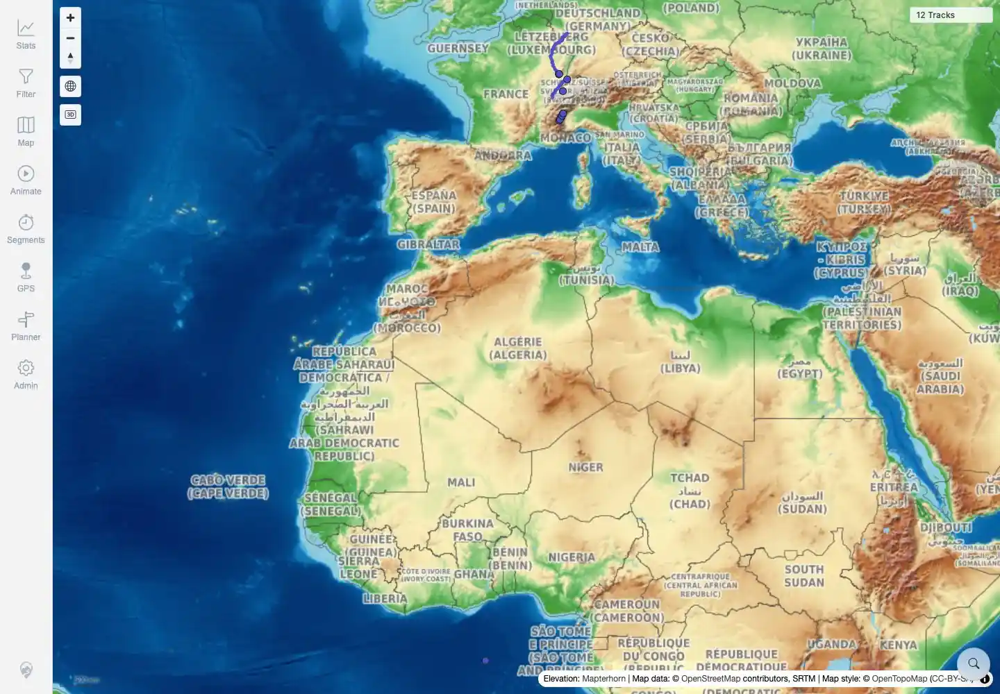
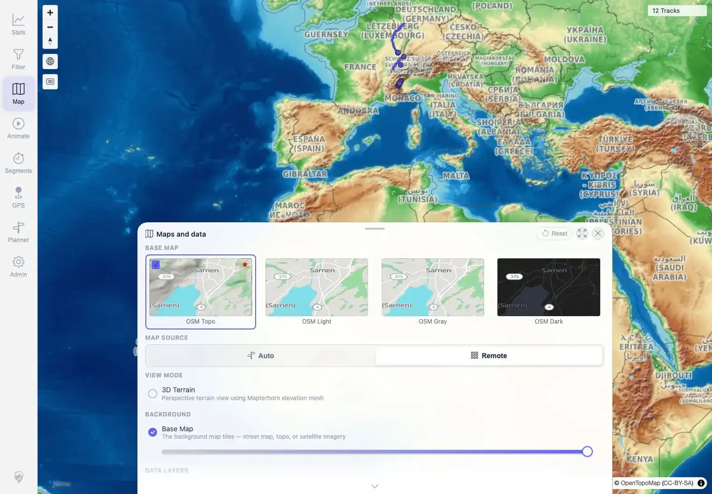
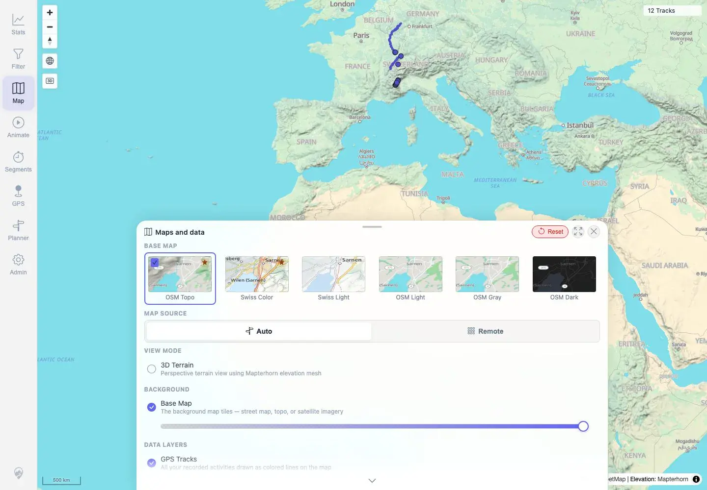

# Packet: MAP_15

## Scope

- Coverage source: `documentation/testing/frontend-regression-test-plan.md`
- Coverage ID or run packet: MAP_15
- In scope: Manual Map Source override from Auto to Remote, remote raster loading, theme availability, persistence after reload, and Reset back to Auto.
- Out of scope: Server-wide remote-raster deployment mode; covered by MAP_13.

## Prerequisites

- Required previous coverage IDs or run packets: MAP_14.
- Required app/data state: Twelve visible tracks; app deployment restored to local `tileMode`.
- Required browser context: Authenticated desktop browser context.

## Allowed Mutations

- Allowed: Change in-app map source preference and reset it.
- Not allowed: Change app data or deployment mode.

## Actions And Results

| Coverage ID | Action | Expected result | Actual result | Status | Evidence |
|---|---|---|---|---|---|
| MAP_15 | In local mode, opened Maps and data, changed Map Source from Auto to Remote, observed tiles/network/theme list, reloaded the page, then clicked Reset. | Remote source loads remote raster provider tiles without `/api/map-proxy`; OSM raster themes remain selectable; Swiss vector themes are not offered; setting persists after reload; Reset restores Auto. | Config remained `tileMode: local`. Remote source became active and showed only OSM Topo, OSM Light, OSM Gray, and OSM Dark; Swiss Color/Light were absent. Remote mode requested `tile.opentopomap.org` with `0` `/api/map-proxy` tile requests, showed OpenTopoMap/OpenStreetMap attribution and `12 Tracks`, persisted after reload, and Reset restored Auto with Swiss themes visible again. | PASS | [assets/MAP_15-manual-remote-source.txt](../assets/MAP_15-manual-remote-source.txt), [assets/MAP_15-remote-source-panel.webp](../assets/MAP_15-remote-source-panel.webp), [assets/MAP_15-remote-source-map.webp](../assets/MAP_15-remote-source-map.webp), [assets/MAP_15-persisted-remote-panel.webp](../assets/MAP_15-persisted-remote-panel.webp), [assets/MAP_15-reset-auto-panel.webp](../assets/MAP_15-reset-auto-panel.webp) |

## Issues

| ID | Severity | Summary | Reproduction | Expected | Actual | Evidence | Release impact |
|---|---|---|---|---|---|---|---|

## Evidence Files

| File | Purpose |
|---|---|
| [assets/MAP_15-manual-remote-source.txt](../assets/MAP_15-manual-remote-source.txt) | Source-state, theme, persistence, reset, and network assertions. |
| [assets/MAP_15-remote-source-panel.webp](../assets/MAP_15-remote-source-panel.webp) | Remote source selected with only OSM raster themes visible. |
| [assets/MAP_15-remote-source-map.webp](../assets/MAP_15-remote-source-map.webp) | Remote raster map after source switch. |
| [assets/MAP_15-persisted-remote-panel.webp](../assets/MAP_15-persisted-remote-panel.webp) | Remote source still selected after reload. |
| [assets/MAP_15-reset-auto-panel.webp](../assets/MAP_15-reset-auto-panel.webp) | Reset restored Auto and Swiss themes. |

## Screenshot Evidence

**Remote source selected with only OSM raster themes visible.**

**Remote raster map after source switch.**

**Remote source still selected after reload.**

**Reset restored Auto and Swiss themes.**

## Timings

| Step | Timing |
|---|---:|
| Manual remote source switch, reload persistence, reset | ~24 seconds |

## Handoff Notes

- Completed: MAP_15 terminal as `PASS`.
- Remaining unfinished coverage: Continue with TRD_01.
- Blocked or not applicable: None.
- State left for the next packet: App remains in local deployment mode; in-app Map Source reset to Auto.
