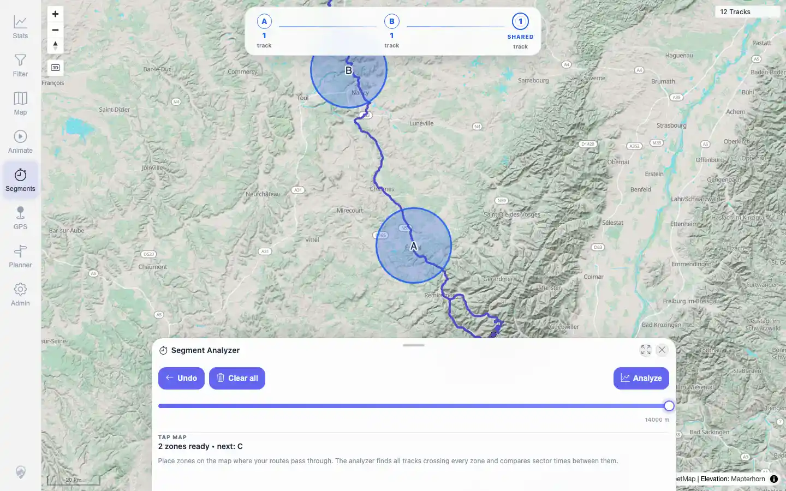
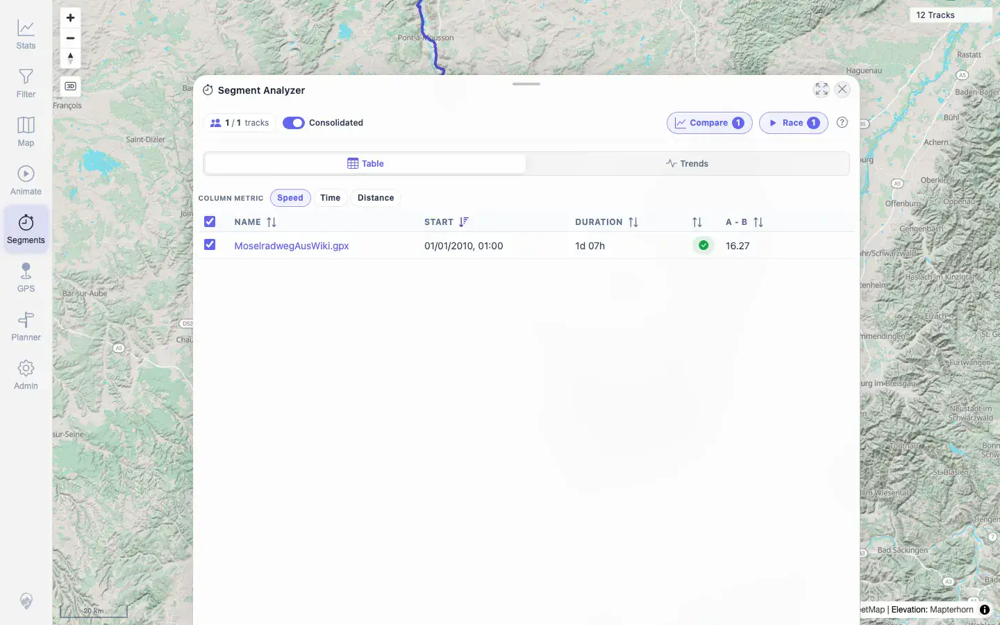
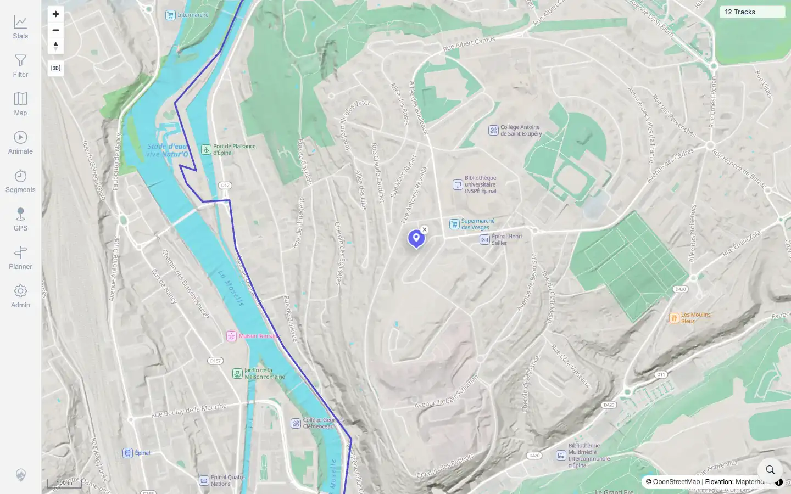
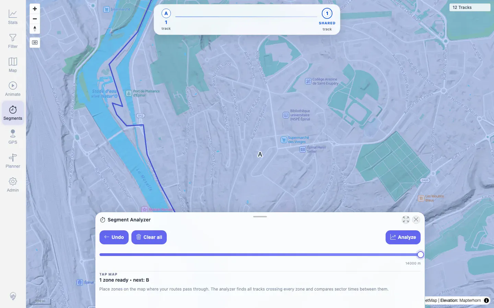

# Packet: MCT_01

## Scope

- Coverage source: `documentation/testing/frontend-regression-test-plan.md`
- Coverage ID or run packet: MCT_01
- In scope: Start Segment Analyzer, place start/end zones, analyze, verify crossing-track result metrics.
- Out of scope: Result-row navigation, compare overlay, and cleanup, covered by later MCT packets.

## Prerequisites

- Required previous coverage IDs or run packets: RUN_SETUP through PLN_11 terminal.
- Required app/data state: 12 visible tracks, no active filter, map source restored to Auto.
- Required browser context: Desktop browser, authenticated as `mtl`.

## Allowed Mutations

- Allowed: Temporary map viewport/search/segment-tool state.
- Not allowed: Track, planner, filter, or server data mutations.

## Actions And Results

| Coverage ID | Action | Expected result | Actual result | Status | Evidence |
|---|---|---|---|---|---|
| MCT_01 | Used location search to center on Epinal, opened Segments, set Detection radius to 14000 m, placed point A, zoomed out, clicked computed Pompey map position for point B, then clicked Analyze. | Result list of crossing tracks appears with speed/time/distance. | Before Analyze the overlay showed `A1trackB1track1sharedtrack`; Analyze returned HTTP 200 and the result sheet listed `MoselradwegAusWiki.gpx` with Compare/Race enabled. UI displayed speed `16.27`; the same request returned time `19514.5s` and distance `88172.1m` for segment A-B. | PASS | [assets/MCT_01-ui-zones-a-b.webp](../assets/MCT_01-ui-zones-a-b.webp), [assets/MCT_01-ui-results-sheet.webp](../assets/MCT_01-ui-results-sheet.webp), [assets/MCT_01-ui-full-flow.txt](../assets/MCT_01-ui-full-flow.txt), [assets/MCT_01-api-segment-results.txt](../assets/MCT_01-api-segment-results.txt) |

## Issues

| ID | Severity | Summary | Reproduction | Expected | Actual | Evidence | Release impact |
|---|---|---|---|---|---|---|---|
|  |  |  |  |  |  |  |  |

## Evidence Files

| File | Purpose |
|---|---|
| [assets/MCT_01-ui-epinal-selected.webp](../assets/MCT_01-ui-epinal-selected.webp) | Location search result selected before starting Segments. |
| [assets/MCT_01-ui-zone-a-epinal.webp](../assets/MCT_01-ui-zone-a-epinal.webp) | Segment Analyzer after placing zone A. |
| [assets/MCT_01-ui-zones-a-b.webp](../assets/MCT_01-ui-zones-a-b.webp) | Segment Analyzer with A/B zones and shared-track count. |
| [assets/MCT_01-ui-results-sheet.webp](../assets/MCT_01-ui-results-sheet.webp) | Result sheet listing the crossing track and action buttons. |
| [assets/MCT_01-ui-full-flow.txt](../assets/MCT_01-ui-full-flow.txt) | UI flow selectors, before/after state, endpoint status, and result text sample. |
| [assets/MCT_01-api-segment-results.txt](../assets/MCT_01-api-segment-results.txt) | Compact server metric dump for the same trigger points. |
| [assets/MCT_location-search-candidates.txt](../assets/MCT_location-search-candidates.txt) | Supporting place-center distances used to choose Epinal and Pompey. |

## Screenshot Evidence

**Segment Analyzer with A/B zones and shared-track count.**

**Result sheet listing the crossing track and action buttons.**

**Location search result selected before starting Segments.**

**Segment Analyzer after placing zone A.**

## Timings

| Step | Timing |
|---|---:|
| UI flow with screenshots | ~28s |
| API metric confirmation | ~3s |

## Handoff Notes

- Completed: MCT_01 PASS.
- Remaining unfinished coverage: MCT_02 onward.
- Blocked or not applicable: None.
- State left for the next packet: Segment result flow is not persistent across browser restarts; MCT_02 should open/recreate the result sheet before clicking the result row.
