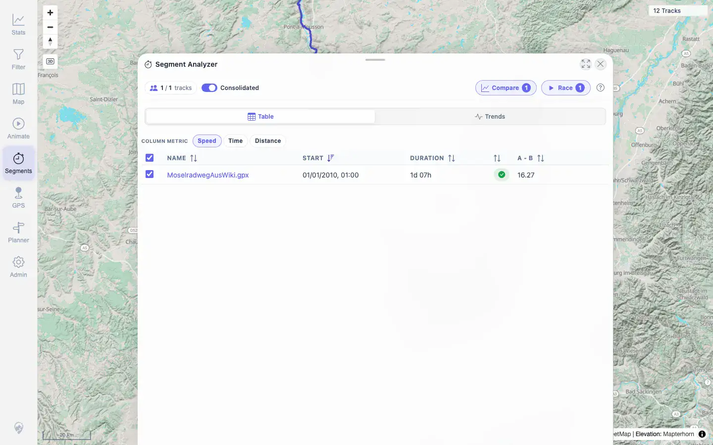
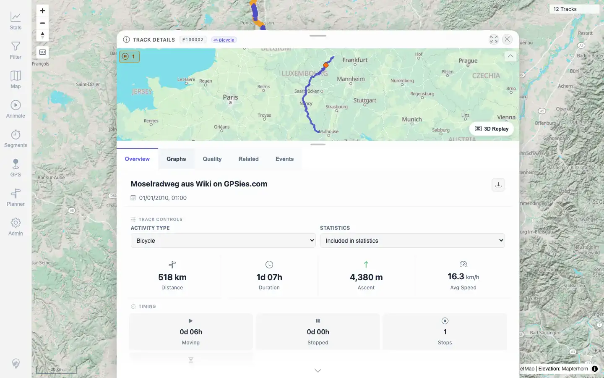

# Packet: MCT_02

## Scope

- Coverage source: `documentation/testing/frontend-regression-test-plan.md`
- Coverage ID or run packet: MCT_02
- In scope: Click a Segment Analyzer result and verify track detail navigation.
- Out of scope: Compare overlay and segment cleanup, covered by later MCT packets.

## Prerequisites

- Required previous coverage IDs or run packets: MCT_01.
- Required app/data state: 12 visible tracks, no active filter.
- Required browser context: Desktop browser, authenticated as `mtl`.

## Allowed Mutations

- Allowed: Temporary map viewport/search/segment-tool/detail-sheet state.
- Not allowed: Track, planner, filter, or server data mutations.

## Actions And Results

| Coverage ID | Action | Expected result | Actual result | Status | Evidence |
|---|---|---|---|---|---|
| MCT_02 | Recreated the Epinal-to-Pompey Segment Analyzer result from MCT_01 and clicked the `MoselradwegAusWiki.gpx` result link. | Clicking a result opens that track's details or segment view. | The URL changed from `/mtl/segments` to `/mtl/track/100002`; Track Details opened for `Moselradweg aus Wiki on GPSies.com` with overview content, stats, 9 chart containers, and mini-map content visible. | PASS | [assets/MCT_02-result-before-click.webp](../assets/MCT_02-result-before-click.webp), [assets/MCT_02-track-detail-from-result.webp](../assets/MCT_02-track-detail-from-result.webp), [assets/MCT_02-result-click-navigation.txt](../assets/MCT_02-result-click-navigation.txt) |

## Issues

| ID | Severity | Summary | Reproduction | Expected | Actual | Evidence | Release impact |
|---|---|---|---|---|---|---|---|
|  |  |  |  |  |  |  |  |

## Evidence Files

| File | Purpose |
|---|---|
| [assets/MCT_02-result-before-click.webp](../assets/MCT_02-result-before-click.webp) | Segment Analyzer result sheet before clicking the result link. |
| [assets/MCT_02-track-detail-from-result.webp](../assets/MCT_02-track-detail-from-result.webp) | Track Details opened from the result row. |
| [assets/MCT_02-result-click-navigation.txt](../assets/MCT_02-result-click-navigation.txt) | Before/after URL and DOM text evidence. |

## Screenshot Evidence

**Segment Analyzer result sheet before clicking the result link.**

**Track Details opened from the result row.**

## Timings

| Step | Timing |
|---|---:|
| Recreate result and click row | ~24s |

## Handoff Notes

- Completed: MCT_02 PASS.
- Remaining unfinished coverage: MCT_03 onward.
- Blocked or not applicable: None.
- State left for the next packet: No server data was changed. Browser state may have Track Details and Segment Analyzer overlays open; `MCT_03` should start from a fresh or reset page.
