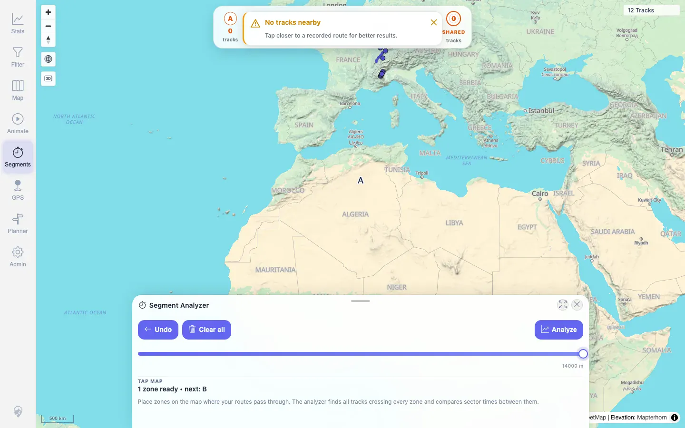
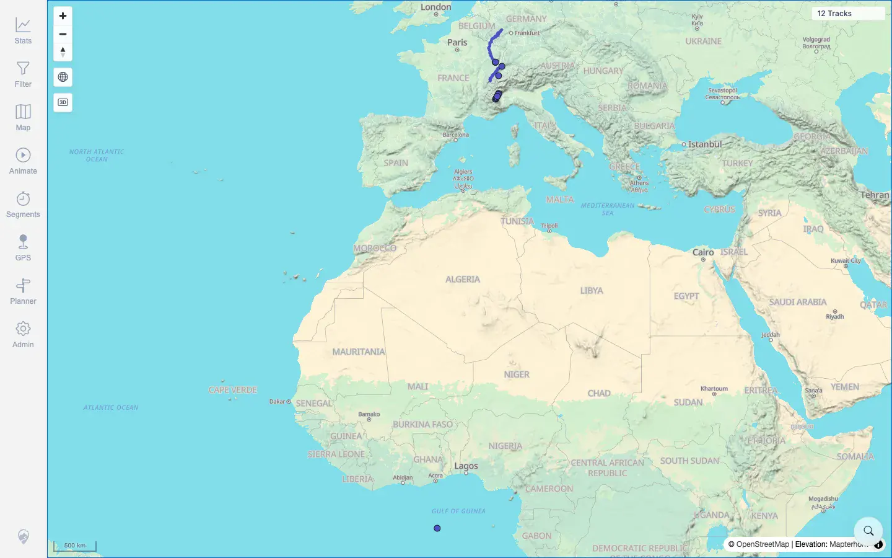

# Packet: MCT_03

## Scope

- Coverage source: `documentation/testing/frontend-regression-test-plan.md`
- Coverage ID or run packet: MCT_03
- In scope: Stop Segment Analyzer after placing a temporary zone and verify visible temporary measure state is cleaned up.
- Out of scope: Compare overlay and sub-track extraction, covered by later MCT packets.

## Prerequisites

- Required previous coverage IDs or run packets: MCT_01, MCT_02.
- Required app/data state: 12 visible tracks, no active filter.
- Required browser context: Fresh desktop browser context, authenticated as `mtl`.

## Allowed Mutations

- Allowed: Temporary Segment Analyzer point/overlay and map viewport state.
- Not allowed: Track, planner, filter, or server data mutations.

## Actions And Results

| Coverage ID | Action | Expected result | Actual result | Status | Evidence |
|---|---|---|---|---|---|
| MCT_03 | Opened Segments, placed one temporary zone, then closed the sheet with Escape. Clicked the map again after closing. | Stopping the measure tool removes temporary markers/listeners and does not keep adding measurement zones. | Before closing, Segments was active with 2 flow nodes and Analyze enabled. After closing, URL returned to `/mtl/`, Segments was not active, visible Segment Analyzer text was gone, flow nodes were `0`, and the overlay was absent. A follow-up map click left flow nodes at `0`; the only post-close request was a normal map proximity request with a non-measure radius. | PASS | [assets/MCT_03-before-stop.webp](../assets/MCT_03-before-stop.webp), [assets/MCT_03-after-stop.webp](../assets/MCT_03-after-stop.webp), [assets/MCT_03-after-stop-map-click.webp](../assets/MCT_03-after-stop-map-click.webp), [assets/MCT_03-cleanup-lifecycle.txt](../assets/MCT_03-cleanup-lifecycle.txt) |

## Issues

| ID | Severity | Summary | Reproduction | Expected | Actual | Evidence | Release impact |
|---|---|---|---|---|---|---|---|
|  |  |  |  |  |  |  |  |

## Evidence Files

| File | Purpose |
|---|---|
| [assets/MCT_03-before-stop.webp](../assets/MCT_03-before-stop.webp) | Segment Analyzer active with temporary measure zone. |
| [assets/MCT_03-after-stop.webp](../assets/MCT_03-after-stop.webp) | App after closing Segment Analyzer. |
| [assets/MCT_03-after-stop-map-click.webp](../assets/MCT_03-after-stop-map-click.webp) | App after a post-close map click, with no visible measure overlay restored. |
| [assets/MCT_03-cleanup-lifecycle.txt](../assets/MCT_03-cleanup-lifecycle.txt) | DOM state and request summary before close, after close, and after post-close click. |

## Screenshot Evidence

**Segment Analyzer active with temporary measure zone.**

**App after closing Segment Analyzer.**

**App after a post-close map click, with no visible measure overlay restored.**

## Timings

| Step | Timing |
|---|---:|
| Lifecycle close and post-close click | ~16s |

## Handoff Notes

- Completed: MCT_03 PASS.
- Remaining unfinished coverage: MCT_04 onward.
- Blocked or not applicable: None.
- State left for the next packet: No server data was changed. Next packet should recreate a Segment Analyzer result for compare/race overlays as needed.
