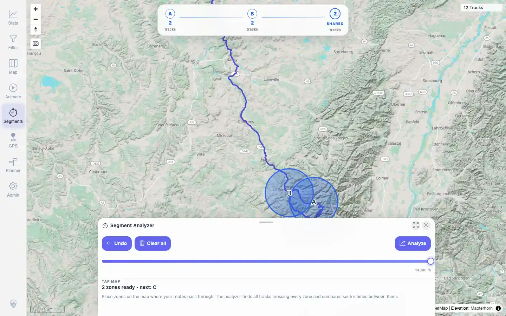
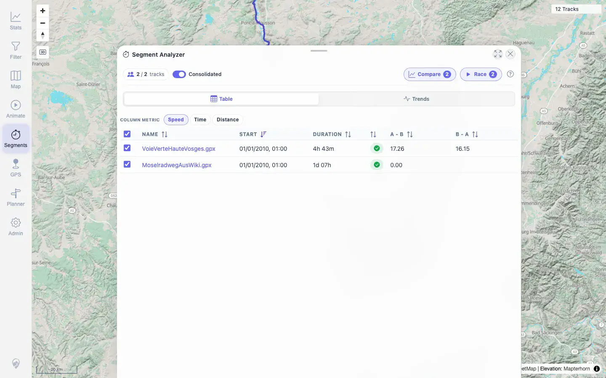
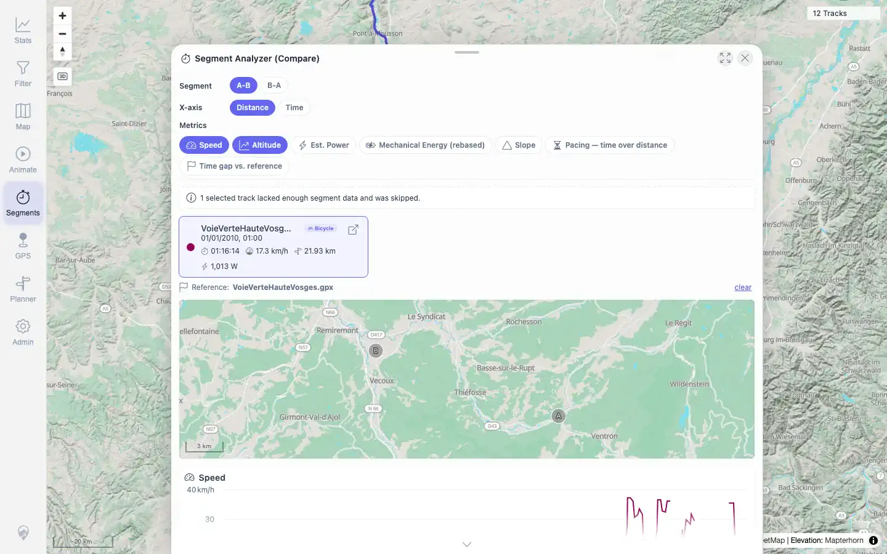

# Packet: MCT_04

## Scope

- Coverage source: `documentation/testing/frontend-regression-test-plan.md`
- Coverage ID or run packet: MCT_04
- In scope: Segment comparison with multiple selected tracks, comparison charts, minimap, and missing/degenerate segment handling.
- Out of scope: Result-row navigation and sub-track endpoint details, covered by MCT_02 and MCT_05.

## Prerequisites

- Required previous coverage IDs or run packets: MCT_01 through MCT_03.
- Required app/data state: 12 visible tracks, no active filter.
- Required browser context: Desktop browser, authenticated as `mtl`.

## Allowed Mutations

- Allowed: Temporary map viewport/search/segment-tool/compare-overlay state.
- Not allowed: Track, planner, filter, or server data mutations.

## Actions And Results

| Coverage ID | Action | Expected result | Actual result | Status | Evidence |
|---|---|---|---|---|---|
| MCT_04 | Used a confirmed 14 km trigger-pair near Epinal to create a two-track Segment Analyzer result, then opened Compare with both auto-selected tracks. | Comparison chart and map align selected tracks correctly, even with missing data. | Zones showed `A2tracksB2tracks2sharedtracks`. Result sheet listed `VoieVerteHauteVosges.gpx` and `MoselradwegAusWiki.gpx`; Compare opened with A-B/B-A chips, minimap present, 3 Highcharts containers, and one racer card for the usable segment. The degenerate Moselradweg sub-track was skipped with the clear warning `1 selected track lacked enough segment data and was skipped.` | PASS | [assets/MCT_04-two-track-zones.webp](../assets/MCT_04-two-track-zones.webp), [assets/MCT_04-two-track-results.webp](../assets/MCT_04-two-track-results.webp), [assets/MCT_04-compare-overlay.webp](../assets/MCT_04-compare-overlay.webp), [assets/MCT_04-compare-overlay.txt](../assets/MCT_04-compare-overlay.txt) |

## Issues

| ID | Severity | Summary | Reproduction | Expected | Actual | Evidence | Release impact |
|---|---|---|---|---|---|---|---|
|  |  |  |  |  |  |  |  |

## Evidence Files

| File | Purpose |
|---|---|
| [assets/MCT_04-track-sampling-candidates.txt](../assets/MCT_04-track-sampling-candidates.txt) | Compact summary of the chosen multi-track trigger pair. |
| [assets/MCT_04-two-track-zones.webp](../assets/MCT_04-two-track-zones.webp) | Segment Analyzer with two shared-track zones. |
| [assets/MCT_04-two-track-results.webp](../assets/MCT_04-two-track-results.webp) | Two-track result sheet before Compare. |
| [assets/MCT_04-compare-overlay.webp](../assets/MCT_04-compare-overlay.webp) | Compare overlay with minimap, charts, and missing-data warning. |
| [assets/MCT_04-compare-overlay.txt](../assets/MCT_04-compare-overlay.txt) | DOM, endpoint, and rendered-state evidence. |

## Screenshot Evidence

**Segment Analyzer with two shared-track zones.**

**Two-track result sheet before Compare.**

**Compare overlay with minimap, charts, and missing-data warning.**

## Timings

| Step | Timing |
|---|---:|
| Candidate scan | ~2s |
| UI result and Compare overlay | ~24s |

## Handoff Notes

- Completed: MCT_04 PASS.
- Remaining unfinished coverage: MCT_05 onward.
- Blocked or not applicable: None.
- State left for the next packet: No server data was changed. The MCT_04 evidence contains concrete sub-track point IDs that can be reused for MCT_05.
