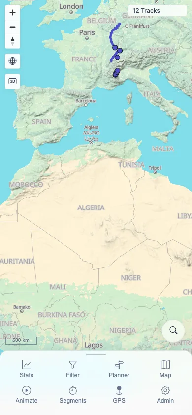

# Packet: MOB_01

## Scope

- Coverage source: `documentation/testing/frontend-regression-test-plan.md`
- Coverage ID or run packet: MOB_01
- In scope: Narrow mobile viewport and touch-enabled browser context baseline.
- Out of scope: Specific mobile sheets, tables, planner, and gesture workflows; covered by MOB_02 through MOB_05.

## Prerequisites

- Required previous coverage IDs or run packets: LOC_04.
- Required app/data state: Authenticated 12-track map.
- Required browser context: Mobile Chromium context with `isMobile: true` and `hasTouch: true`.

## Allowed Mutations

- Allowed: Open a fresh mobile browser context.
- Not allowed: Change server data.

## Actions And Results

| Coverage ID | Action | Expected result | Actual result | Status | Evidence |
|---|---|---|---|---|---|
| MOB_01 | Loaded MTL Explorer in a 390 x 844 mobile viewport with touch enabled. | App is tested at narrow mobile width and with touch input enabled. | Browser reported `innerWidth=390`, `maxTouchPoints=1`, `ontouchstart=true`, coarse pointer and no-hover media queries true. The app loaded the 12-track shell, mobile nav controls were visible, and document/body width stayed at 390 px. | PASS | [assets/MOB_01-mobile-context.txt](../assets/MOB_01-mobile-context.txt); [assets/MOB_01-mobile-shell.webp](../assets/MOB_01-mobile-shell.webp) |

## Issues

| ID | Severity | Summary | Reproduction | Expected | Actual | Evidence | Release impact |
|---|---|---|---|---|---|---|---|

## Evidence Files

| File | Purpose |
|---|---|
| [assets/MOB_01-mobile-context.txt](../assets/MOB_01-mobile-context.txt) | Mobile viewport, touch capability, shell text, and overflow metrics. |
| [assets/MOB_01-mobile-shell.webp](../assets/MOB_01-mobile-shell.webp) | Mobile app shell at 390 x 844. |

## Screenshot Evidence

**Mobile app shell at 390 x 844.**

## Timings

| Step | Timing |
|---|---:|
| Mobile context baseline | ~1 min |

## Handoff Notes

- Completed: MOB_01 terminal as `PASS`.
- Remaining unfinished coverage: Continue with MOB_02.
- Blocked or not applicable: None.
- State left for the next packet: Fresh mobile context closed; server state unchanged at 12 tracks.
