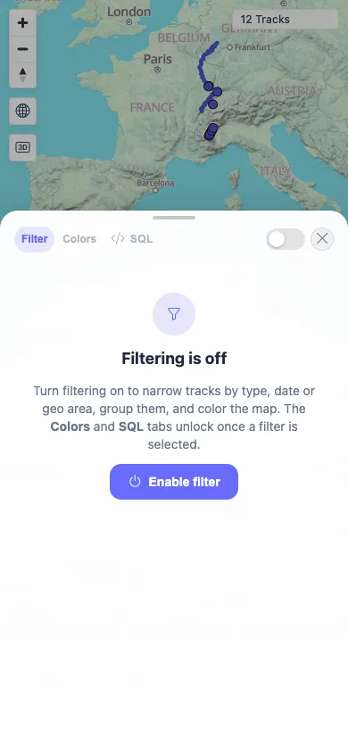
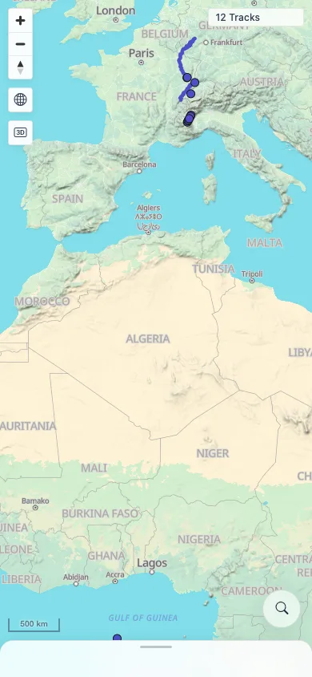
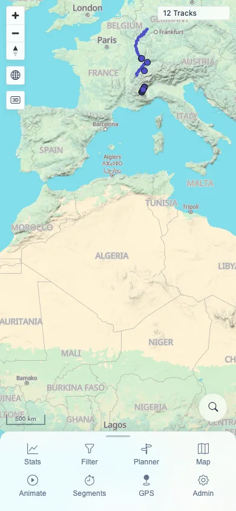

# Packet: MOB_02

## Scope

- Coverage source: `documentation/testing/frontend-regression-test-plan.md`
- Coverage ID or run packet: MOB_02
- In scope: Mobile bottom sheet and navigation sheet drag, snap, and close behavior.
- Out of scope: Planner-specific touch gestures; covered by MOB_04.

## Prerequisites

- Required previous coverage IDs or run packets: MOB_01.
- Required app/data state: Authenticated 12-track map.
- Required browser context: Mobile Chromium context with touch enabled.

## Allowed Mutations

- Allowed: Open/close mobile sheets and drag their handles.
- Not allowed: Change server data.

## Actions And Results

| Coverage ID | Action | Expected result | Actual result | Status | Evidence |
|---|---|---|---|---|---|
| MOB_02 | Opened the Filter bottom sheet, dragged it down and back to full snap, then dragged the mobile navigation sheet down and up using Chrome touch events. | Bottom sheets and the navigation sheet drag, snap, and close correctly. | Filter sheet opened at `607.7 px` high, dragged closed to an `8 px` strip, reopened, and stayed snapped at full height after upward drag. Navigation sheet collapsed from `132 px` to `46 px` and expanded back to `132 px`. Page width stayed 390 px. | PASS | [assets/MOB_02-mobile-sheets.txt](../assets/MOB_02-mobile-sheets.txt); [assets/MOB_02-filter-open.webp](../assets/MOB_02-filter-open.webp); [assets/MOB_02-filter-closed.webp](../assets/MOB_02-filter-closed.webp); [assets/MOB_02-nav-collapsed.webp](../assets/MOB_02-nav-collapsed.webp); [assets/MOB_02-nav-expanded.webp](../assets/MOB_02-nav-expanded.webp) |

## Issues

| ID | Severity | Summary | Reproduction | Expected | Actual | Evidence | Release impact |
|---|---|---|---|---|---|---|---|

## Evidence Files

| File | Purpose |
|---|---|
| [assets/MOB_02-mobile-sheets.txt](../assets/MOB_02-mobile-sheets.txt) | Sheet/nav measurements before and after touch drags. |
| [assets/MOB_02-filter-open.webp](../assets/MOB_02-filter-open.webp) | Filter sheet open at full mobile snap. |
| [assets/MOB_02-filter-closed.webp](../assets/MOB_02-filter-closed.webp) | Filter sheet closed to bottom strip. |
| [assets/MOB_02-nav-collapsed.webp](../assets/MOB_02-nav-collapsed.webp) | Navigation sheet collapsed. |
| [assets/MOB_02-nav-expanded.webp](../assets/MOB_02-nav-expanded.webp) | Navigation sheet expanded again. |

## Screenshot Evidence

**Filter sheet open at full mobile snap.**

**Filter sheet closed to bottom strip.**

**Navigation sheet collapsed.**

**Navigation sheet expanded again.**

## Timings

| Step | Timing |
|---|---:|
| Mobile sheet drag/snap checks | ~3 min |

## Handoff Notes

- Completed: MOB_02 terminal as `PASS`.
- Remaining unfinished coverage: Continue with MOB_03.
- Blocked or not applicable: None.
- State left for the next packet: Fresh mobile context closed; server state unchanged.
