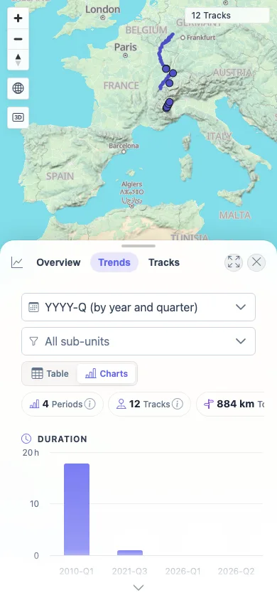
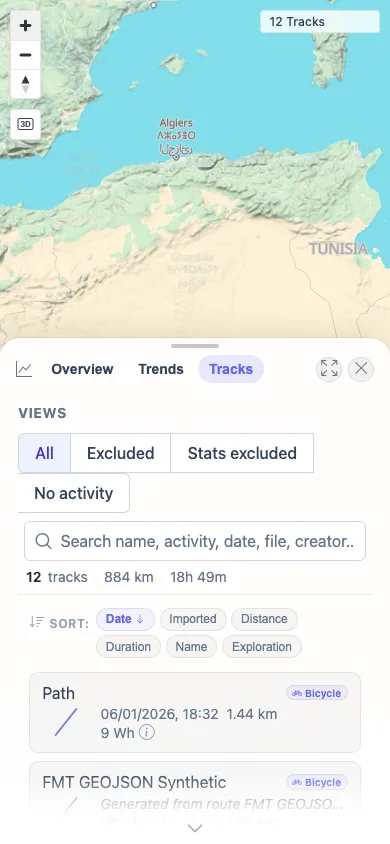

# Packet: MOB_03

## Scope

- Coverage source: `documentation/testing/frontend-regression-test-plan.md`
- Coverage ID or run packet: MOB_03
- In scope: Mobile usability for Stats tables/lists, charts, and map controls; horizontal overflow checks.
- Out of scope: Planner touch editing and map gesture coverage; covered by MOB_04 and MOB_05.

## Prerequisites

- Required previous coverage IDs or run packets: MOB_02.
- Required app/data state: Authenticated 12-track map.
- Required browser context: Mobile Chromium context with touch enabled.

## Allowed Mutations

- Allowed: Open Stats tabs and use map zoom controls.
- Not allowed: Change server data.

## Actions And Results

| Coverage ID | Action | Expected result | Actual result | Status | Evidence |
|---|---|---|---|---|---|
| MOB_03 | Opened Stats Overview, Trends, and Tracks tabs at 390 px width, inspected chart/list metrics and overflow, then clicked map Zoom in. | Tables, charts, and map controls stay usable; no text overflows. | Stats Overview and Tracks list rendered usable mobile content; Trends rendered multiple `354 x 185` Highcharts charts; document/body width stayed 390 px. Long track description text was contained/ellipsized in the card. Zoom control changed scale from `500 km` to `300 km`. | PASS | [assets/MOB_03-mobile-usability.txt](../assets/MOB_03-mobile-usability.txt); [assets/MOB_03-stats-trends.webp](../assets/MOB_03-stats-trends.webp); [assets/MOB_03-tracks-list.webp](../assets/MOB_03-tracks-list.webp); [assets/MOB_03-map-zoom.webp](../assets/MOB_03-map-zoom.webp) |

## Issues

| ID | Severity | Summary | Reproduction | Expected | Actual | Evidence | Release impact |
|---|---|---|---|---|---|---|---|

## Evidence Files

| File | Purpose |
|---|---|
| [assets/MOB_03-mobile-usability.txt](../assets/MOB_03-mobile-usability.txt) | Mobile width, overflow, chart dimensions, Tracks list, and map zoom metrics. |
| [assets/MOB_03-stats-trends.webp](../assets/MOB_03-stats-trends.webp) | Mobile Stats Trends charts. |
| [assets/MOB_03-tracks-list.webp](../assets/MOB_03-tracks-list.webp) | Mobile Tracks tab list. |
| [assets/MOB_03-map-zoom.webp](../assets/MOB_03-map-zoom.webp) | Map after mobile zoom-control interaction. |

## Screenshot Evidence

**Mobile Stats Trends charts.**

**Mobile Tracks tab list.**

**Map after mobile zoom-control interaction.**

## Timings

| Step | Timing |
|---|---:|
| Mobile tables/charts/map checks | ~3 min |

## Handoff Notes

- Completed: MOB_03 terminal as `PASS`.
- Remaining unfinished coverage: Continue with MOB_04.
- Blocked or not applicable: None.
- State left for the next packet: Fresh mobile context closed; server state unchanged.
