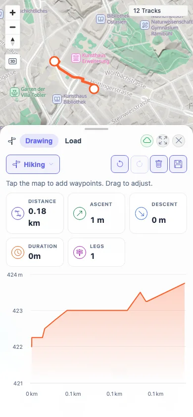
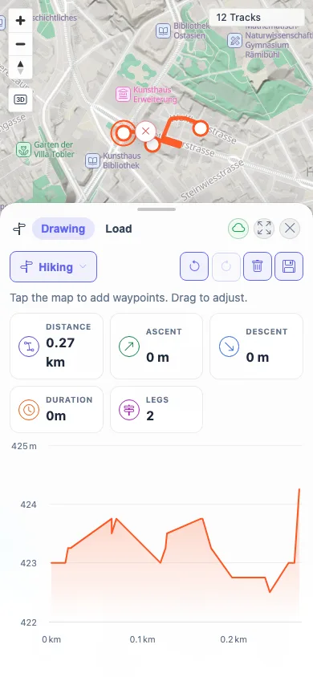

# Packet: MOB_04

## Scope

- Coverage source: `documentation/testing/frontend-regression-test-plan.md`
- Coverage ID or run packet: MOB_04
- In scope: Mobile touch waypoint tapping, insertion, and dragging in Planner.
- Out of scope: Desktop planner save/export workflows; covered by PLN packets.

## Prerequisites

- Required previous coverage IDs or run packets: MOB_03.
- Required app/data state: Zürich search available; routing helpers operational.
- Required browser context: Mobile Chromium context with touch enabled.

## Allowed Mutations

- Allowed: Create temporary in-memory planner waypoints.
- Not allowed: Save a route or change server data.

## Actions And Results

| Coverage ID | Action | Expected result | Actual result | Status | Evidence |
|---|---|---|---|---|---|
| MOB_04 | In mobile Planner at Zürich, tapped two waypoints, tapped a third waypoint, then touch-dragged the first waypoint. | Planner waypoints can be tapped, dragged, and inserted with touch. | Two taps produced a 0.18 km, 1-leg route with an elevation chart. The third tap produced a 0.39 km, 2-leg route. Touch drag from `110,124` to `154,166` recomputed the route to 0.27 km with 2 legs and the chart still rendered. | PASS | [assets/MOB_04-touch-planner.txt](../assets/MOB_04-touch-planner.txt); [assets/MOB_04-touch-two-waypoints.webp](../assets/MOB_04-touch-two-waypoints.webp); [assets/MOB_04-touch-inserted-waypoint.webp](../assets/MOB_04-touch-inserted-waypoint.webp); [assets/MOB_04-touch-dragged-waypoint.webp](../assets/MOB_04-touch-dragged-waypoint.webp) |

## Issues

| ID | Severity | Summary | Reproduction | Expected | Actual | Evidence | Release impact |
|---|---|---|---|---|---|---|---|

## Evidence Files

| File | Purpose |
|---|---|
| [assets/MOB_04-touch-planner.txt](../assets/MOB_04-touch-planner.txt) | Planner route metrics after tap, insert, and drag touch operations. |
| [assets/MOB_04-touch-two-waypoints.webp](../assets/MOB_04-touch-two-waypoints.webp) | Route after two touch waypoints. |
| [assets/MOB_04-touch-inserted-waypoint.webp](../assets/MOB_04-touch-inserted-waypoint.webp) | Route after adding a third waypoint by touch. |
| [assets/MOB_04-touch-dragged-waypoint.webp](../assets/MOB_04-touch-dragged-waypoint.webp) | Route after touch-dragging a waypoint. |

## Screenshot Evidence

**Route after two touch waypoints.**

**Route after adding a third waypoint by touch.**

**Route after touch-dragging a waypoint.**

## Timings

| Step | Timing |
|---|---:|
| Mobile planner touch route check | ~4 min |

## Handoff Notes

- Completed: MOB_04 terminal as `PASS`.
- Remaining unfinished coverage: Continue with MOB_05.
- Blocked or not applicable: None.
- State left for the next packet: Fresh mobile context closed; no saved route created.
