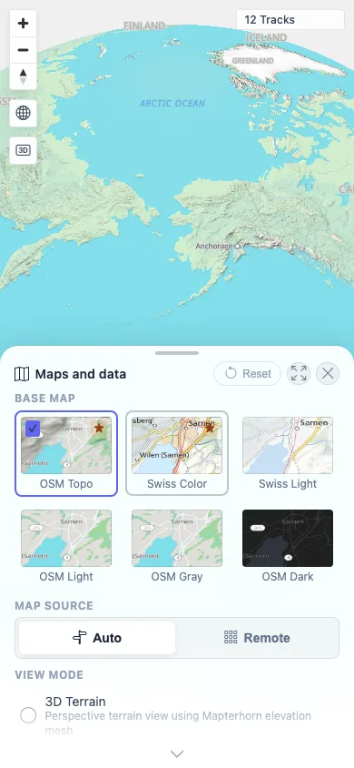

# Packet: MOB_05

## Scope

- Coverage source: `documentation/testing/frontend-regression-test-plan.md`
- Coverage ID or run packet: MOB_05
- In scope: Mobile map drag, double-tap, and pinch gestures after using each major tool.
- Out of scope: Tool-specific behavior already covered by earlier packets.

## Prerequisites

- Required previous coverage IDs or run packets: MOB_04.
- Required app/data state: Authenticated 12-track map.
- Required browser context: Mobile Chromium context with touch enabled.

## Allowed Mutations

- Allowed: Temporary viewport/tool state changes.
- Not allowed: Change server data.

## Actions And Results

| Coverage ID | Action | Expected result | Actual result | Status | Evidence |
|---|---|---|---|---|---|
| MOB_05 | For each major mobile tool (`Stats`, `Filter`, `Planner`, `Map`, `Animate`, `Segments`, `GPS`, `Admin`), opened the tool, returned to the map sheet, then performed touch double-tap, drag, and pinch gestures over the visible map. | Map gestures (pinch, double-tap, drag) work after using each tool. | Every tool cycle reported `dragChanged=true`, double-tap scale changes, and pinch scale changes. Example scales changed between `1000 km`, `500 km`, `300 km`, `200 km`, and `1000 km` depending on the gesture sequence. | PASS | [assets/MOB_05-touch-gestures.txt](../assets/MOB_05-touch-gestures.txt); [assets/MOB_05-after-tool-gestures.webp](../assets/MOB_05-after-tool-gestures.webp) |

## Issues

| ID | Severity | Summary | Reproduction | Expected | Actual | Evidence | Release impact |
|---|---|---|---|---|---|---|---|

## Evidence Files

| File | Purpose |
|---|---|
| [assets/MOB_05-touch-gestures.txt](../assets/MOB_05-touch-gestures.txt) | Per-tool gesture results for drag screenshot-hash changes, double-tap zoom, and pinch zoom. |
| [assets/MOB_05-after-tool-gestures.webp](../assets/MOB_05-after-tool-gestures.webp) | Final mobile map/tool state after gesture cycle. |

## Screenshot Evidence

**Final mobile map/tool state after gesture cycle.**

## Timings

| Step | Timing |
|---|---:|
| Per-tool mobile gesture cycle | ~8 min |

## Handoff Notes

- Completed: MOB_05 terminal as `PASS`.
- Remaining unfinished coverage: Continue with NET_01.
- Blocked or not applicable: None.
- State left for the next packet: Fresh mobile context closed; server state unchanged.
