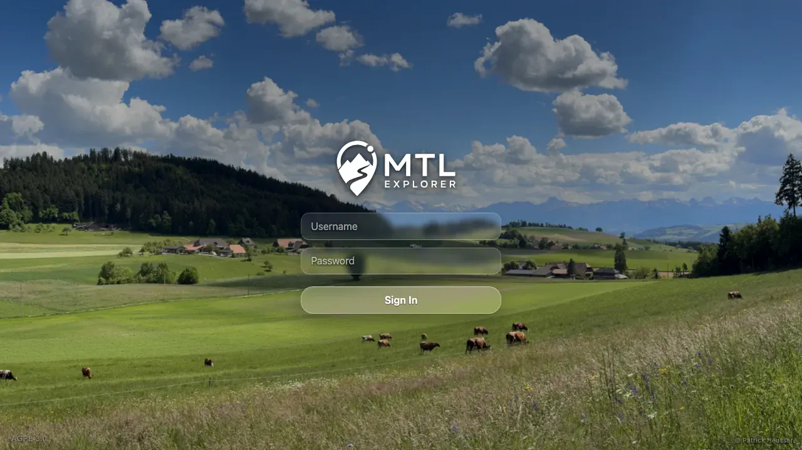

# Packet: NET_03

## Scope

- Coverage source: `documentation/testing/frontend-regression-test-plan.md`
- Coverage ID or run packet: NET_03
- In scope: Invalid/expired auth response redirects to login.
- Out of scope: Normal login/logout behavior; covered by SGN packets.

## Prerequisites

- Required previous coverage IDs or run packets: NET_02.
- Required app/data state: Isolated authenticated browser context.
- Required browser context: Desktop Chromium context.

## Allowed Mutations

- Allowed: Corrupt the isolated browser context's local JWT.
- Not allowed: Change server data or shared credentials.

## Actions And Results

| Coverage ID | Action | Expected result | Actual result | Status | Evidence |
|---|---|---|---|---|---|
| NET_03 | Logged in, replaced `mtl.jwt` with `invalid.expired.token`, and reloaded. | 401 / 403 from the server redirects to login. | A 401 response from `/mtl/api/info/build` was captured; the app redirected to `/mtl/login?reason=expired` and showed the login form with Sign In. | PASS | [assets/NET_03-auth-redirect.txt](../assets/NET_03-auth-redirect.txt); [assets/NET_03-auth-redirect.webp](../assets/NET_03-auth-redirect.webp) |

## Issues

| ID | Severity | Summary | Reproduction | Expected | Actual | Evidence | Release impact |
|---|---|---|---|---|---|---|---|

## Evidence Files

| File | Purpose |
|---|---|
| [assets/NET_03-auth-redirect.txt](../assets/NET_03-auth-redirect.txt) | Invalid JWT, 401 response, redirect URL, and login-form evidence. |
| [assets/NET_03-auth-redirect.webp](../assets/NET_03-auth-redirect.webp) | Login screen after expired-token redirect. |

## Screenshot Evidence

**Login screen after expired-token redirect.**

## Timings

| Step | Timing |
|---|---:|
| Invalid auth redirect check | ~2 min |

## Handoff Notes

- Completed: NET_03 terminal as `PASS`.
- Remaining unfinished coverage: Continue with NET_04.
- Blocked or not applicable: None.
- State left for the next packet: Isolated context closed; shared app/server state unchanged.
