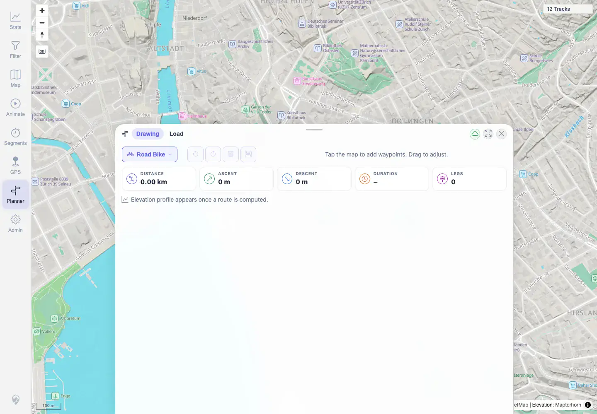

# Packet: PLN_01

## Scope

- Coverage source: `documentation/testing/frontend-regression-test-plan.md`
- Coverage ID or run packet: PLN_01
- In scope: Open Planner and select a routing profile.
- Out of scope: Route editing and persistence covered by later PLN packets.

## Prerequisites

- Required previous coverage IDs or run packets: RUN_SETUP through TBS_11 terminal.
- Required app/data state: 12 visible tracks; BRouter enabled.
- Required browser context: Authenticated desktop Chromium context.

## Allowed Mutations

- Allowed: Use location search to focus Zürich; open Planner; change profile.
- Not allowed: Leave saved plans behind.

## Actions And Results

| Coverage ID | Action | Expected result | Actual result | Status | Evidence |
|---|---|---|---|---|---|
| PLN_01 | Opened Planner after selecting Zürich and chose the Road Bike profile from the profile dropdown. | Planner opens and routing profile can be selected. | Planner opened on Drawing tab with profiles Hiking, Road Bike, Mountain Hiking, and Car; Road Bike was selected. | PASS | [assets/PLN_desktop-flow.txt](../assets/PLN_desktop-flow.txt), [assets/PLN_01-open-profile.webp](../assets/PLN_01-open-profile.webp) |

## Issues

| ID | Severity | Summary | Reproduction | Expected | Actual | Evidence | Release impact |
|---|---|---|---|---|---|---|---|
|  |  |  |  |  |  |  |  |

## Evidence Files

| File | Purpose |
|---|---|
| [assets/PLN_desktop-flow.txt](../assets/PLN_desktop-flow.txt) | Profile options and selected profile log. |
| [assets/PLN_01-open-profile.webp](../assets/PLN_01-open-profile.webp) | Planner open with Road Bike profile. |

## Screenshot Evidence

**Planner open with Road Bike profile.**

## Timings

| Step | Timing |
|---|---:|
| Planner open/profile selection | 2026-06-01T22:58:00+0200 |

## Handoff Notes

- Completed: PLN_01 is terminal PASS.
- Remaining unfinished coverage: PLN_02 onward.
- Blocked or not applicable: None.
- State left for the next packet: Temporary planner routes from this flow were cleaned up.
