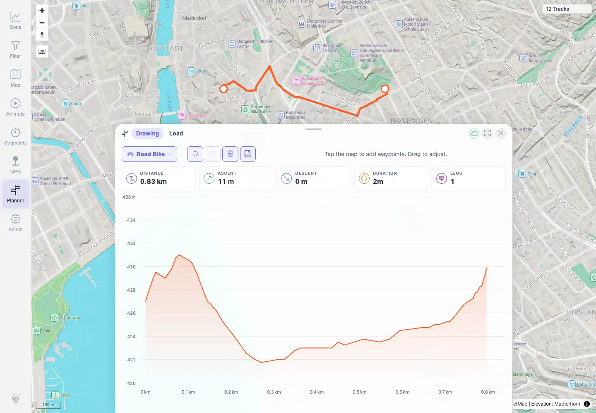

# Packet: PLN_02

## Scope

- Coverage source: `documentation/testing/frontend-regression-test-plan.md`
- Coverage ID or run packet: PLN_02
- In scope: Add waypoints on the map and compute/draw a route.
- Out of scope: Route editing covered by PLN_03/PLN_04.

## Prerequisites

- Required previous coverage IDs or run packets: PLN_01.
- Required app/data state: Zürich map view; Road Bike planner profile.
- Required browser context: Authenticated desktop Chromium context.

## Allowed Mutations

- Allowed: Add temporary planner waypoints.
- Not allowed: Persist saved plans after packet cleanup.

## Actions And Results

| Coverage ID | Action | Expected result | Actual result | Status | Evidence |
|---|---|---|---|---|---|
| PLN_02 | Clicked two points on the Zürich map in Planner. | A route is computed and drawn. | Planner drew the route and showed live stats: 0.83 km distance, 11 m ascent, 2 min duration, 1 leg, with Save enabled. | PASS | [assets/PLN_desktop-flow.txt](../assets/PLN_desktop-flow.txt), [assets/PLN_02-route-computed.webp](../assets/PLN_02-route-computed.webp) |

## Issues

| ID | Severity | Summary | Reproduction | Expected | Actual | Evidence | Release impact |
|---|---|---|---|---|---|---|---|
|  |  |  |  |  |  |  |  |

## Evidence Files

| File | Purpose |
|---|---|
| [assets/PLN_desktop-flow.txt](../assets/PLN_desktop-flow.txt) | Route stats and click-point evidence. |
| [assets/PLN_02-route-computed.webp](../assets/PLN_02-route-computed.webp) | Drawn route, waypoints, stats, and elevation profile. |

## Screenshot Evidence

**Drawn route, waypoints, stats, and elevation profile.**

## Timings

| Step | Timing |
|---|---:|
| Two-waypoint route computation | 2026-06-01T22:59:00+0200 |

## Handoff Notes

- Completed: PLN_02 is terminal PASS.
- Remaining unfinished coverage: PLN_03 onward.
- Blocked or not applicable: None.
- State left for the next packet: Temporary route state only; no saved plan retained.
