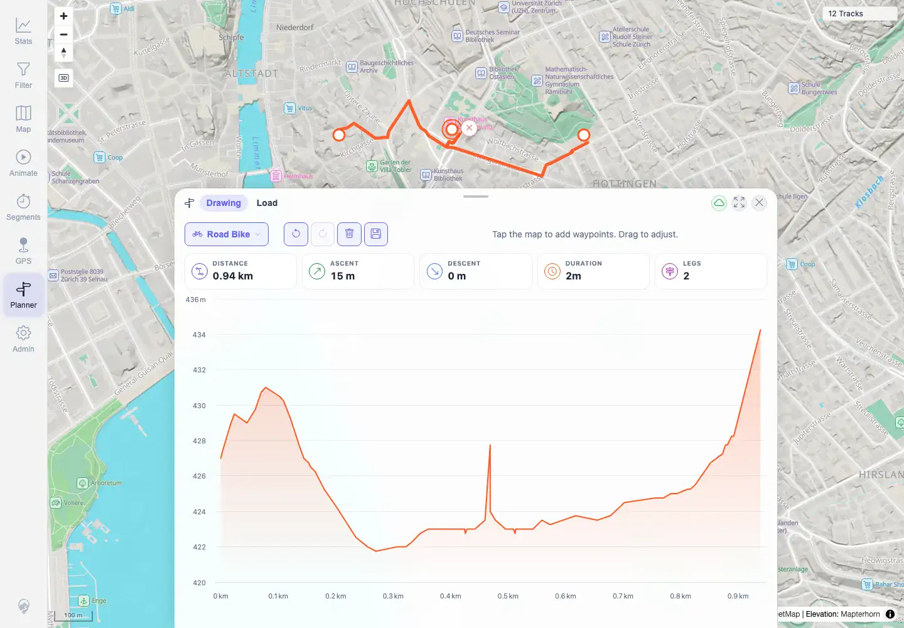

# Packet: PLN_03

## Scope

- Coverage source: `documentation/testing/frontend-regression-test-plan.md`
- Coverage ID or run packet: PLN_03
- In scope: Insert a waypoint by dragging an existing route leg.
- Out of scope: General move/delete/undo covered by PLN_04.

## Prerequisites

- Required previous coverage IDs or run packets: PLN_02.
- Required app/data state: Two-waypoint Road Bike planner route visible.
- Required browser context: Authenticated desktop Chromium context.

## Allowed Mutations

- Allowed: Insert a temporary waypoint into the in-memory planned route.
- Not allowed: Persist saved plans after packet cleanup.

## Actions And Results

| Coverage ID | Action | Expected result | Actual result | Status | Evidence |
|---|---|---|---|---|---|
| PLN_03 | Dragged the visible orange route at screen point `720,236` to `720,206`. | A waypoint is inserted into the existing leg and the route recomputes. | Planner changed from 1 leg / 0.83 km to 2 legs / 0.94 km and displayed the selected waypoint delete marker. | PASS | [assets/PLN_desktop-flow.txt](../assets/PLN_desktop-flow.txt), [assets/PLN_03-route-waypoint-inserted.webp](../assets/PLN_03-route-waypoint-inserted.webp) |

## Issues

| ID | Severity | Summary | Reproduction | Expected | Actual | Evidence | Release impact |
|---|---|---|---|---|---|---|---|
|  |  |  |  |  |  |  |  |

## Evidence Files

| File | Purpose |
|---|---|
| [assets/PLN_desktop-flow.txt](../assets/PLN_desktop-flow.txt) | Insert drag coordinates and before/after stats. |
| [assets/PLN_03-route-waypoint-inserted.webp](../assets/PLN_03-route-waypoint-inserted.webp) | Inserted waypoint route state. |

## Screenshot Evidence

**Inserted waypoint route state.**

## Timings

| Step | Timing |
|---|---:|
| Route waypoint insertion | 2026-06-01T23:00:00+0200 |

## Handoff Notes

- Completed: PLN_03 is terminal PASS.
- Remaining unfinished coverage: PLN_04 onward.
- Blocked or not applicable: None.
- State left for the next packet: Route insertion was temporary and later cleaned up.
