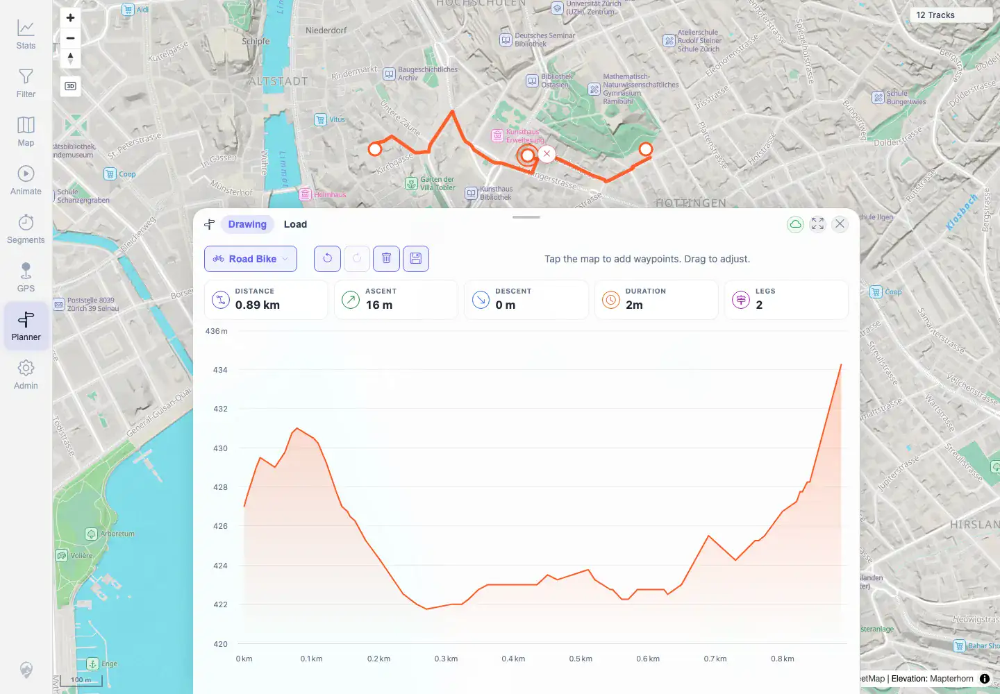
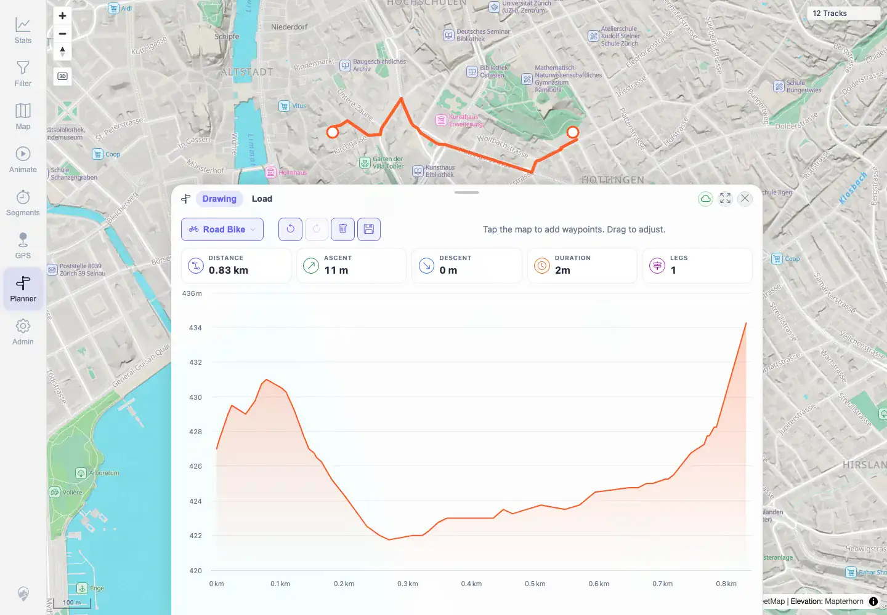

# Packet: PLN_04

## Scope

- Coverage source: `documentation/testing/frontend-regression-test-plan.md`
- Coverage ID or run packet: PLN_04
- In scope: Move/delete waypoints and clear/undo/redo route edits.
- Out of scope: Saving planned routes covered by PLN_07.

## Prerequisites

- Required previous coverage IDs or run packets: PLN_03.
- Required app/data state: Planner route with an inserted waypoint.
- Required browser context: Authenticated desktop Chromium context.

## Allowed Mutations

- Allowed: Temporary route edits in Planner.
- Not allowed: Leave saved plans behind.

## Actions And Results

| Coverage ID | Action | Expected result | Actual result | Status | Evidence |
|---|---|---|---|---|---|
| PLN_04 | Dragged inserted waypoint, deleted it via waypoint delete marker, used Undo/Redo for delete, Clear route, Undo clear, Redo clear, and restored the route for later save. | Move/delete/clear/undo/redo all work and stats reflect the route state. | Move changed stats to 0.89 km / 2 legs; delete returned to 0.83 km / 1 leg; undo/redo toggled those states; clear set stats to 0.00 km and disabled Save; undo restored the route. | PASS | [assets/PLN_desktop-flow.txt](../assets/PLN_desktop-flow.txt), [assets/PLN_04-after-move.webp](../assets/PLN_04-after-move.webp), [assets/PLN_04-after-delete.webp](../assets/PLN_04-after-delete.webp), [assets/PLN_04-edit-undo-redo-clear.webp](../assets/PLN_04-edit-undo-redo-clear.webp) |

## Issues

| ID | Severity | Summary | Reproduction | Expected | Actual | Evidence | Release impact |
|---|---|---|---|---|---|---|---|
|  |  |  |  |  |  |  |  |

## Evidence Files

| File | Purpose |
|---|---|
| [assets/PLN_desktop-flow.txt](../assets/PLN_desktop-flow.txt) | Move/delete/undo/redo/clear stats sequence. |
| [assets/PLN_04-after-move.webp](../assets/PLN_04-after-move.webp) | Route after waypoint move. |
| [assets/PLN_04-after-delete.webp](../assets/PLN_04-after-delete.webp) | Route after waypoint delete. |
| [assets/PLN_04-edit-undo-redo-clear.webp](../assets/PLN_04-edit-undo-redo-clear.webp) | Route restored after clear/undo/redo cycle. |

## Screenshot Evidence

**Route after waypoint move.**

**Route after waypoint delete.**

**Route restored after clear/undo/redo cycle.**

## Timings

| Step | Timing |
|---|---:|
| Planner edit controls | 2026-06-01T23:01:00+0200 |

## Handoff Notes

- Completed: PLN_04 is terminal PASS.
- Remaining unfinished coverage: PLN_05 onward.
- Blocked or not applicable: None.
- State left for the next packet: Route restored for save/export checks.
