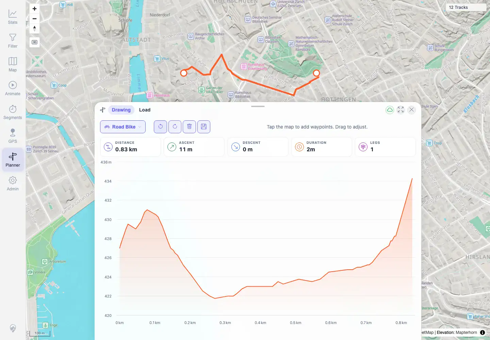

# Packet: PLN_05

## Scope

- Coverage source: `documentation/testing/frontend-regression-test-plan.md`
- Coverage ID or run packet: PLN_05
- In scope: Planner live stats bar updates during route edits.
- Out of scope: Elevation hover behavior covered by PLN_06.

## Prerequisites

- Required previous coverage IDs or run packets: PLN_04.
- Required app/data state: Planner route restored after edit controls.
- Required browser context: Authenticated desktop Chromium context.

## Allowed Mutations

- Allowed: Temporary planner route edits.
- Not allowed: Persist saved plans after cleanup.

## Actions And Results

| Coverage ID | Action | Expected result | Actual result | Status | Evidence |
|---|---|---|---|---|---|
| PLN_05 | Observed live stats before and after route insert/move/delete/clear/undo. | Distance, ascent, time, and leg count update as the route is edited. | Stats changed from 0.83 km / 1 leg to 0.94 km / 2 legs after insert, 0.89 km / 2 legs after move, 0.00 km / 0 legs after clear, and restored to 0.83 km / 1 leg after undo. | PASS | [assets/PLN_desktop-flow.txt](../assets/PLN_desktop-flow.txt), [assets/PLN_05-live-stats-after-edits.webp](../assets/PLN_05-live-stats-after-edits.webp) |

## Issues

| ID | Severity | Summary | Reproduction | Expected | Actual | Evidence | Release impact |
|---|---|---|---|---|---|---|---|
|  |  |  |  |  |  |  |  |

## Evidence Files

| File | Purpose |
|---|---|
| [assets/PLN_desktop-flow.txt](../assets/PLN_desktop-flow.txt) | Live stats sequence. |
| [assets/PLN_05-live-stats-after-edits.webp](../assets/PLN_05-live-stats-after-edits.webp) | Stats bar with computed route. |

## Screenshot Evidence

**Stats bar with computed route.**

## Timings

| Step | Timing |
|---|---:|
| Planner live stats validation | 2026-06-01T23:02:00+0200 |

## Handoff Notes

- Completed: PLN_05 is terminal PASS.
- Remaining unfinished coverage: PLN_06 onward.
- Blocked or not applicable: None.
- State left for the next packet: Temporary route only.
