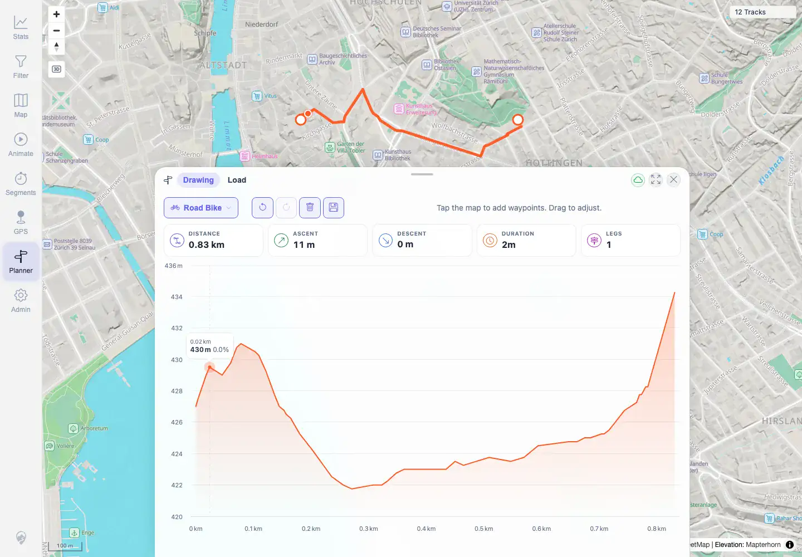

# Packet: PLN_06

## Scope

- Coverage source: `documentation/testing/frontend-regression-test-plan.md`
- Coverage ID or run packet: PLN_06
- In scope: Planner elevation profile rendering and hover-to-map marker sync.
- Out of scope: General route stats covered by PLN_05.

## Prerequisites

- Required previous coverage IDs or run packets: PLN_05.
- Required app/data state: Planner route with elevation profile rendered.
- Required browser context: Authenticated desktop Chromium context.

## Allowed Mutations

- Allowed: Hover over the planner elevation chart.
- Not allowed: Persist saved plans after cleanup.

## Actions And Results

| Coverage ID | Action | Expected result | Actual result | Status | Evidence |
|---|---|---|---|---|---|
| PLN_06 | Hovered over the visible Highcharts elevation curve. | Elevation profile renders and hover highlights the matching map point. | Elevation profile rendered; focused hover at `377,662` showed a Highcharts tooltip and one `.planner-hover-marker` on the map. | PASS | [assets/PLN_06-elevation-hover.txt](../assets/PLN_06-elevation-hover.txt), [assets/PLN_06-elevation-hover-marker.webp](../assets/PLN_06-elevation-hover-marker.webp) |

## Issues

| ID | Severity | Summary | Reproduction | Expected | Actual | Evidence | Release impact |
|---|---|---|---|---|---|---|---|
|  |  |  |  |  |  |  |  |

## Evidence Files

| File | Purpose |
|---|---|
| [assets/PLN_06-elevation-hover.txt](../assets/PLN_06-elevation-hover.txt) | Focused hover observations and final marker count. |
| [assets/PLN_06-elevation-hover-marker.webp](../assets/PLN_06-elevation-hover-marker.webp) | Elevation profile hover state. |

## Screenshot Evidence

**Elevation profile hover state.**

## Timings

| Step | Timing |
|---|---:|
| Elevation profile hover | 2026-06-01T23:05:00+0200 |

## Handoff Notes

- Completed: PLN_06 is terminal PASS.
- Remaining unfinished coverage: PLN_07 onward.
- Blocked or not applicable: None.
- State left for the next packet: No persisted data change.
