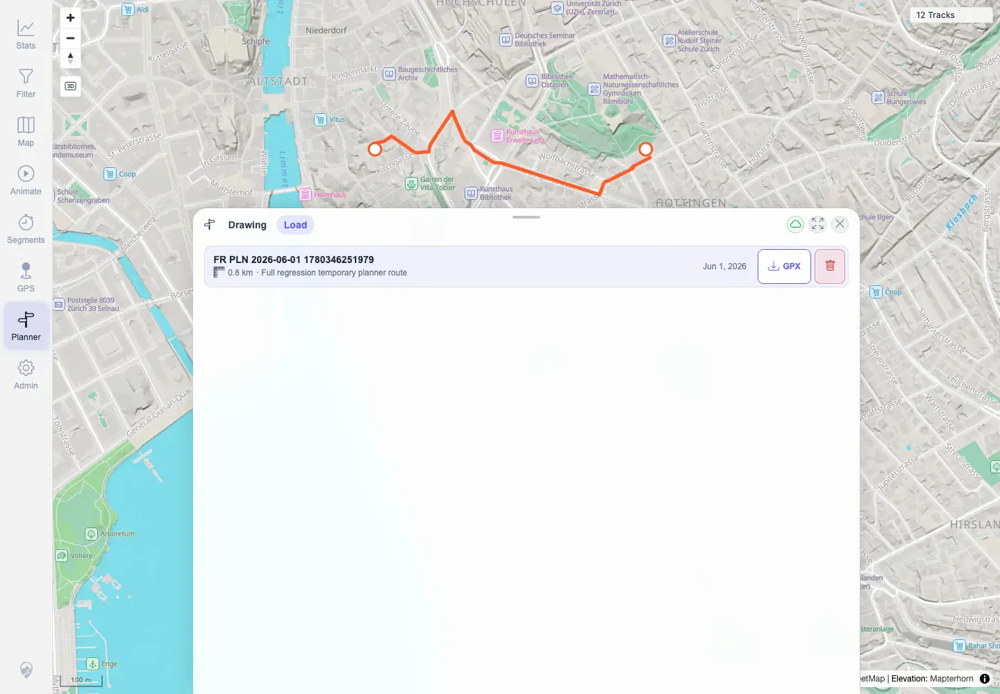
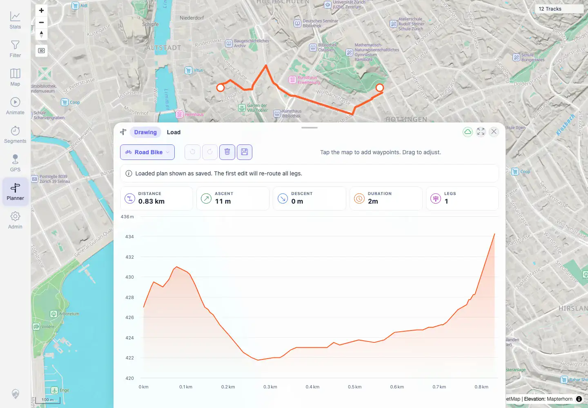
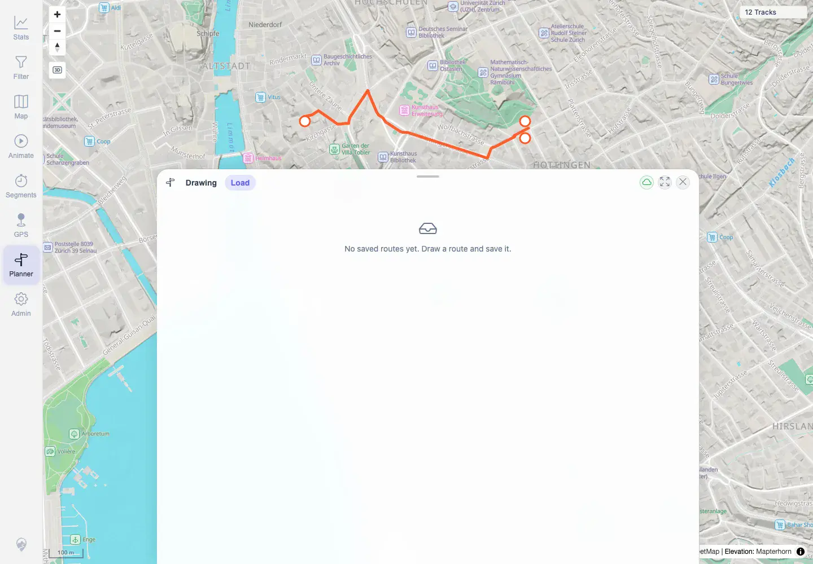

# Packet: PLN_07

## Scope

- Coverage source: `documentation/testing/frontend-regression-test-plan.md`
- Coverage ID or run packet: PLN_07
- In scope: Save a plan, list saved plans, load it, and delete it.
- Out of scope: GPX export content validation covered by PLN_08.

## Prerequisites

- Required previous coverage IDs or run packets: PLN_06.
- Required app/data state: Computed planner route with Save enabled.
- Required browser context: Authenticated desktop Chromium context.

## Allowed Mutations

- Allowed: Temporarily create a saved planned route with prefix `FR PLN 2026-06-01`.
- Not allowed: Leave saved planned routes behind.

## Actions And Results

| Coverage ID | Action | Expected result | Actual result | Status | Evidence |
|---|---|---|---|---|---|
| PLN_07 | Saved the current route, opened Load tab, loaded the saved route, then deleted it. | Save/list/load/delete planned routes works. | Saved plan `FR PLN 2026-06-01 1780346251979` as id `100016`, listed it in Load tab, loaded it back with the saved-route notice and route stats, then deleted it; API cleanup found no remaining prefixed plans. | PASS | [assets/PLN_desktop-flow.txt](../assets/PLN_desktop-flow.txt), [assets/PLN_07-saved-plan-list.webp](../assets/PLN_07-saved-plan-list.webp), [assets/PLN_07-loaded-plan.webp](../assets/PLN_07-loaded-plan.webp), [assets/PLN_07-plan-deleted.webp](../assets/PLN_07-plan-deleted.webp) |

## Issues

| ID | Severity | Summary | Reproduction | Expected | Actual | Evidence | Release impact |
|---|---|---|---|---|---|---|---|
|  |  |  |  |  |  |  |  |

## Evidence Files

| File | Purpose |
|---|---|
| [assets/PLN_desktop-flow.txt](../assets/PLN_desktop-flow.txt) | Saved plan id/name, loaded stats, delete and cleanup result. |
| [assets/PLN_07-saved-plan-list.webp](../assets/PLN_07-saved-plan-list.webp) | Saved plan visible in Load tab. |
| [assets/PLN_07-loaded-plan.webp](../assets/PLN_07-loaded-plan.webp) | Saved plan loaded back into Drawing tab. |
| [assets/PLN_07-plan-deleted.webp](../assets/PLN_07-plan-deleted.webp) | Load tab after deletion. |

## Screenshot Evidence

**Saved plan visible in Load tab.**

**Saved plan loaded back into Drawing tab.**

**Load tab after deletion.**

## Timings

| Step | Timing |
|---|---:|
| Planner save/list/load/delete | 2026-06-01T23:03:00+0200 |

## Handoff Notes

- Completed: PLN_07 is terminal PASS.
- Remaining unfinished coverage: PLN_08 onward.
- Blocked or not applicable: None.
- State left for the next packet: Prefixed temporary planned route deleted; cleanup verified no remaining prefixed plan.
