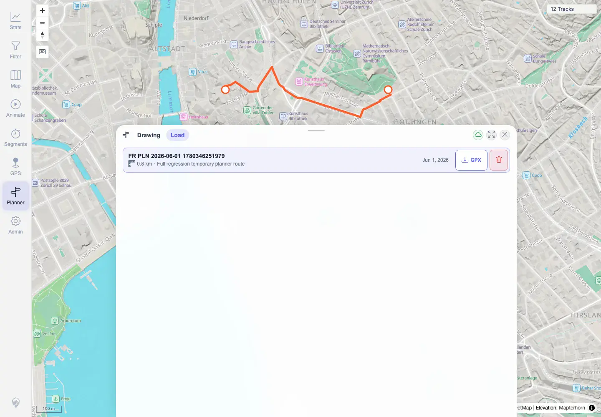

# Packet: PLN_08

## Scope

- Coverage source: `documentation/testing/frontend-regression-test-plan.md`
- Coverage ID or run packet: PLN_08
- In scope: Download saved plan as GPX and validate content.
- Out of scope: Save/load/delete controls covered by PLN_07.

## Prerequisites

- Required previous coverage IDs or run packets: PLN_07.
- Required app/data state: Temporary saved plan present in Load tab during the export step.
- Required browser context: Authenticated desktop Chromium context with downloads enabled.

## Allowed Mutations

- Allowed: Download temporary planned-route GPX.
- Not allowed: Keep downloaded bulky artifacts in the run folder.

## Actions And Results

| Coverage ID | Action | Expected result | Actual result | Status | Evidence |
|---|---|---|---|---|---|
| PLN_08 | Clicked GPX export for the saved temporary plan and parsed the downloaded file. | Downloaded GPX is valid and matches the planned route. | Downloaded `FR PLN 2026-06-01 1780346251979.gpx`; it was 4,080 bytes, contained `<gpx>`, `<trk>`, and 56 `<trkpt>` entries. | PASS | [assets/PLN_desktop-flow.txt](../assets/PLN_desktop-flow.txt), [assets/PLN_08-export-gpx-list.webp](../assets/PLN_08-export-gpx-list.webp) |

## Issues

| ID | Severity | Summary | Reproduction | Expected | Actual | Evidence | Release impact |
|---|---|---|---|---|---|---|---|
|  |  |  |  |  |  |  |  |

## Evidence Files

| File | Purpose |
|---|---|
| [assets/PLN_desktop-flow.txt](../assets/PLN_desktop-flow.txt) | GPX filename, byte size, and trackpoint validation. |
| [assets/PLN_08-export-gpx-list.webp](../assets/PLN_08-export-gpx-list.webp) | GPX export button in saved-plan list. |

## Screenshot Evidence

**GPX export button in saved-plan list.**

## Timings

| Step | Timing |
|---|---:|
| Planned-route GPX export | 2026-06-01T23:03:30+0200 |

## Handoff Notes

- Completed: PLN_08 is terminal PASS.
- Remaining unfinished coverage: PLN_09 onward.
- Blocked or not applicable: None.
- State left for the next packet: Download validated; temporary saved plan later deleted.
