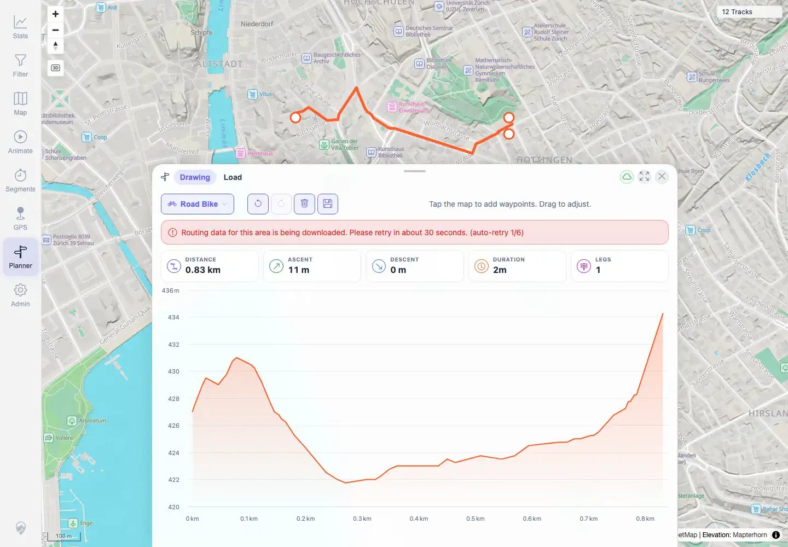

# Packet: PLN_09

## Scope

- Coverage source: `documentation/testing/frontend-regression-test-plan.md`
- Coverage ID or run packet: PLN_09
- In scope: Planner routing-data downloading/unavailable UI state.
- Out of scope: Saved-plan resilience covered by PLN_10.

## Prerequisites

- Required previous coverage IDs or run packets: PLN_08.
- Required app/data state: Planner enabled; saved plan loaded before simulated route trouble.
- Required browser context: Authenticated desktop Chromium context.

## Allowed Mutations

- Allowed: Simulate `/api/planner/route` segment-downloading response in browser automation.
- Not allowed: Leave network interception active after packet.

## Actions And Results

| Coverage ID | Action | Expected result | Actual result | Status | Evidence |
|---|---|---|---|---|---|
| PLN_09 | Simulated a route recompute returning `segment-downloading` while editing a loaded plan. | UI shows a clear segment downloading/unavailable state instead of an unhandled error. | Planner displayed `Routing data for this area is being downloaded. Please retry in about 30 seconds. (auto-retry 1/6)` in its notice area. | PASS | [assets/PLN_desktop-flow.txt](../assets/PLN_desktop-flow.txt), [assets/PLN_09-segment-downloading-notice.webp](../assets/PLN_09-segment-downloading-notice.webp) |

## Issues

| ID | Severity | Summary | Reproduction | Expected | Actual | Evidence | Release impact |
|---|---|---|---|---|---|---|---|
|  |  |  |  |  |  |  |  |

## Evidence Files

| File | Purpose |
|---|---|
| [assets/PLN_desktop-flow.txt](../assets/PLN_desktop-flow.txt) | Simulated route error and notice text. |
| [assets/PLN_09-segment-downloading-notice.webp](../assets/PLN_09-segment-downloading-notice.webp) | Planner notice for segment-downloading state. |

## Screenshot Evidence

**Planner notice for segment-downloading state.**

## Timings

| Step | Timing |
|---|---:|
| Planner missing-segment state | 2026-06-01T23:04:00+0200 |

## Handoff Notes

- Completed: PLN_09 is terminal PASS.
- Remaining unfinished coverage: PLN_10 onward.
- Blocked or not applicable: None.
- State left for the next packet: Route interception removed; temporary plan deleted later in PLN_07 cleanup.
