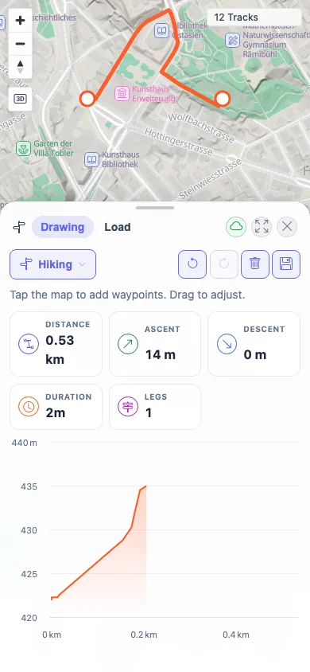
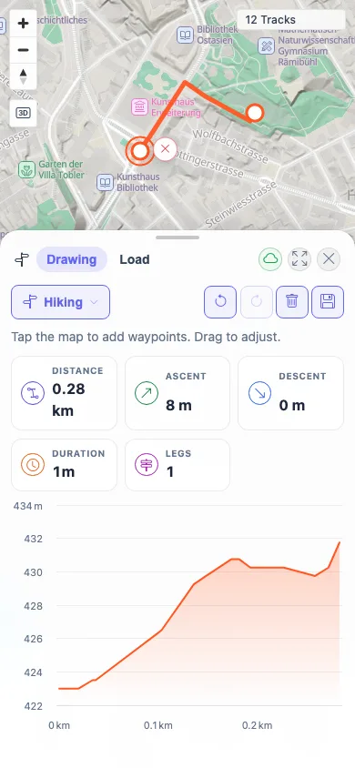

# Packet: PLN_11

## Scope

- Coverage source: `documentation/testing/frontend-regression-test-plan.md`
- Coverage ID or run packet: PLN_11
- In scope: Mobile touch placement and dragging of planner waypoints.
- Out of scope: Desktop planner save/export behavior covered by PLN_07 and PLN_08.

## Prerequisites

- Required previous coverage IDs or run packets: PLN_01 through PLN_10.
- Required app/data state: Zürich location search available; BRouter segment for Zürich available.
- Required browser context: Fresh mobile Chromium context with `isMobile: true` and `hasTouch: true`.

## Allowed Mutations

- Allowed: Temporary in-memory planner waypoints.
- Not allowed: Save a mobile planned route.

## Actions And Results

| Coverage ID | Action | Expected result | Actual result | Status | Evidence |
|---|---|---|---|---|---|
| PLN_11 | In a touch-enabled mobile viewport, selected Zürich, opened Planner, tapped two map waypoints, then dragged the first waypoint via touch events from `110,124` to `154,166`. | Touch placement and dragging work for planner waypoints. | Two taps created a 0.53 km / 1-leg Hiking route with elevation chart; touch drag recomputed the route to 0.28 km / 1 leg with chart still rendered and no errors. | PASS | [assets/PLN_11-mobile-touch.txt](../assets/PLN_11-mobile-touch.txt), [assets/PLN_11-mobile-touch-route.webp](../assets/PLN_11-mobile-touch-route.webp), [assets/PLN_11-mobile-touch-drag.webp](../assets/PLN_11-mobile-touch-drag.webp) |

## Issues

| ID | Severity | Summary | Reproduction | Expected | Actual | Evidence | Release impact |
|---|---|---|---|---|---|---|---|
|  |  |  |  |  |  |  |  |

## Evidence Files

| File | Purpose |
|---|---|
| [assets/PLN_11-mobile-touch.txt](../assets/PLN_11-mobile-touch.txt) | Mobile touch route and drag state log. |
| [assets/PLN_11-mobile-touch-route.webp](../assets/PLN_11-mobile-touch-route.webp) | Mobile route after touch waypoint placement. |
| [assets/PLN_11-mobile-touch-drag.webp](../assets/PLN_11-mobile-touch-drag.webp) | Mobile route after touch waypoint drag. |

## Screenshot Evidence

**Mobile route after touch waypoint placement.**

**Mobile route after touch waypoint drag.**

## Timings

| Step | Timing |
|---|---:|
| Mobile planner touch placement/drag | 2026-06-01T23:08:00+0200 |

## Handoff Notes

- Completed: PLN_11 is terminal PASS.
- Remaining unfinished coverage: MCT_01 onward.
- Blocked or not applicable: None.
- State left for the next packet: Fresh mobile context closed; no saved route created.
