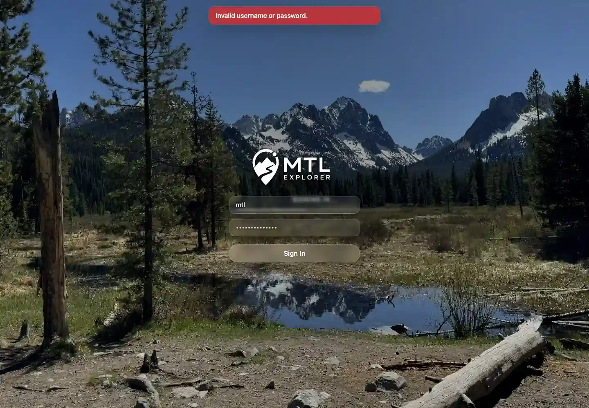

# Packet: SGN_03

## Scope

- Coverage source: `documentation/testing/frontend-regression-test-plan.md`
- Coverage ID or run packet: SGN_03
- In scope: Sign in with wrong credentials and verify a clear error while staying on login.
- Out of scope: Valid sign-in and sign-out; covered by SGN_02 and SGN_05.

## Prerequisites

- Required previous coverage IDs or run packets: SGN_02.
- Required app/data state: App running.
- Required browser context: Fresh signed-out browser context.

## Allowed Mutations

- Allowed: Submit invalid login credentials.
- Not allowed: Change app data.

## Actions And Results

| Coverage ID | Action | Expected result | Actual result | Status | Evidence |
|---|---|---|---|---|---|
| SGN_03 | Entered username `mtl` with an intentionally wrong password and clicked **Sign In**. | Clear error appears and user stays on login screen. | URL remained `/mtl/login`; message `Invalid username or password.` appeared; login screen stayed visible. | PASS | [assets/SGN_03-wrong-credentials.txt](../assets/SGN_03-wrong-credentials.txt), [assets/SGN_03-wrong-credentials.webp](../assets/SGN_03-wrong-credentials.webp) |

## Issues

| ID | Severity | Summary | Reproduction | Expected | Actual | Evidence | Release impact |
|---|---|---|---|---|---|---|---|

## Evidence Files

| File | Purpose |
|---|---|
| [assets/SGN_03-wrong-credentials.txt](../assets/SGN_03-wrong-credentials.txt) | Wrong-credential URL/error assertions. |
| [assets/SGN_03-wrong-credentials.webp](../assets/SGN_03-wrong-credentials.webp) | Login screen screenshot with error. |

## Screenshot Evidence

**Login screen screenshot with error.**

## Timings

| Step | Timing |
|---|---:|
| Wrong-credential submission to error | ~2.5 seconds |

## Handoff Notes

- Completed: SGN_03 terminal as `PASS`.
- Remaining unfinished coverage: Continue with SGN_04.
- Blocked or not applicable: None.
- State left for the next packet: App state unchanged.
