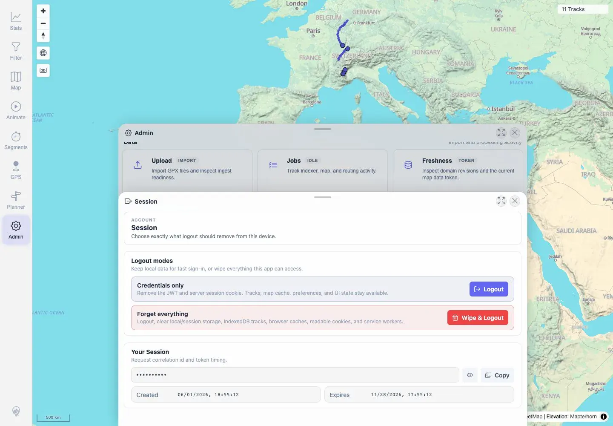
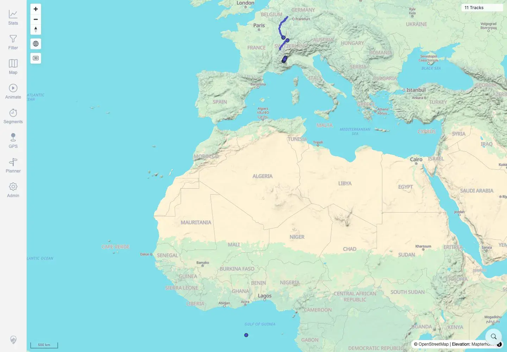

# Packet: SGN_05

## Scope

- Coverage source: `documentation/testing/frontend-regression-test-plan.md`
- Coverage ID or run packet: SGN_05
- In scope: Sign out, verify return to login, and verify signing in again works.
- Out of scope: Wipe-and-logout local data removal.

## Prerequisites

- Required previous coverage IDs or run packets: SGN_02.
- Required app/data state: App running with eleven visible tracks.
- Required browser context: Authenticated desktop browser context.

## Allowed Mutations

- Allowed: Use credentials-only Logout and sign in again.
- Not allowed: Use **Wipe & Logout** or clear app data.

## Actions And Results

| Coverage ID | Action | Expected result | Actual result | Status | Evidence |
|---|---|---|---|---|---|
| SGN_05 | Opened Admin → Session, clicked credentials-only **Logout**, verified login screen, then signed in again with README credentials. | Sign-out returns to login; signing in again works. | Logout returned to `/mtl/login` with Sign In visible. Re-login returned to `/mtl/` and map showed `11 Tracks`. | PASS | [assets/SGN_05-logout-relogin.txt](../assets/SGN_05-logout-relogin.txt), [assets/SGN_05-session-logout-control.webp](../assets/SGN_05-session-logout-control.webp), [assets/SGN_05-after-logout-login.webp](../assets/SGN_05-after-logout-login.webp), [assets/SGN_05-relogin-map.webp](../assets/SGN_05-relogin-map.webp) |

## Issues

| ID | Severity | Summary | Reproduction | Expected | Actual | Evidence | Release impact |
|---|---|---|---|---|---|---|---|

## Evidence Files

| File | Purpose |
|---|---|
| [assets/SGN_05-logout-relogin.txt](../assets/SGN_05-logout-relogin.txt) | Logout and re-login URL/text assertions. |
| [assets/SGN_05-session-logout-control.webp](../assets/SGN_05-session-logout-control.webp) | Admin Session panel with Logout controls. |
| [assets/SGN_05-after-logout-login.webp](../assets/SGN_05-after-logout-login.webp) | Login screen after logout. |
| [assets/SGN_05-relogin-map.webp](../assets/SGN_05-relogin-map.webp) | Map after signing in again. |

## Screenshot Evidence

**Admin Session panel with Logout controls.**

**Login screen after logout.**

**Map after signing in again.**

## Timings

| Step | Timing |
|---|---:|
| Logout to login | ~2.5 seconds |
| Re-login to map | ~5.5 seconds |

## Handoff Notes

- Completed: SGN_05 terminal as `PASS`.
- Remaining unfinished coverage: Continue with SGN_06.
- Blocked or not applicable: None.
- State left for the next packet: Browser test context ended after successful re-login; app state unchanged.
