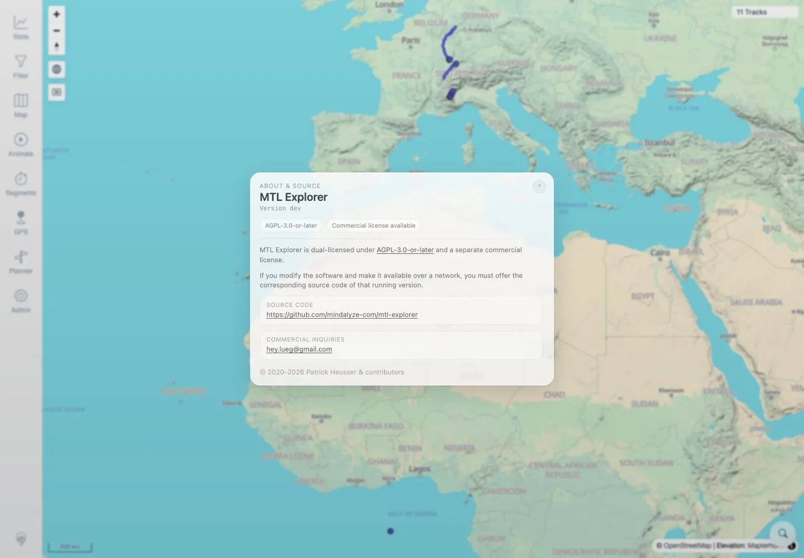

# Packet: SGN_08

## Scope

- Coverage source: `documentation/testing/frontend-regression-test-plan.md`
- Coverage ID or run packet: SGN_08
- In scope: Verify `MTL Explorer` branding appears in About/public-facing copy.
- Out of scope: Documentation/release copy review.

## Prerequisites

- Required previous coverage IDs or run packets: SGN_02.
- Required app/data state: App running and authenticated.
- Required browser context: Authenticated desktop browser context.

## Allowed Mutations

- Allowed: Open About dialog.
- Not allowed: Change app data or settings.

## Actions And Results

| Coverage ID | Action | Expected result | Actual result | Status | Evidence |
|---|---|---|---|---|---|
| SGN_08 | Opened the app About dialog via the brand/about control. | Public-facing copy uses `MTL Explorer`. | About dialog showed `MTL Explorer`, license/source details, and project source URL. | PASS | [assets/SGN_08-about-branding.txt](../assets/SGN_08-about-branding.txt), [assets/SGN_08-about-branding.webp](../assets/SGN_08-about-branding.webp) |

## Issues

| ID | Severity | Summary | Reproduction | Expected | Actual | Evidence | Release impact |
|---|---|---|---|---|---|---|---|

## Evidence Files

| File | Purpose |
|---|---|
| [assets/SGN_08-about-branding.txt](../assets/SGN_08-about-branding.txt) | About dialog text assertions and captured copy. |
| [assets/SGN_08-about-branding.webp](../assets/SGN_08-about-branding.webp) | About dialog screenshot. |

## Screenshot Evidence

**About dialog screenshot.**

## Timings

| Step | Timing |
|---|---:|
| Open About dialog | ~1 second |

## Handoff Notes

- Completed: SGN_08 terminal as `PASS`.
- Remaining unfinished coverage: Continue with SGN_09.
- Blocked or not applicable: None.
- State left for the next packet: App state unchanged.
