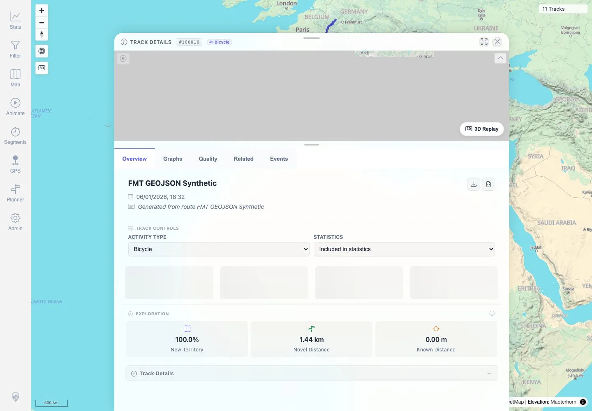

# Packet: SGN_09

## Scope

- Coverage source: `documentation/testing/frontend-regression-test-plan.md`
- Coverage ID or run packet: SGN_09
- In scope: Verify browser back/forward navigation between app views works without navigation-blocking errors.
- Out of scope: Hard-loading app subroutes; admin hard-load issue already recorded as MTL-FR-001.

## Prerequisites

- Required previous coverage IDs or run packets: SGN_02.
- Required app/data state: Eleven visible tracks.
- Required browser context: Authenticated desktop browser context.

## Allowed Mutations

- Allowed: Navigate map → stats → details, then browser back/forward.
- Not allowed: Change app data.

## Actions And Results

| Coverage ID | Action | Expected result | Actual result | Status | Evidence |
|---|---|---|---|---|---|
| SGN_09 | Navigated from map to Stats, opened GeoJSON-backed details, then used browser back/back and forward/forward. | Back/forward restores the expected views without errors. | Start map, Stats, details, back to Stats, back to map, forward to Stats, and forward to details all restored expected URLs/content. No navigation-blocking errors occurred; only the previously recorded Highcharts accessibility warning appeared. | PASS | [assets/SGN_09-back-forward-navigation.txt](../assets/SGN_09-back-forward-navigation.txt), [assets/SGN_09-forward-details.webp](../assets/SGN_09-forward-details.webp) |

## Issues

| ID | Severity | Summary | Reproduction | Expected | Actual | Evidence | Release impact |
|---|---|---|---|---|---|---|---|
| MTL-FR-002 | P3 | Highcharts accessibility module warning appears when rendering chart views. | Open Stats/detail chart views during navigation. | No chart accessibility console warning, or warning intentionally disabled. | Highcharts emitted its accessibility module warning. | [assets/SGN_09-back-forward-navigation.txt](../assets/SGN_09-back-forward-navigation.txt), [assets/FIT_03-details-tabs-summary.txt](../assets/FIT_03-details-tabs-summary.txt) | Low functional risk; chart accessibility and console-noise issue. |

## Evidence Files

| File | Purpose |
|---|---|
| [assets/SGN_09-back-forward-navigation.txt](../assets/SGN_09-back-forward-navigation.txt) | URL/content assertions for each back/forward step and non-blocking warning note. |
| [assets/SGN_09-forward-details.webp](../assets/SGN_09-forward-details.webp) | Final forward navigation details screenshot. |

## Screenshot Evidence

**Final forward navigation details screenshot.**

## Timings

| Step | Timing |
|---|---:|
| Back/forward navigation sequence | ~9 seconds |

## Handoff Notes

- Completed: SGN_09 terminal as `PASS`.
- Remaining unfinished coverage: Continue with MAP_01.
- Blocked or not applicable: None.
- State left for the next packet: App state unchanged.
