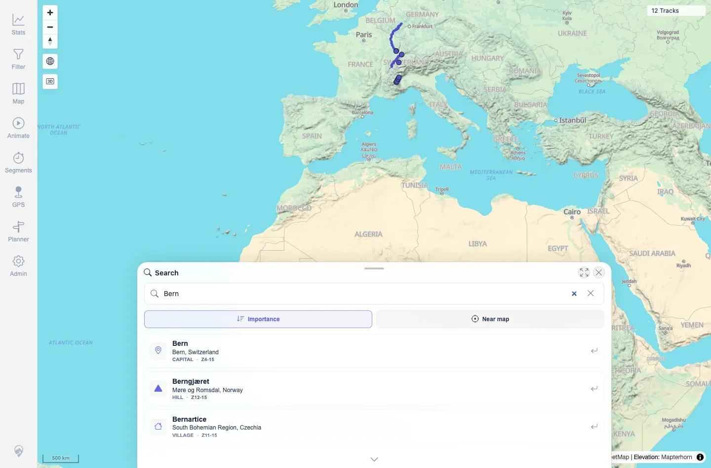

# Packet: SRC_01

## Scope

- Coverage source: `documentation/testing/frontend-regression-test-plan.md`
- Coverage ID or run packet: SRC_01
- In scope: Opening location search, entering a place query, and receiving results.
- Out of scope: Selecting, marker cleanup, and no-result states; covered by SRC_02 through SRC_04.

## Prerequisites

- Required previous coverage IDs or run packets: GPS_05.
- Required app/data state: 12 visible tracks; location-search service available.
- Required browser context: Fresh authenticated desktop Chromium context.

## Allowed Mutations

- Allowed: Open location search and query public gazetteer data.
- Not allowed: Change server data.

## Actions And Results

| Coverage ID | Action | Expected result | Actual result | Status | Evidence |
|---|---|---|---|---|---|
| SRC_01 | Clicked the Search location floating button, typed `Bern`, and waited for the debounced location search. | Search sheet opens and place-name results appear. | Search sheet opened with `Importance` and `Near map` sort controls. Query `Bern` returned results including `Bern, Switzerland`, `Berngjæret`, `Bernartice`, and others; no console warnings or errors were captured. | PASS | [assets/SRC_location-search.txt](../assets/SRC_location-search.txt); [assets/SRC_01-bern-results.webp](../assets/SRC_01-bern-results.webp) |

## Issues

| ID | Severity | Summary | Reproduction | Expected | Actual | Evidence | Release impact |
|---|---|---|---|---|---|---|---|

## Evidence Files

| File | Purpose |
|---|---|
| [assets/SRC_location-search.txt](../assets/SRC_location-search.txt) | Search query, result titles, request, and console summary. |
| [assets/SRC_01-bern-results.webp](../assets/SRC_01-bern-results.webp) | Search sheet showing `Bern` results. |

## Screenshot Evidence

**Search sheet showing Bern results.**

## Timings

| Step | Timing |
|---|---:|
| Open search and query `Bern` | ~5 s |

## Handoff Notes

- Completed: SRC_01 terminal as `PASS`.
- Remaining unfinished coverage: Continue with SRC_02.
- Blocked or not applicable: None.
- State left for the next packet: Same browser session continued into SRC_02; server data unchanged.
