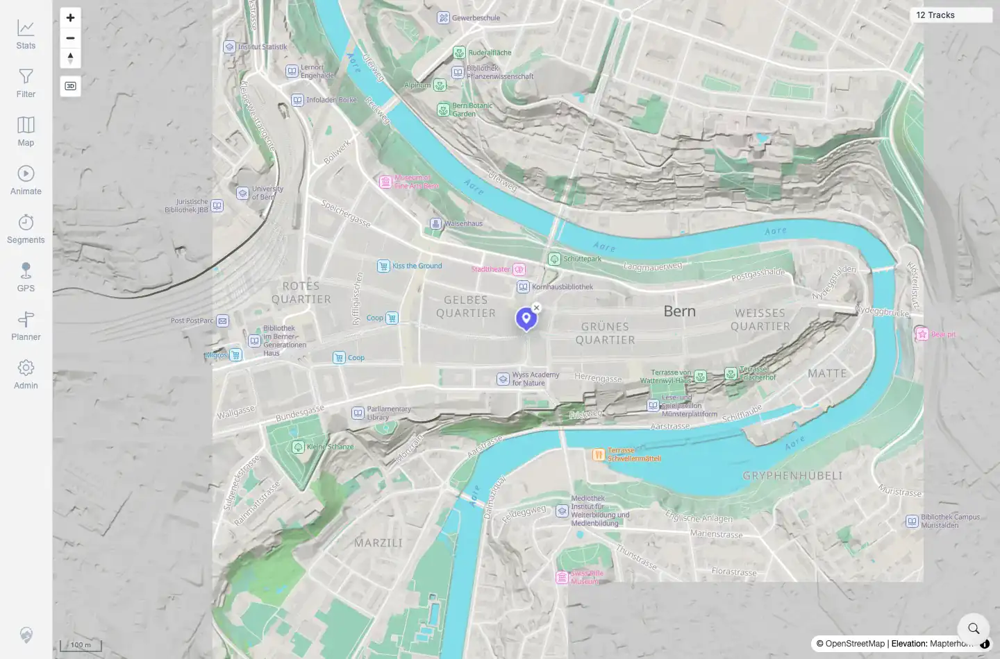

# Packet: SRC_02

## Scope

- Coverage source: `documentation/testing/frontend-regression-test-plan.md`
- Coverage ID or run packet: SRC_02
- In scope: Selecting a location-search result, map fly-to, and marker placement.
- Out of scope: Search result retrieval and marker cleanup; covered by SRC_01 and SRC_03.

## Prerequisites

- Required previous coverage IDs or run packets: SRC_01.
- Required app/data state: `Bern` results visible in the search sheet.
- Required browser context: Same authenticated desktop Chromium session.

## Allowed Mutations

- Allowed: Select a search result and place a temporary location marker.
- Not allowed: Change server data.

## Actions And Results

| Coverage ID | Action | Expected result | Actual result | Status | Evidence |
|---|---|---|---|---|---|
| SRC_02 | Selected the first `Bern` result. | Map flies to the selected place and a marker is placed. | Search sheet closed, map scale changed from `500 km` to `100 m`, and one `.mtl-location-search-marker` with a clear button was present. Selected result was `Bern / Bern, Switzerland`. | PASS | [assets/SRC_location-search.txt](../assets/SRC_location-search.txt); [assets/SRC_02-selected-marker.webp](../assets/SRC_02-selected-marker.webp) |

## Issues

| ID | Severity | Summary | Reproduction | Expected | Actual | Evidence | Release impact |
|---|---|---|---|---|---|---|---|

## Evidence Files

| File | Purpose |
|---|---|
| [assets/SRC_location-search.txt](../assets/SRC_location-search.txt) | Selected result, marker count, and map scale summary. |
| [assets/SRC_02-selected-marker.webp](../assets/SRC_02-selected-marker.webp) | Map after selecting Bern with marker present. |

## Screenshot Evidence

**Map after selecting Bern with marker present.**

## Timings

| Step | Timing |
|---|---:|
| Select result and wait for map fly-to | ~3 s |

## Handoff Notes

- Completed: SRC_02 terminal as `PASS`.
- Remaining unfinished coverage: Continue with SRC_03.
- Blocked or not applicable: None.
- State left for the next packet: Temporary location-search marker present.
