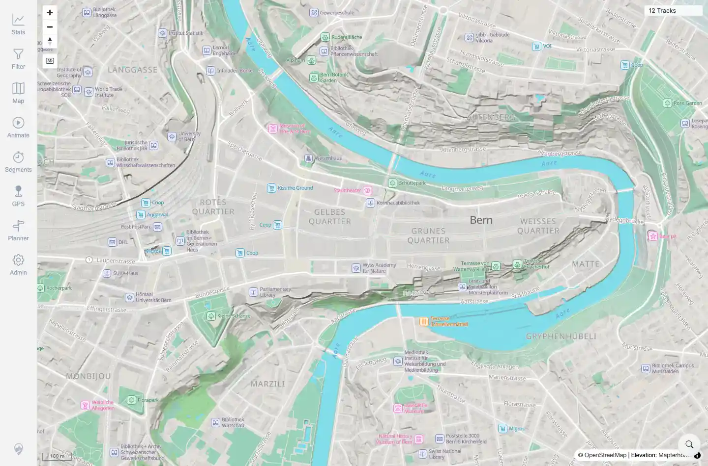

# Packet: SRC_03

## Scope

- Coverage source: `documentation/testing/frontend-regression-test-plan.md`
- Coverage ID or run packet: SRC_03
- In scope: Clearing the temporary location-search marker.
- Out of scope: Search result retrieval and no-match messaging; covered by SRC_01 and SRC_04.

## Prerequisites

- Required previous coverage IDs or run packets: SRC_02.
- Required app/data state: Location-search marker visible after selecting Bern.
- Required browser context: Same authenticated desktop Chromium session.

## Allowed Mutations

- Allowed: Clear the temporary search marker.
- Not allowed: Change server data.

## Actions And Results

| Coverage ID | Action | Expected result | Actual result | Status | Evidence |
|---|---|---|---|---|---|
| SRC_03 | Clicked the marker's clear button. | Search marker is removed cleanly. | Marker count changed from `1` to `0`; marker clear button count changed from `1` to `0`; no console warnings or errors were captured. | PASS | [assets/SRC_location-search.txt](../assets/SRC_location-search.txt); [assets/SRC_03-marker-cleared.webp](../assets/SRC_03-marker-cleared.webp) |

## Issues

| ID | Severity | Summary | Reproduction | Expected | Actual | Evidence | Release impact |
|---|---|---|---|---|---|---|---|

## Evidence Files

| File | Purpose |
|---|---|
| [assets/SRC_location-search.txt](../assets/SRC_location-search.txt) | Marker-clear method and post-clear marker count. |
| [assets/SRC_03-marker-cleared.webp](../assets/SRC_03-marker-cleared.webp) | Map after search marker removal. |

## Screenshot Evidence

**Map after search marker removal.**

## Timings

| Step | Timing |
|---|---:|
| Clear marker | ~1 s |

## Handoff Notes

- Completed: SRC_03 terminal as `PASS`.
- Remaining unfinished coverage: Continue with SRC_04.
- Blocked or not applicable: None.
- State left for the next packet: Marker cleared; same browser session continued into no-result search.
