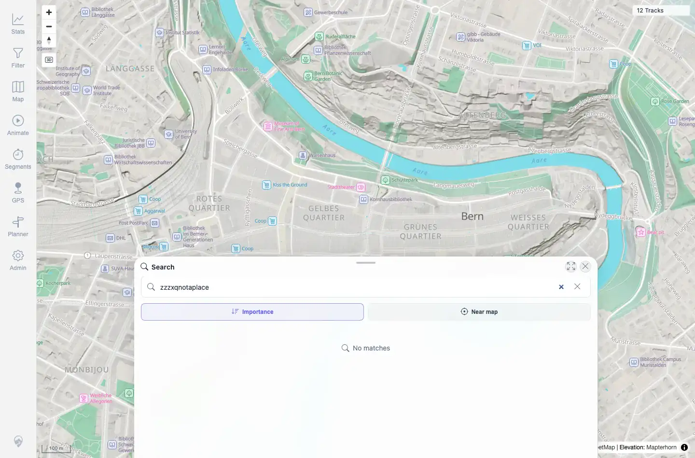

# Packet: SRC_04

## Scope

- Coverage source: `documentation/testing/frontend-regression-test-plan.md`
- Coverage ID or run packet: SRC_04
- In scope: Short/empty-progress and no-result location-search states.
- Out of scope: Successful result selection; covered by SRC_02.

## Prerequisites

- Required previous coverage IDs or run packets: SRC_03.
- Required app/data state: Search marker cleared.
- Required browser context: Same authenticated desktop Chromium session.

## Allowed Mutations

- Allowed: Reopen search and enter short/no-match queries.
- Not allowed: Change server data.

## Actions And Results

| Coverage ID | Action | Expected result | Actual result | Status | Evidence |
|---|---|---|---|---|---|
| SRC_04 | Reopened Search, entered one-character query `x`, then entered no-match query `zzzxqnotaplace`. | Empty/short/no-result queries show a clear controlled message. | Short query displayed `Keep typing`; no-match query displayed `No matches` and no result rows; no console warnings or errors were captured. | PASS | [assets/SRC_location-search.txt](../assets/SRC_location-search.txt); [assets/SRC_04-no-matches.webp](../assets/SRC_04-no-matches.webp) |

## Issues

| ID | Severity | Summary | Reproduction | Expected | Actual | Evidence | Release impact |
|---|---|---|---|---|---|---|---|

## Evidence Files

| File | Purpose |
|---|---|
| [assets/SRC_location-search.txt](../assets/SRC_location-search.txt) | Short-query and no-match state summaries. |
| [assets/SRC_04-no-matches.webp](../assets/SRC_04-no-matches.webp) | Search sheet showing no-match state. |

## Screenshot Evidence

**Search sheet showing no-match state.**

## Timings

| Step | Timing |
|---|---:|
| Short and no-match states | ~4 s |

## Handoff Notes

- Completed: SRC_04 terminal as `PASS`.
- Remaining unfinished coverage: Continue with GLB_01.
- Blocked or not applicable: None.
- State left for the next packet: No location-search marker; server data unchanged.
