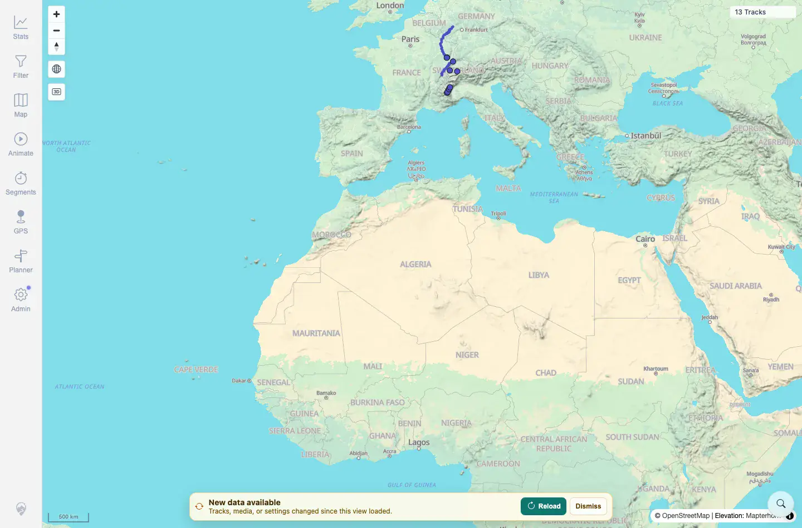

# Packet: SYN_01

## Scope

- Coverage source: `documentation/testing/frontend-regression-test-plan.md`
- Coverage ID or run packet: SYN_01
- In scope: Freshness banner after a server-side data change.
- Out of scope: Applying the reload; covered by SYN_02.

## Prerequisites

- Required previous coverage IDs or run packets: ADM_11.
- Required app/data state: Clean 12-track map, no `syn*.gpx` disposable files.
- Required browser context: Desktop Chromium context already showing 12 tracks before the import.

## Allowed Mutations

- Allowed: Add one fully synthetic GPX to the watched folder.
- Not allowed: Use private GPX data or leave the disposable file behind.

## Actions And Results

| Coverage ID | Action | Expected result | Actual result | Status | Evidence |
|---|---|---|---|---|---|
| SYN_01 | Started from a 12-track map, copied `syn01b_sync_reload_validation.gpx` into the watched folder, and waited for the data-freshness banner. | After server-side data changes, a data-freshness banner appears. | Banner appeared with `New data available`, explanatory text, and `Reload`. Baseline was `12 Tracks` before import. | PASS | [assets/SYN_01-before-12.webp](../assets/SYN_01-before-12.webp); [assets/SYN_01-freshness-banner.webp](../assets/SYN_01-freshness-banner.webp); [assets/SYN_01-freshness-banner.txt](../assets/SYN_01-freshness-banner.txt) |

## Issues

| ID | Severity | Summary | Reproduction | Expected | Actual | Evidence | Release impact |
|---|---|---|---|---|---|---|---|

## Evidence Files

| File | Purpose |
|---|---|
| [assets/SYN_01-before-12.webp](../assets/SYN_01-before-12.webp) | Baseline map before disposable import. |
| [assets/SYN_01-freshness-banner.webp](../assets/SYN_01-freshness-banner.webp) | Freshness banner after server-side import. |
| [assets/SYN_01-freshness-banner.txt](../assets/SYN_01-freshness-banner.txt) | Baseline token/count and banner text summary. |

## Screenshot Evidence

**Baseline map before disposable import.**

**Freshness banner after server-side import.**

## Timings

| Step | Timing |
|---|---:|
| Import to banner | ~1 min |

## Handoff Notes

- Completed: SYN_01 terminal as `PASS`.
- Remaining unfinished coverage: Continue with SYN_02.
- Blocked or not applicable: None.
- State left for the next packet: Freshness banner visible and ready for Reload.
