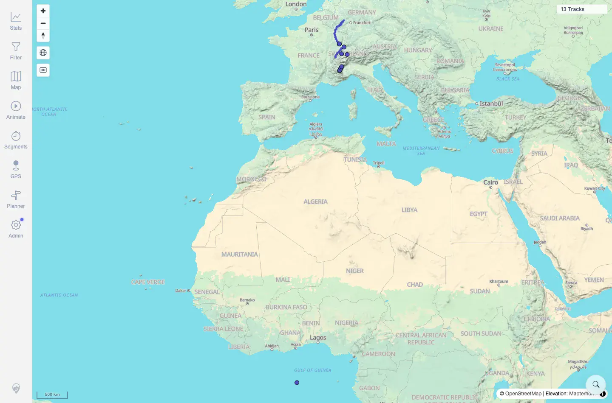
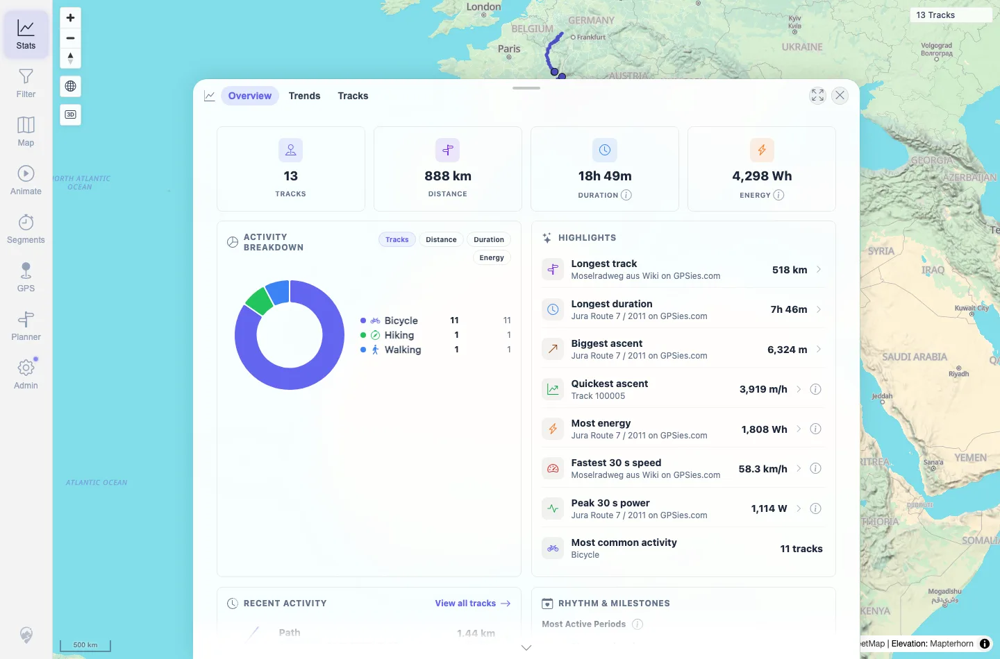
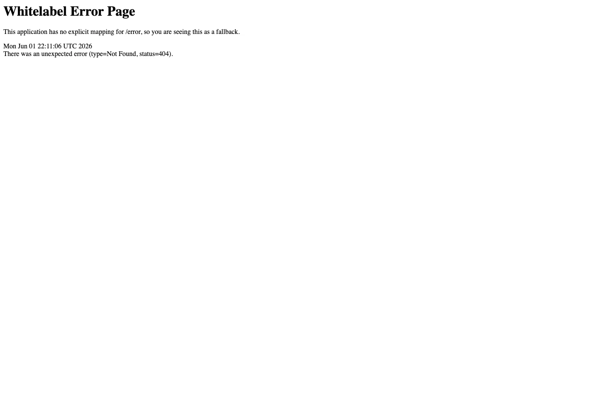

# Packet: SYN_02

## Scope

- Coverage source: `documentation/testing/frontend-regression-test-plan.md`
- Coverage ID or run packet: SYN_02
- In scope: Reloading from the freshness banner and verifying map/stat cache refresh.
- Out of scope: Dismiss behavior; covered by SYN_05.

## Prerequisites

- Required previous coverage IDs or run packets: SYN_01.
- Required app/data state: Freshness banner visible after disposable import.
- Required browser context: Same desktop Chromium context.

## Allowed Mutations

- Allowed: Click freshness banner `Reload`; remove the disposable GPX afterward.
- Not allowed: Leave disposable `syn*.gpx` files in the watched folder.

## Actions And Results

| Coverage ID | Action | Expected result | Actual result | Status | Evidence |
|---|---|---|---|---|---|
| SYN_02 | Clicked `Reload` from the freshness banner, then checked the map and Stats Overview. | Reloading from the banner refreshes cached tracks and stats. | Map showed `13 Tracks` after Reload. Stats Overview showed `13 TRACKS` and included the synthetic `SYN 01B Sync Reload Validation` recent activity. The disposable file was removed afterward and a fresh context returned to `12 Tracks`. | PASS | [assets/SYN_02-after-reload-map.webp](../assets/SYN_02-after-reload-map.webp); [assets/SYN_02-stats-after-reload.webp](../assets/SYN_02-stats-after-reload.webp); [assets/SYN_02-reload-results.txt](../assets/SYN_02-reload-results.txt); [assets/SYN_02-cleanup-restored-12.webp](../assets/SYN_02-cleanup-restored-12.webp) |

## Issues

| ID | Severity | Summary | Reproduction | Expected | Actual | Evidence | Release impact |
|---|---|---|---|---|---|---|---|

## Evidence Files

| File | Purpose |
|---|---|
| [assets/SYN_02-after-reload-map.webp](../assets/SYN_02-after-reload-map.webp) | Map after banner reload. |
| [assets/SYN_02-stats-after-reload.webp](../assets/SYN_02-stats-after-reload.webp) | Stats Overview after banner reload. |
| [assets/SYN_02-reload-results.txt](../assets/SYN_02-reload-results.txt) | Count, stats, and cleanup summary. |
| [assets/SYN_02-cleanup-restored-12.webp](../assets/SYN_02-cleanup-restored-12.webp) | Cleanup/restored map state. |

## Screenshot Evidence

**Map after banner reload.**

**Stats Overview after banner reload.**

**Cleanup/restored map state.**

## Timings

| Step | Timing |
|---|---:|
| Banner reload and map/stats verification | ~1 min |
| Cleanup reset | ~1 min |

## Handoff Notes

- Completed: SYN_02 terminal as `PASS`.
- Remaining unfinished coverage: Continue with SYN_03.
- Blocked or not applicable: None.
- State left for the next packet: Server restored to 12 visible tracks.
