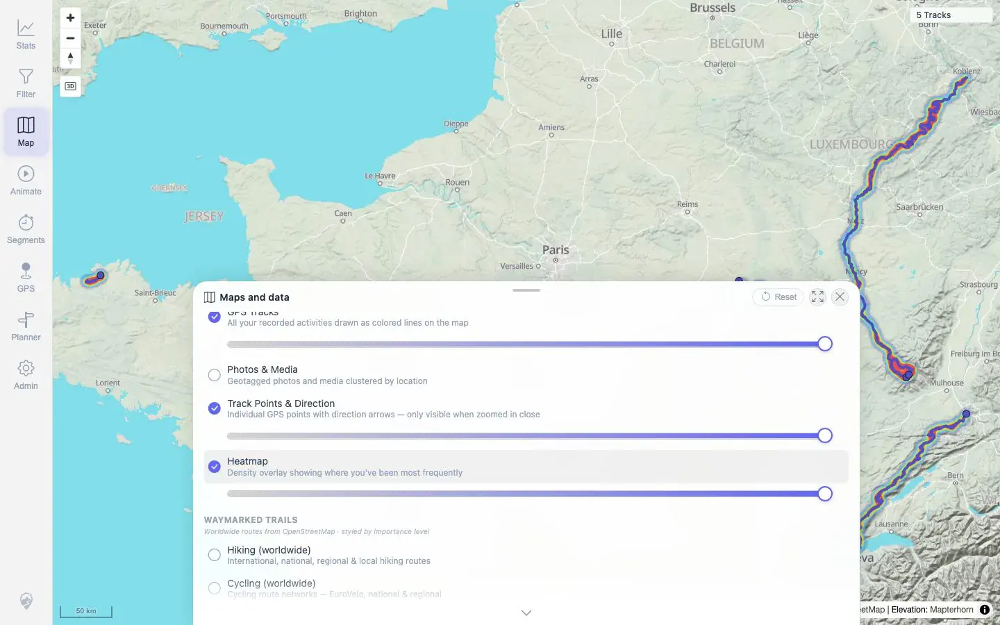

# Packet: SYN_03

## Scope

- Coverage source: `documentation/testing/frontend-regression-test-plan.md`
- Coverage ID or run packet: SYN_03
- In scope: Summary validation that the required five-GPX import and delete-two-track flow updated all required user-visible surfaces.
- Out of scope: Repeating the import/delete mutations; those were already executed in IMP_* and DEL_*.

## Prerequisites

- Required previous coverage IDs or run packets: IMP_02 through IMP_09 and DEL_01 through DEL_05.
- Required app/data state: Current run has already completed the required import/delete flow.
- Required browser context: Existing packet evidence from desktop Chromium and API/log checks.

## Allowed Mutations

- Allowed: No new mutations; validate completed packet evidence.
- Not allowed: Re-import or delete additional tracks for this summary packet.

## Actions And Results

| Coverage ID | Action | Expected result | Actual result | Status | Evidence |
|---|---|---|---|---|---|
| SYN_03 | Reviewed the completed import/delete packets and evidence for indexer state, freshness/reload, map, browser, stats, filters, heatmap, and details. | Required five-GPX import and delete-two-track flow passes across source-of-truth file changes. | Five GPX files were imported, indexer/jobs settled, Helper Reload refreshed map/browser/stats/filter to five tracks, stats/heatmap reflected the imports, two source files were deleted, and map/stats/filter/heatmap/related/details evidence reflected only the three remaining GPX tracks. | PASS | `packets/IMP_03.md`; `packets/IMP_05.md`; `packets/IMP_09.md`; `packets/DEL_02.md`; `packets/DEL_03.md`; `packets/DEL_04.md` |

## Issues

| ID | Severity | Summary | Reproduction | Expected | Actual | Evidence | Release impact |
|---|---|---|---|---|---|---|---|

## Evidence Files

| File | Purpose |
|---|---|
| [assets/IMP_03-index-wait-logs.txt](../assets/IMP_03-index-wait-logs.txt) | Live watcher and indexing for five GPX files. |
| [assets/IMP_05-surfaces-after-reload.txt](../assets/IMP_05-surfaces-after-reload.txt) | Map, stats/browser, and filter after five-GPX reload. |
| [assets/IMP_09-stats-api-summary.txt](../assets/IMP_09-stats-api-summary.txt) | Stats totals/activity after five-GPX import. |
| [assets/IMP_09-heatmap-enabled.webp](../assets/IMP_09-heatmap-enabled.webp) | Heatmap density after five-GPX import. |
| [assets/DEL_02-post-delete-status.txt](../assets/DEL_02-post-delete-status.txt) | Delete processing/indexer status. |
| [assets/DEL_03-user-visible-removal.txt](../assets/DEL_03-user-visible-removal.txt) | Deleted-name absence across map/stats/filter/heatmap/related surfaces. |
| [assets/DEL_04-remaining-open-results.txt](../assets/DEL_04-remaining-open-results.txt) | Remaining track details open correctly. |

## Screenshot Evidence

**Heatmap density after five-GPX import.**

## Timings

| Step | Timing |
|---|---:|
| Evidence review for completed flow | ~5 min |

## Handoff Notes

- Completed: SYN_03 terminal as `PASS`.
- Remaining unfinished coverage: Continue with SYN_04.
- Blocked or not applicable: None.
- State left for the next packet: Server remains at restored 12-track state from SYN_02 cleanup.
