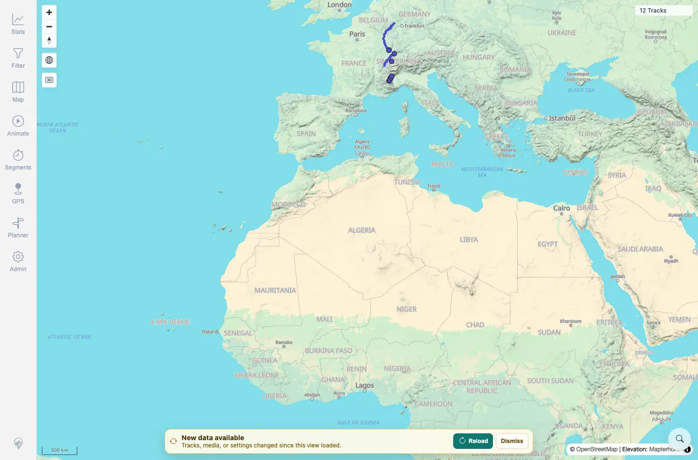
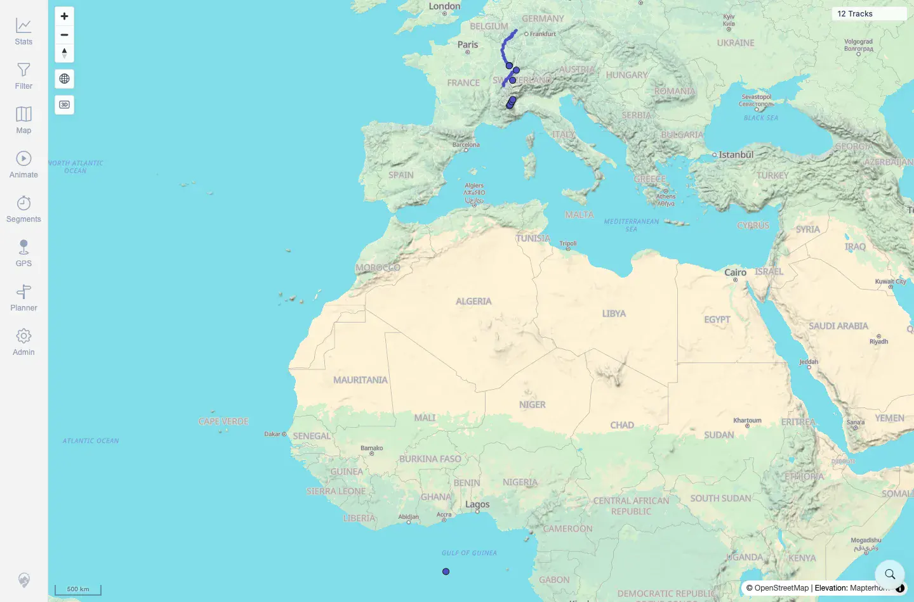

# Packet: SYN_05

## Scope

- Coverage source: `documentation/testing/frontend-regression-test-plan.md`
- Coverage ID or run packet: SYN_05
- In scope: Freshness banner Dismiss behavior.
- Out of scope: Reloading the banner; covered by SYN_02.

## Prerequisites

- Required previous coverage IDs or run packets: SYN_04.
- Required app/data state: Clean 12-track map, no `syn*.gpx` disposable files.
- Required browser context: Desktop Chromium context.

## Allowed Mutations

- Allowed: Add one fully synthetic GPX to create a banner, click Dismiss, then remove the file.
- Not allowed: Force-dismiss by editing app internals or storage.

## Actions And Results

| Coverage ID | Action | Expected result | Actual result | Status | Evidence |
|---|---|---|---|---|---|
| SYN_05 | Added `syn05b_dismiss_validation.gpx`, waited for the banner, clicked Dismiss, waited, then cleaned up. | Dismissing the banner does not loop or re-show immediately. | Banner appeared from a 12-track baseline. The first Dismiss click succeeded; banner was absent 6 seconds later and remained absent after the second wait. Cleanup removed the file and fresh context returned to `12 Tracks`. | PASS | [assets/SYN_05-before-dismiss.webp](../assets/SYN_05-before-dismiss.webp); [assets/SYN_05-after-dismiss.webp](../assets/SYN_05-after-dismiss.webp); [assets/SYN_05-dismiss-results.txt](../assets/SYN_05-dismiss-results.txt); [assets/SYN_05-cleanup-state.txt](../assets/SYN_05-cleanup-state.txt) |

## Issues

| ID | Severity | Summary | Reproduction | Expected | Actual | Evidence | Release impact |
|---|---|---|---|---|---|---|---|

## Evidence Files

| File | Purpose |
|---|---|
| [assets/SYN_05-baseline-12.webp](../assets/SYN_05-baseline-12.webp) | Baseline before disposable import. |
| [assets/SYN_05-before-dismiss.webp](../assets/SYN_05-before-dismiss.webp) | Banner before Dismiss. |
| [assets/SYN_05-after-dismiss.webp](../assets/SYN_05-after-dismiss.webp) | Banner absent after Dismiss. |
| [assets/SYN_05-dismiss-results.txt](../assets/SYN_05-dismiss-results.txt) | Dismiss timing and status summary. |
| [assets/SYN_05-cleanup-state.txt](../assets/SYN_05-cleanup-state.txt) | Cleanup verification. |

## Screenshot Evidence

**Banner before Dismiss.**

**Banner absent after Dismiss.**

**Baseline before disposable import.**

## Timings

| Step | Timing |
|---|---:|
| Import, dismiss, and cleanup | ~4 min |

## Handoff Notes

- Completed: SYN_05 terminal as `PASS`.
- Remaining unfinished coverage: Continue with SYN_06.
- Blocked or not applicable: None.
- State left for the next packet: Server restored to 12 tracks; no `syn*.gpx` files remain.
