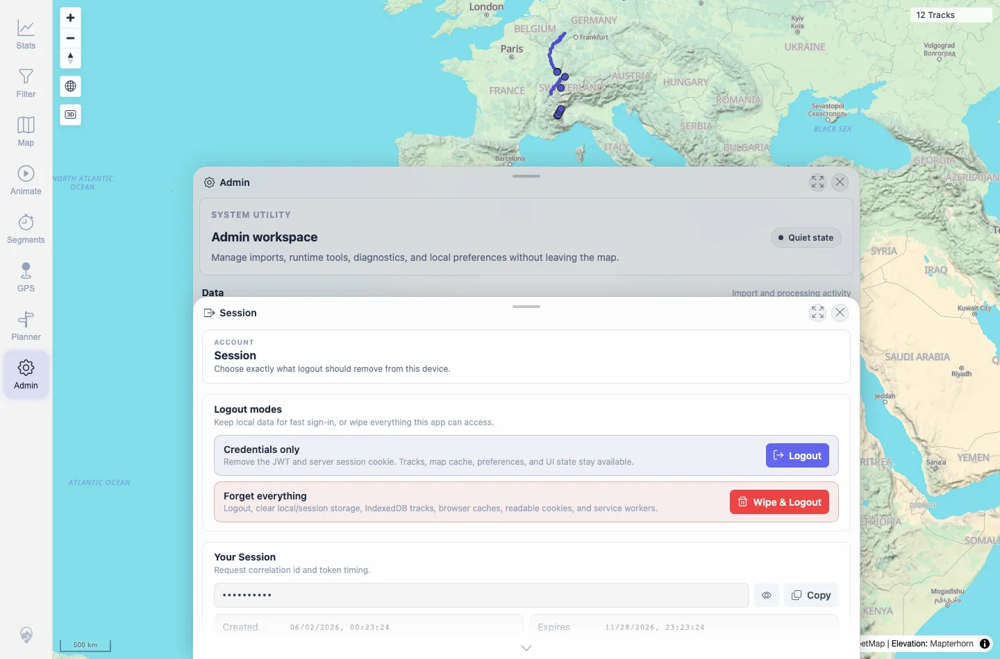
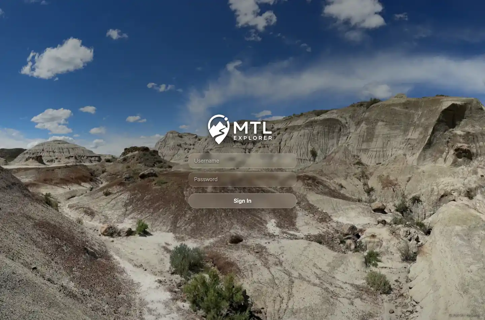
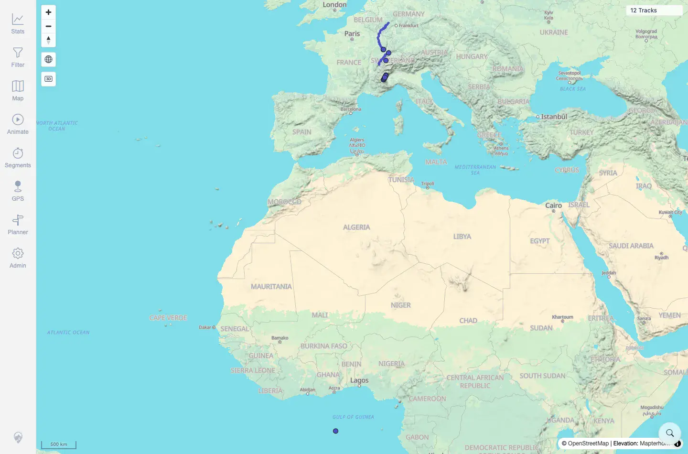

# Packet: SYN_06

## Scope

- Coverage source: `documentation/testing/frontend-regression-test-plan.md`
- Coverage ID or run packet: SYN_06
- In scope: Logout/login stability after data-refresh checks.
- Out of scope: Full auth regression; covered by SGN_*.

## Prerequisites

- Required previous coverage IDs or run packets: SYN_05.
- Required app/data state: Clean 12-track map, no freshness banner.
- Required browser context: Desktop Chromium context.

## Allowed Mutations

- Allowed: Use Admin Session credentials-only logout and log back in.
- Not allowed: Wipe all app data.

## Actions And Results

| Coverage ID | Action | Expected result | Actual result | Status | Evidence |
|---|---|---|---|---|---|
| SYN_06 | Used Admin Session credentials-only Logout, signed in again, and waited 12 seconds on the map. | Logging out and back in does not re-trigger an automatic data refresh repeatedly. | Logout removed the JWT and returned to `/mtl/login`. After signing in, the app remained responsive at `12 Tracks`; no `New data available` banner and no loading text were visible after the wait. | PASS | [assets/SYN_06-logout-login.txt](../assets/SYN_06-logout-login.txt); [assets/SYN_06-session-before-logout.webp](../assets/SYN_06-session-before-logout.webp); [assets/SYN_06-logged-out.webp](../assets/SYN_06-logged-out.webp); [assets/SYN_06-after-login.webp](../assets/SYN_06-after-login.webp) |

## Issues

| ID | Severity | Summary | Reproduction | Expected | Actual | Evidence | Release impact |
|---|---|---|---|---|---|---|---|

## Evidence Files

| File | Purpose |
|---|---|
| [assets/SYN_06-logout-login.txt](../assets/SYN_06-logout-login.txt) | Token/logout/login and post-login stability summary. |
| [assets/SYN_06-session-before-logout.webp](../assets/SYN_06-session-before-logout.webp) | Session panel before credentials-only logout. |
| [assets/SYN_06-logged-out.webp](../assets/SYN_06-logged-out.webp) | Login screen after logout. |
| [assets/SYN_06-after-login.webp](../assets/SYN_06-after-login.webp) | Stable 12-track map after login wait. |

## Screenshot Evidence

**Session panel before credentials-only logout.**

**Login screen after logout.**

**Stable 12-track map after login wait.**

## Timings

| Step | Timing |
|---|---:|
| Logout/login and stability wait | ~1 min |

## Handoff Notes

- Completed: SYN_06 terminal as `PASS`.
- Remaining unfinished coverage: Continue with SYN_07.
- Blocked or not applicable: None.
- State left for the next packet: Authenticated map at 12 tracks.
