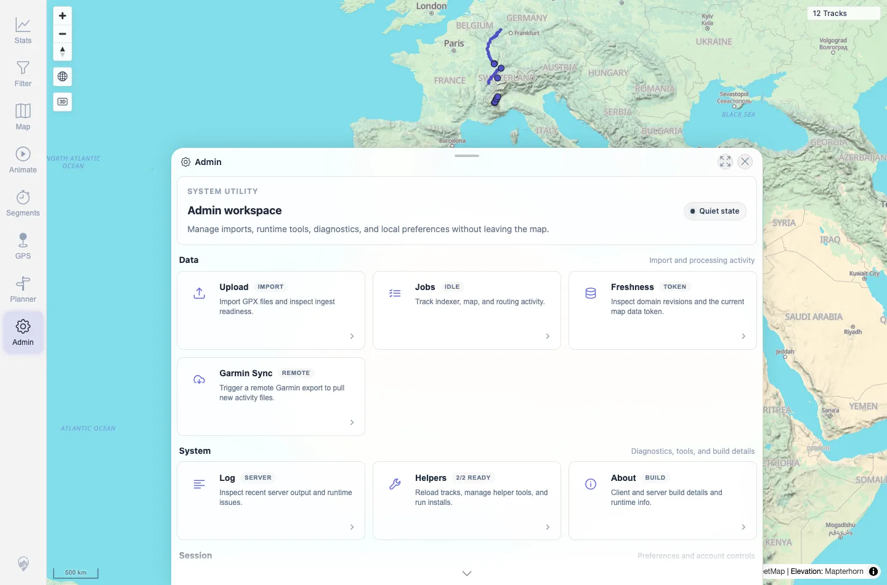

# Packet: SYN_07

## Scope

- Coverage source: `documentation/testing/frontend-regression-test-plan.md`
- Coverage ID or run packet: SYN_07
- In scope: Indexer-running badge/state and map interaction during indexing.
- Out of scope: Long-running stress/performance benchmarking.

## Prerequisites

- Required previous coverage IDs or run packets: SYN_06.
- Required app/data state: Authenticated map at 12 tracks.
- Required browser context: Desktop Chromium context.

## Allowed Mutations

- Allowed: Add and remove one fully synthetic large GPX to create indexer work.
- Not allowed: Leave disposable files or pending jobs.

## Actions And Results

| Coverage ID | Action | Expected result | Actual result | Status | Evidence |
|---|---|---|---|---|---|
| SYN_07 | Added `syn07_running_state_large.gpx`, watched Admin home while API showed one pending GPS indexer item, then closed Admin and zoomed the map. Retested locally after the client fix with equivalent synthetic GPS pending work. | Indexer-running state surfaces as a badge but does not block map interaction. | Fixed: in local retest, with clean idle jobs and GPS `pending=1`, visible Admin polling flipped the home chip to `Jobs active` and Jobs tile to `Live`. Map interaction still worked, changing scale from `500 m` to `300 m`. Cleanup removed the verification file and GPS pending returned to `0`. | FIXED | [assets/SYN_07-indexer-running.txt](../assets/SYN_07-indexer-running.txt); [assets/SYN_07-indexer-running.webp](../assets/SYN_07-indexer-running.webp); [assets/SYN_07-fixed-local-retest.txt](../assets/SYN_07-fixed-local-retest.txt) |

## Issues

| ID | Severity | Summary | Reproduction | Expected | Actual | Evidence | Release impact |
|---|---|---|---|---|---|---|---|
| MTL-FR-006 | P3 | Admin Jobs tile now surfaces visible GPS indexer work while Admin is open. | Open Admin home, add a large watched-folder GPX so `/api/indexer/status` reports GPS `pending=1`, and observe the Admin tile/state chip. | Admin home should surface a running/jobs-active badge while indexer work is pending. | Fixed: visible Admin status polling now updates the home chip to `Jobs active` and Jobs tile to `Live` while GPS indexer work is pending. | [assets/SYN_07-fixed-local-retest.txt](../assets/SYN_07-fixed-local-retest.txt) | FIXED |

## Evidence Files

| File | Purpose |
|---|---|
| [assets/SYN_07-indexer-running.txt](../assets/SYN_07-indexer-running.txt) | API pending count, UI text, map interaction, and cleanup verification. |
| [assets/SYN_07-indexer-running.webp](../assets/SYN_07-indexer-running.webp) | Admin home during pending indexer work. |
| [assets/SYN_07-fixed-local-retest.txt](../assets/SYN_07-fixed-local-retest.txt) | 2026-06-04 local retest showing visible Admin polling surfaces GPS pending work and cleanup restored idle state. |

## Screenshot Evidence

**Admin home during pending indexer work.**

## Timings

| Step | Timing |
|---|---:|
| Large import running-state capture and cleanup | ~5 min |
| Local fixed-state retest and cleanup | ~2 min |

## Handoff Notes

- Completed: SYN_07 retested and terminal as `FIXED`.
- Remaining unfinished coverage: Continue with APP_01.
- Blocked or not applicable: None.
- State left for the next packet: Server restored to idle GPS/jobs state; no `syn*.gpx` files remain.
