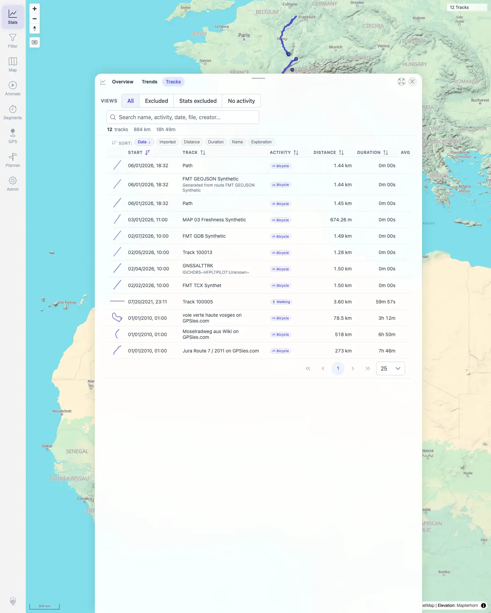

# Packet: TBS_01

## Scope

- Coverage source: `documentation/testing/frontend-regression-test-plan.md`
- Coverage ID or run packet: TBS_01
- In scope: Track browser listing fields for all visible tracks.
- Out of scope: Search, sorting, quick-view presets, and row navigation; covered by TBS_02 through TBS_05.

## Prerequisites

- Required previous coverage IDs or run packets: FLT_08.
- Required app/data state: Filtering off; all 12 tracks visible.
- Required browser context: Persistent desktop Chromium profile.

## Allowed Mutations

- Allowed: Open Stats and switch to the Tracks tab.
- Not allowed: Edit or delete track data.

## Actions And Results

| Coverage ID | Action | Expected result | Actual result | Status | Evidence |
|---|---|---|---|---|---|
| TBS_01 | Opened Stats and switched to the Tracks tab. | Track browser lists all tracks with name, date, distance, duration, activity, etc. | Tracks tab showed `12 tracks · 884 km · 18h 49m`, quick views, sort controls, and rows with `START`, `TRACK`, `ACTIVITY`, `DISTANCE`, `DURATION`, `AVG KM/H`, `ENERGY`, `EXPLORATION`, and `IMPORTED` columns. Visible row samples included synthetic format tracks, the FIT Walking track, and Mosel/Jura GPX rows. | PASS | [assets/TBS_01-track-browser-list.txt](../assets/TBS_01-track-browser-list.txt); [assets/TBS_01-track-browser-list.webp](../assets/TBS_01-track-browser-list.webp) |

## Issues

| ID | Severity | Summary | Reproduction | Expected | Actual | Evidence | Release impact |
|---|---|---|---|---|---|---|---|

## Evidence Files

| File | Purpose |
|---|---|
| [assets/TBS_01-track-browser-list.txt](../assets/TBS_01-track-browser-list.txt) | Compact assertions, headers, and visible row samples. |
| [assets/TBS_01-track-browser-list.webp](../assets/TBS_01-track-browser-list.webp) | Tracks tab listing with all-track browser columns. |

## Screenshot Evidence

**Tracks tab listing with all-track browser columns.**

## Timings

| Step | Timing |
|---|---:|
| Track browser listing check | ~1 min |

## Handoff Notes

- Completed: TBS_01 terminal as `PASS`.
- Remaining unfinished coverage: Continue with TBS_02.
- Blocked or not applicable: None.
- State left for the next packet: Stats Tracks tab open, filtering off.
