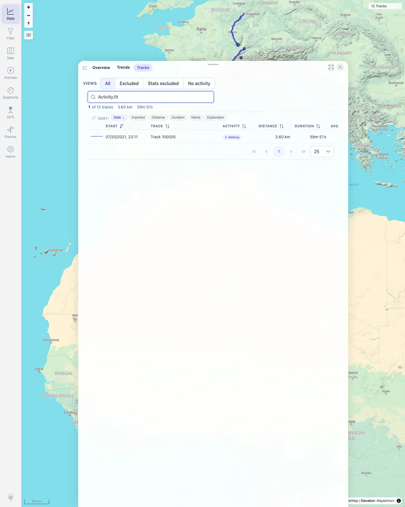

# Packet: TBS_02

## Scope

- Coverage source: `documentation/testing/frontend-regression-test-plan.md`
- Coverage ID or run packet: TBS_02
- In scope: Track browser search across names, descriptions, dates, distances, durations, activity labels, and file/path metadata.
- Out of scope: Sorting and row navigation; covered by TBS_03 and TBS_05.

## Prerequisites

- Required previous coverage IDs or run packets: TBS_01.
- Required app/data state: Filtering off; Stats Tracks tab lists 12 tracks.
- Required browser context: Persistent desktop Chromium profile.

## Allowed Mutations

- Allowed: Type and clear track-browser search terms.
- Not allowed: Edit track data.

## Actions And Results

| Coverage ID | Action | Expected result | Actual result | Status | Evidence |
|---|---|---|---|---|---|
| TBS_02 | Searched the Tracks tab for `Jura`, `IGCHDRS`, `07/20/2021`, `3.60 km`, `59m 57s`, `Walking`, and `Activity.fit`, then cleared search. | Search matches names, descriptions, dates, distances, durations, activity, and file paths. | Each search returned one matching row: Jura by name, IGC header text by description, FIT row by date/distance/duration/activity, and the same FIT row by source file `Activity.fit`. Clearing search restored 12 rows. | PASS | [assets/TBS_02-search-results.txt](../assets/TBS_02-search-results.txt); [assets/TBS_02-file-search.webp](../assets/TBS_02-file-search.webp) |

## Issues

| ID | Severity | Summary | Reproduction | Expected | Actual | Evidence | Release impact |
|---|---|---|---|---|---|---|---|

## Evidence Files

| File | Purpose |
|---|---|
| [assets/TBS_02-search-results.txt](../assets/TBS_02-search-results.txt) | Search matrix with row counts and first-row samples. |
| [assets/TBS_02-file-search.webp](../assets/TBS_02-file-search.webp) | Track browser filtered by `Activity.fit`. |

## Screenshot Evidence

**Track browser filtered by Activity.fit.**

## Timings

| Step | Timing |
|---|---:|
| Track browser search matrix | ~2 min |

## Handoff Notes

- Completed: TBS_02 terminal as `PASS`.
- Remaining unfinished coverage: Continue with TBS_03.
- Blocked or not applicable: None.
- State left for the next packet: Stats Tracks tab open, search cleared, filtering off.
